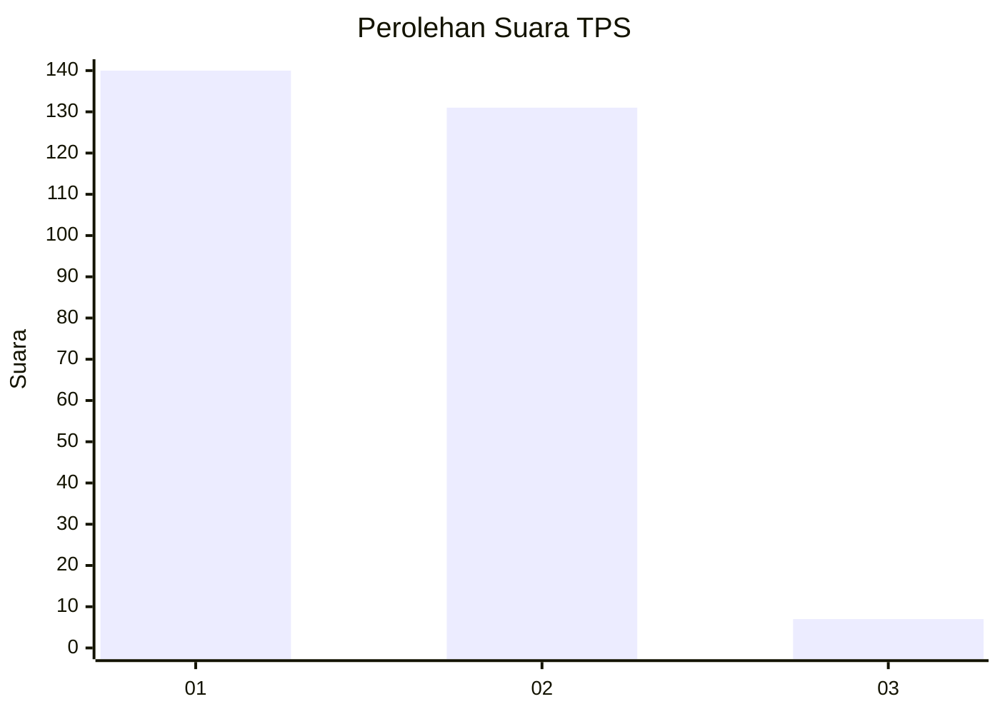
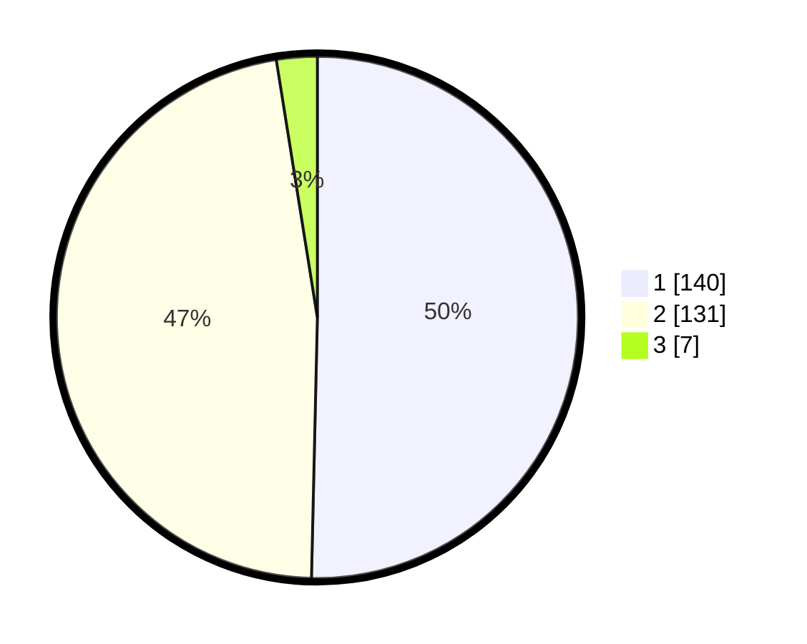

# Hasil

## Grafik

## Tabel

| No. | Nama Paslon    | Suara | Suara (raw) | Persentase |
|:--- |:-------------- | -----:| -----------:| ----------:|
| 1   | ANIES MUHAIMIN | 140   | [140][p-1]  | 50,36      |
| 2   | PRABOWO GIBRAN | 131   | [131][p-2]  | 47,12      |
| 3   | GANJAR MAHFUD  | 7     | [7][p-3]    | 2,52       |

[p-1]: https://github.com/gigit-pemilu/pemilu-2024/blob/main/pilpres/hitung-suara/sub/35-jawa-timur/sub/28-pamekasan/sub/09-pakong/sub/2003-klompang-timur/sub/007-tps/sub/paslon-1.txt
[p-2]: https://github.com/gigit-pemilu/pemilu-2024/blob/main/pilpres/hitung-suara/sub/35-jawa-timur/sub/28-pamekasan/sub/09-pakong/sub/2003-klompang-timur/sub/007-tps/sub/paslon-2.txt
[p-3]: https://github.com/gigit-pemilu/pemilu-2024/blob/main/pilpres/hitung-suara/sub/35-jawa-timur/sub/28-pamekasan/sub/09-pakong/sub/2003-klompang-timur/sub/007-tps/sub/paslon-3.txt

## Foto C Plano

https://sirekap-obj-formc.kpu.go.id/0636/pemilu/ppwp/35/28/09/20/03/3528092003007-20240215-063155--2d7f0990-0a87-4f34-83a9-f4caed74e455.jpg

https://sirekap-obj-formc.kpu.go.id/0636/pemilu/ppwp/35/28/09/20/03/3528092003007-20240215-063628--2e8167c6-4f3c-444e-a938-3e7965c08bc4.jpg

https://sirekap-obj-formc.kpu.go.id/0636/pemilu/ppwp/35/28/09/20/03/3528092003007-20240215-063533--d6950157-77c2-46cd-8cbe-c4b67d28ebc7.jpg

## Metadata

| Key        | Value               |
| ---------- | ------------------- |
| Time Stamp | 2024-02-15 22:00:27 |

