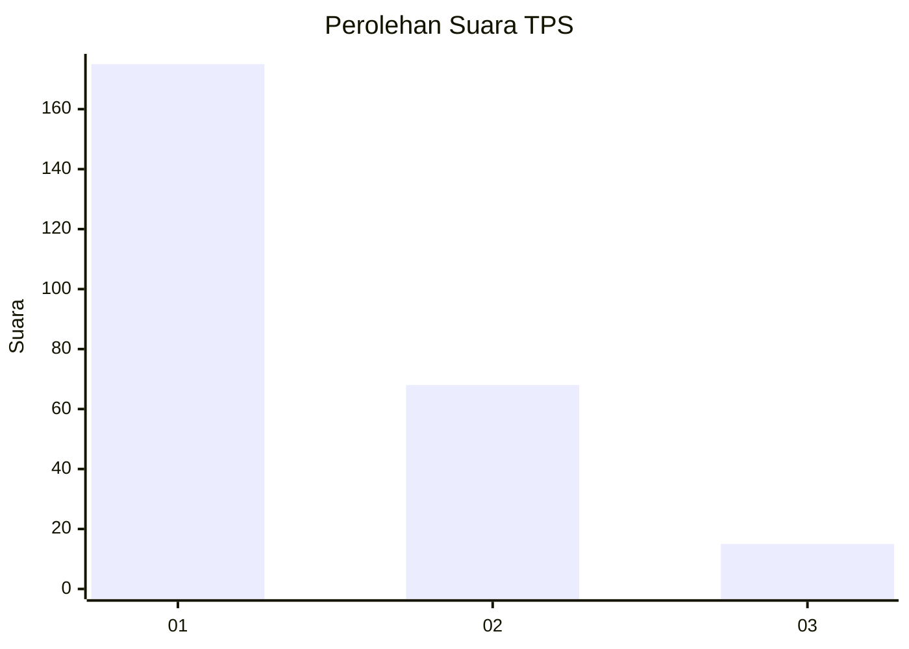
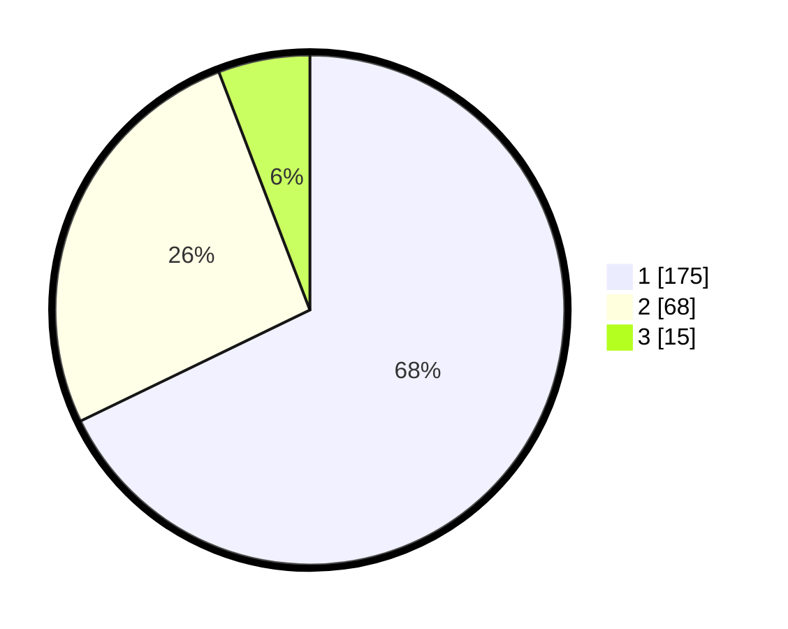

# Hasil

## Grafik

## Tabel

| No. | Nama Paslon    | Suara | Suara (raw) | Persentase |
|:--- |:-------------- | -----:| -----------:| ----------:|
| 1   | ANIES MUHAIMIN | 175   | [175][p-1]  | 67,83      |
| 2   | PRABOWO GIBRAN | 68    | [68][p-2]   | 26,36      |
| 3   | GANJAR MAHFUD  | 15    | [15][p-3]   | 5,81       |

[p-1]: https://github.com/gigit-pemilu/pemilu-2024-35-jawa-timur/blob/main/pilpres/hitung-suara/sub/35-jawa-timur/sub/28-pamekasan/sub/09-pakong/sub/2004-cenlecen/sub/003-tps/sub/paslon-1.txt
[p-2]: https://github.com/gigit-pemilu/pemilu-2024-35-jawa-timur/blob/main/pilpres/hitung-suara/sub/35-jawa-timur/sub/28-pamekasan/sub/09-pakong/sub/2004-cenlecen/sub/003-tps/sub/paslon-2.txt
[p-3]: https://github.com/gigit-pemilu/pemilu-2024-35-jawa-timur/blob/main/pilpres/hitung-suara/sub/35-jawa-timur/sub/28-pamekasan/sub/09-pakong/sub/2004-cenlecen/sub/003-tps/sub/paslon-3.txt

## Foto C Plano

https://sirekap-obj-formc.kpu.go.id/7f8c/pemilu/ppwp/35/28/09/20/04/3528092004003-20240214-225828--7a08c7fd-9d7e-4c97-9561-24e4b0e1af81.jpg

https://sirekap-obj-formc.kpu.go.id/7f8c/pemilu/ppwp/35/28/09/20/04/3528092004003-20240214-231524--a8c96cf1-4f33-484b-a41f-22af0062b260.jpg

https://sirekap-obj-formc.kpu.go.id/7f8c/pemilu/ppwp/35/28/09/20/04/3528092004003-20240214-230003--269b9aeb-6bbb-49cd-bf82-99d5edde1563.jpg

## Metadata

| Key        | Value               |
| ---------- | ------------------- |
| Time Stamp | 2024-02-15 22:00:27 |

