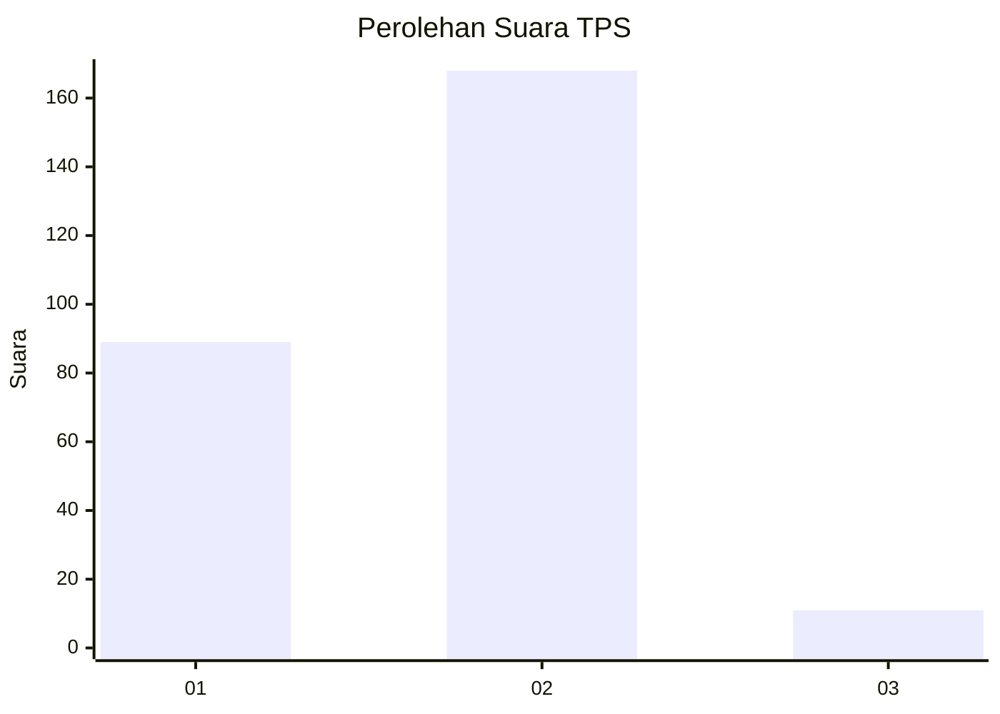
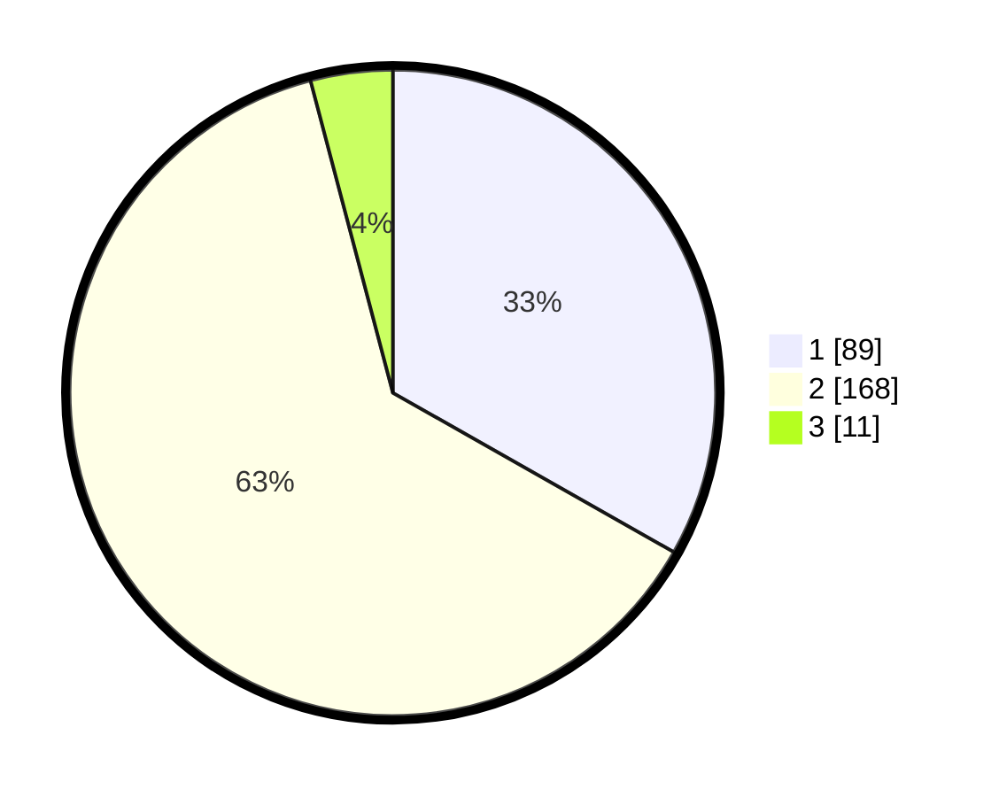

# Hasil

## Grafik

## Tabel

| No. | Nama Paslon    | Suara | Suara (raw) | Persentase |
|:--- |:-------------- | -----:| -----------:| ----------:|
| 1   | ANIES MUHAIMIN | 89    | [89][p-1]   | 33,21      |
| 2   | PRABOWO GIBRAN | 168   | [168][p-2]  | 62,69      |
| 3   | GANJAR MAHFUD  | 11    | [11][p-3]   | 4,10       |

[p-1]: https://github.com/gigit-pemilu/pemilu-2024/blob/main/pilpres/hitung-suara/sub/35-jawa-timur/sub/28-pamekasan/sub/09-pakong/sub/2004-cenlecen/sub/007-tps/sub/paslon-1.txt
[p-2]: https://github.com/gigit-pemilu/pemilu-2024/blob/main/pilpres/hitung-suara/sub/35-jawa-timur/sub/28-pamekasan/sub/09-pakong/sub/2004-cenlecen/sub/007-tps/sub/paslon-2.txt
[p-3]: https://github.com/gigit-pemilu/pemilu-2024/blob/main/pilpres/hitung-suara/sub/35-jawa-timur/sub/28-pamekasan/sub/09-pakong/sub/2004-cenlecen/sub/007-tps/sub/paslon-3.txt

## Foto C Plano

https://sirekap-obj-formc.kpu.go.id/2b94/pemilu/ppwp/35/28/09/20/04/3528092004007-20240214-224323--734d9265-a345-4e2a-94c6-a4734ae2b6a4.jpg

https://sirekap-obj-formc.kpu.go.id/2b94/pemilu/ppwp/35/28/09/20/04/3528092004007-20240214-224513--6547dede-eb14-401a-8033-951febb0d386.jpg

https://sirekap-obj-formc.kpu.go.id/2b94/pemilu/ppwp/35/28/09/20/04/3528092004007-20240214-224608--e5ae7c22-e0a8-48b7-b64a-258eea00e99d.jpg

## Metadata

| Key        | Value               |
| ---------- | ------------------- |
| Time Stamp | 2024-02-15 22:00:27 |

