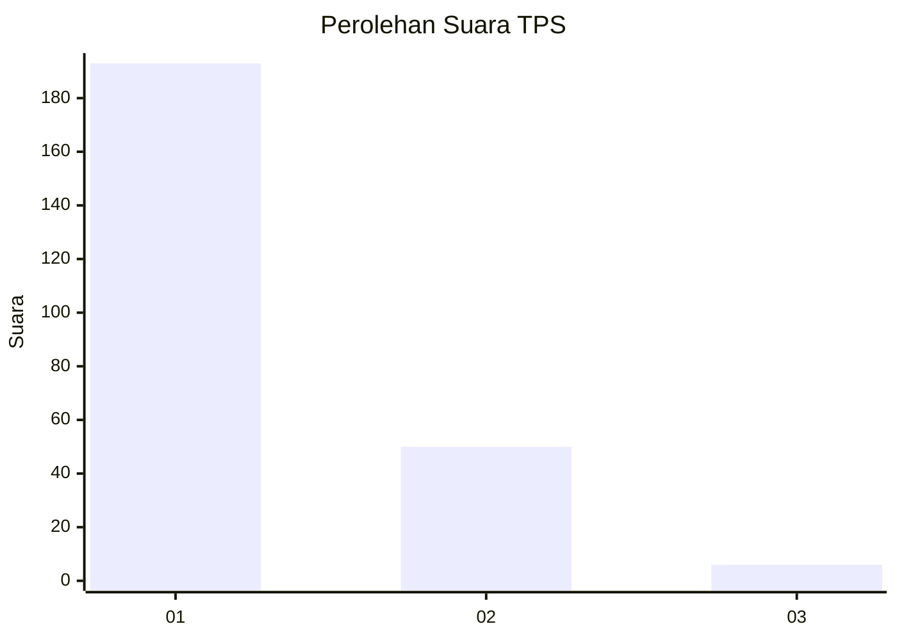
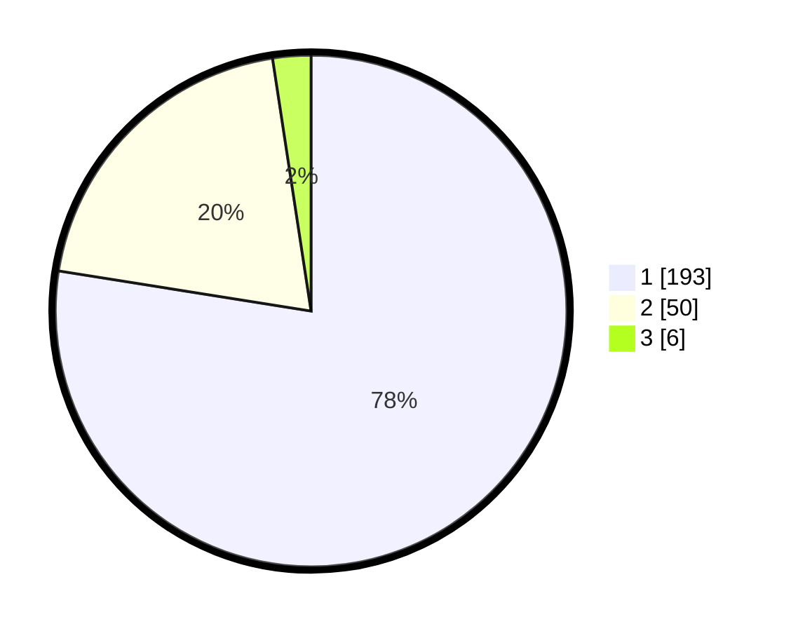

# Hasil

## Grafik

## Tabel

| No. | Nama Paslon    | Suara | Suara (raw) | Persentase |
|:--- |:-------------- | -----:| -----------:| ----------:|
| 1   | ANIES MUHAIMIN | 193   | [193][p-1]  | 77,51      |
| 2   | PRABOWO GIBRAN | 50    | [50][p-2]   | 20,08      |
| 3   | GANJAR MAHFUD  | 6     | [6][p-3]    | 2,41       |

[p-1]: https://github.com/gigit-pemilu/pemilu-2024-35-jawa-timur/blob/main/pilpres/hitung-suara/sub/35-jawa-timur/sub/28-pamekasan/sub/09-pakong/sub/2008-palalang/sub/003-tps/sub/paslon-1.txt
[p-2]: https://github.com/gigit-pemilu/pemilu-2024-35-jawa-timur/blob/main/pilpres/hitung-suara/sub/35-jawa-timur/sub/28-pamekasan/sub/09-pakong/sub/2008-palalang/sub/003-tps/sub/paslon-2.txt
[p-3]: https://github.com/gigit-pemilu/pemilu-2024-35-jawa-timur/blob/main/pilpres/hitung-suara/sub/35-jawa-timur/sub/28-pamekasan/sub/09-pakong/sub/2008-palalang/sub/003-tps/sub/paslon-3.txt

## Foto C Plano

https://sirekap-obj-formc.kpu.go.id/87c4/pemilu/ppwp/35/28/09/20/08/3528092008003-20240215-013411--209f4533-ede4-4d1a-809e-8b51e8e09783.jpg

https://sirekap-obj-formc.kpu.go.id/87c4/pemilu/ppwp/35/28/09/20/08/3528092008003-20240214-235115--dff1db08-086a-4b40-8a49-052825feb0e2.jpg

https://sirekap-obj-formc.kpu.go.id/87c4/pemilu/ppwp/35/28/09/20/08/3528092008003-20240214-235223--aa31f502-eb98-4039-b212-c0db1200d6a5.jpg

## Metadata

| Key        | Value               |
| ---------- | ------------------- |
| Time Stamp | 2024-02-15 22:30:27 |

