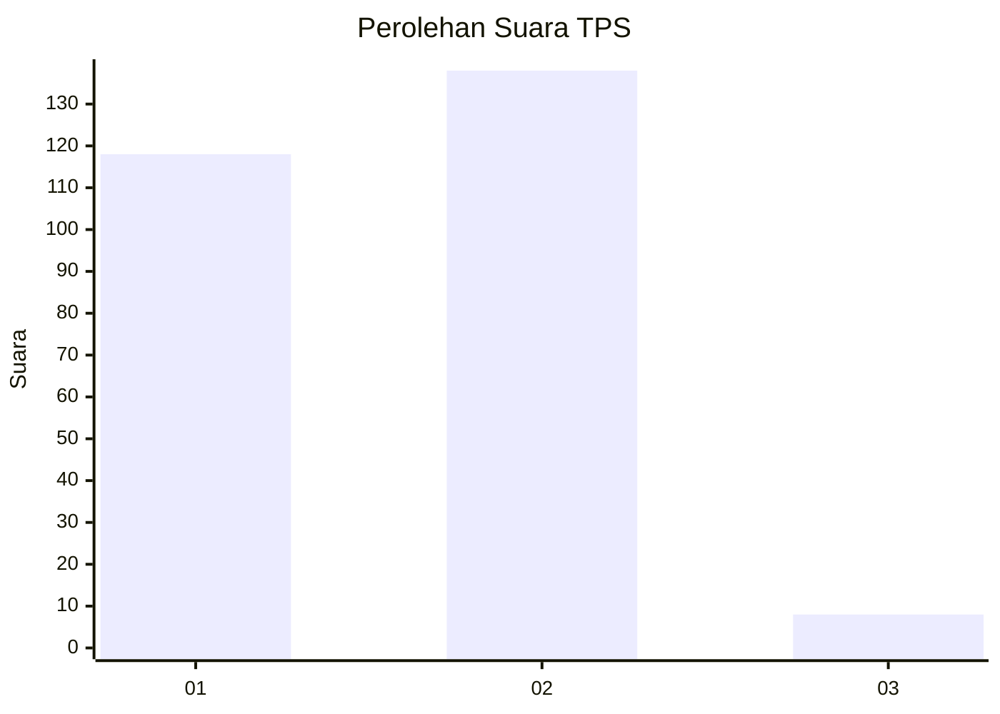
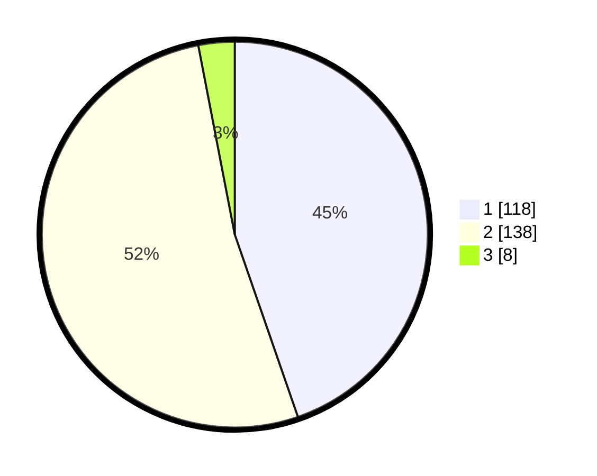

# Hasil

## Grafik

## Tabel

| No. | Nama Paslon    | Suara | Suara (raw) | Persentase |
|:--- |:-------------- | -----:| -----------:| ----------:|
| 1   | ANIES MUHAIMIN | 118   | [118][p-1]  | 44,70      |
| 2   | PRABOWO GIBRAN | 138   | [138][p-2]  | 52,27      |
| 3   | GANJAR MAHFUD  | 8     | [8][p-3]    | 3,03       |

[p-1]: https://github.com/gigit-pemilu/pemilu-2024/blob/main/pilpres/hitung-suara/sub/35-jawa-timur/sub/28-pamekasan/sub/09-pakong/sub/2009-seddur/sub/001-tps/sub/paslon-1.txt
[p-2]: https://github.com/gigit-pemilu/pemilu-2024/blob/main/pilpres/hitung-suara/sub/35-jawa-timur/sub/28-pamekasan/sub/09-pakong/sub/2009-seddur/sub/001-tps/sub/paslon-2.txt
[p-3]: https://github.com/gigit-pemilu/pemilu-2024/blob/main/pilpres/hitung-suara/sub/35-jawa-timur/sub/28-pamekasan/sub/09-pakong/sub/2009-seddur/sub/001-tps/sub/paslon-3.txt

## Foto C Plano

https://sirekap-obj-formc.kpu.go.id/21db/pemilu/ppwp/35/28/09/20/09/3528092009001-20240214-224256--acb3c3c7-563a-4f6e-89e2-276171d7034a.jpg

https://sirekap-obj-formc.kpu.go.id/21db/pemilu/ppwp/35/28/09/20/09/3528092009001-20240214-224127--d019c4f3-a50e-463e-b6f7-b8e30c4f84d3.jpg

https://sirekap-obj-formc.kpu.go.id/21db/pemilu/ppwp/35/28/09/20/09/3528092009001-20240214-224559--70601047-4db4-4908-95c5-2b60aa50cbc1.jpg

## Metadata

| Key        | Value               |
| ---------- | ------------------- |
| Time Stamp | 2024-02-15 22:30:27 |

