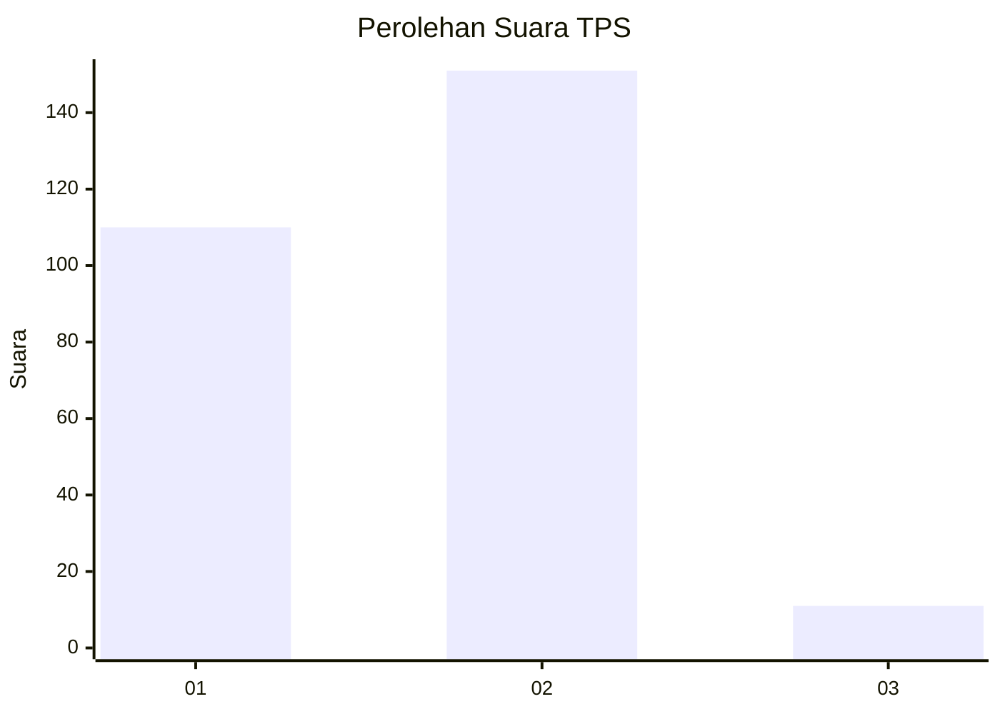
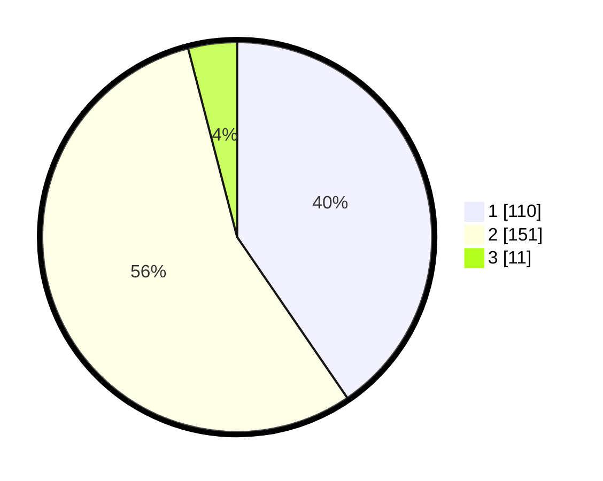

# Hasil

## Grafik

## Tabel

| No. | Nama Paslon    | Suara | Suara (raw) | Persentase |
|:--- |:-------------- | -----:| -----------:| ----------:|
| 1   | ANIES MUHAIMIN | 110   | [110][p-1]  | 40,44      |
| 2   | PRABOWO GIBRAN | 151   | [151][p-2]  | 55,51      |
| 3   | GANJAR MAHFUD  | 11    | [11][p-3]   | 4,04       |

[p-1]: https://github.com/gigit-pemilu/pemilu-2024/blob/main/pilpres/hitung-suara/sub/35-jawa-timur/sub/28-pamekasan/sub/09-pakong/sub/2009-seddur/sub/002-tps/sub/paslon-1.txt
[p-2]: https://github.com/gigit-pemilu/pemilu-2024/blob/main/pilpres/hitung-suara/sub/35-jawa-timur/sub/28-pamekasan/sub/09-pakong/sub/2009-seddur/sub/002-tps/sub/paslon-2.txt
[p-3]: https://github.com/gigit-pemilu/pemilu-2024/blob/main/pilpres/hitung-suara/sub/35-jawa-timur/sub/28-pamekasan/sub/09-pakong/sub/2009-seddur/sub/002-tps/sub/paslon-3.txt

## Foto C Plano

https://sirekap-obj-formc.kpu.go.id/7701/pemilu/ppwp/35/28/09/20/09/3528092009002-20240215-022044--1d516115-f324-46ba-bf09-bc1b01b48de3.jpg

https://sirekap-obj-formc.kpu.go.id/7701/pemilu/ppwp/35/28/09/20/09/3528092009002-20240215-022119--fb1af1fa-8eef-45be-a5a6-4c11c9f67129.jpg

https://sirekap-obj-formc.kpu.go.id/7701/pemilu/ppwp/35/28/09/20/09/3528092009002-20240215-021135--f49a1075-d4d7-4497-aaeb-351131a45555.jpg

## Metadata

| Key        | Value               |
| ---------- | ------------------- |
| Time Stamp | 2024-02-15 22:30:27 |

