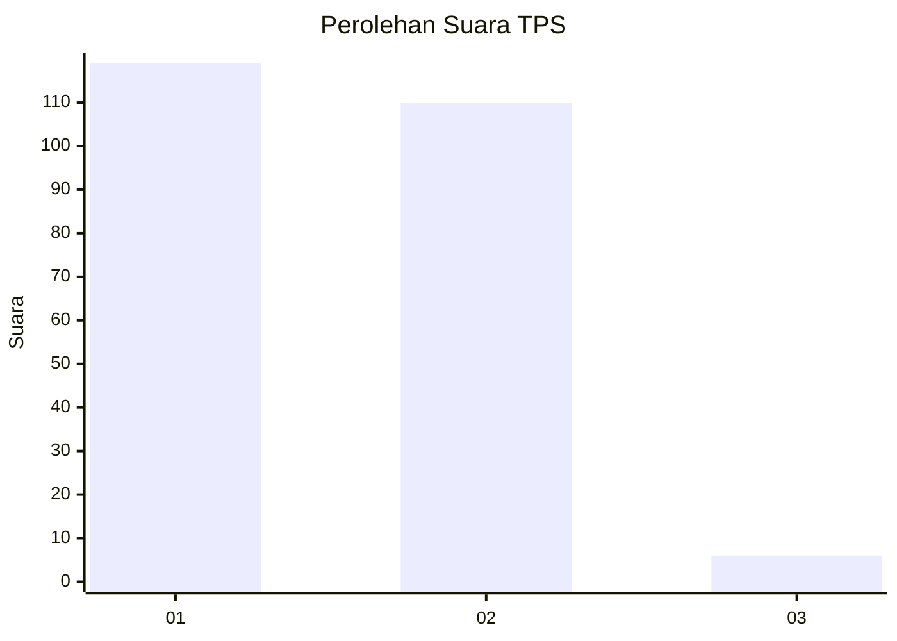
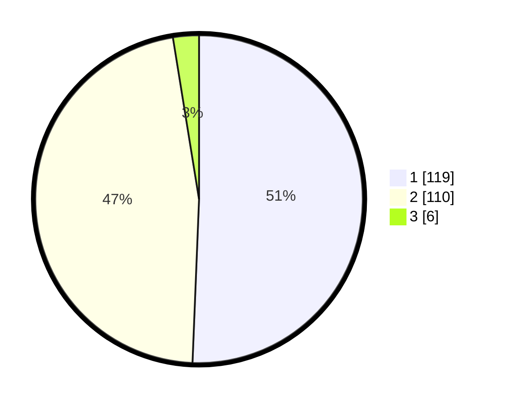

# Hasil

## Grafik

## Tabel

| No. | Nama Paslon    | Suara | Suara (raw) | Persentase |
|:--- |:-------------- | -----:| -----------:| ----------:|
| 1   | ANIES MUHAIMIN | 119   | [119][p-1]  | 50,64      |
| 2   | PRABOWO GIBRAN | 110   | [110][p-2]  | 46,81      |
| 3   | GANJAR MAHFUD  | 6     | [6][p-3]    | 2,55       |

[p-1]: https://github.com/gigit-pemilu/pemilu-2024-35-jawa-timur/blob/main/pilpres/hitung-suara/sub/35-jawa-timur/sub/28-pamekasan/sub/09-pakong/sub/2009-seddur/sub/006-tps/sub/paslon-1.txt
[p-2]: https://github.com/gigit-pemilu/pemilu-2024-35-jawa-timur/blob/main/pilpres/hitung-suara/sub/35-jawa-timur/sub/28-pamekasan/sub/09-pakong/sub/2009-seddur/sub/006-tps/sub/paslon-2.txt
[p-3]: https://github.com/gigit-pemilu/pemilu-2024-35-jawa-timur/blob/main/pilpres/hitung-suara/sub/35-jawa-timur/sub/28-pamekasan/sub/09-pakong/sub/2009-seddur/sub/006-tps/sub/paslon-3.txt

## Foto C Plano

https://sirekap-obj-formc.kpu.go.id/1e83/pemilu/ppwp/35/28/09/20/09/3528092009006-20240215-001501--80a41711-45a0-4e06-bfe6-cdd0f40c7e72.jpg

https://sirekap-obj-formc.kpu.go.id/1e83/pemilu/ppwp/35/28/09/20/09/3528092009006-20240214-155159--4a897c6c-44a7-4d35-99e3-8d03a1b1fb68.jpg

https://sirekap-obj-formc.kpu.go.id/1e83/pemilu/ppwp/35/28/09/20/09/3528092009006-20240214-155339--59c2bcbd-962b-4db8-a59f-2d3868e949c2.jpg

## Metadata

| Key        | Value               |
| ---------- | ------------------- |
| Time Stamp | 2024-02-15 22:30:27 |

