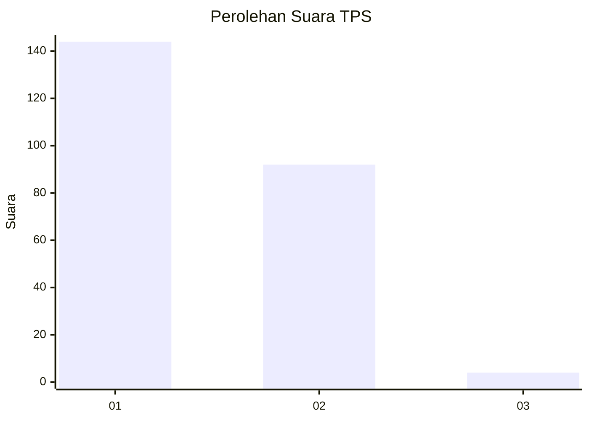
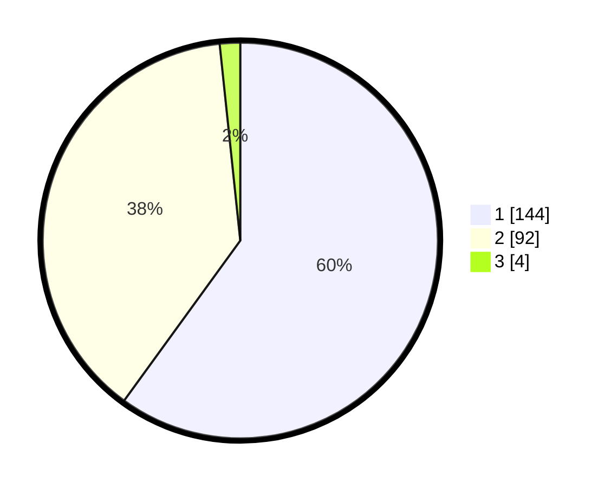

# Hasil

## Grafik

## Tabel

| No. | Nama Paslon    | Suara | Suara (raw) | Persentase |
|:--- |:-------------- | -----:| -----------:| ----------:|
| 1   | ANIES MUHAIMIN | 144   | [144][p-1]  | 60,00      |
| 2   | PRABOWO GIBRAN | 92    | [92][p-2]   | 38,33      |
| 3   | GANJAR MAHFUD  | 4     | [4][p-3]    | 1,67       |

[p-1]: https://github.com/gigit-pemilu/pemilu-2024-35-jawa-timur/blob/main/pilpres/hitung-suara/sub/35-jawa-timur/sub/28-pamekasan/sub/09-pakong/sub/2009-seddur/sub/007-tps/sub/paslon-1.txt
[p-2]: https://github.com/gigit-pemilu/pemilu-2024-35-jawa-timur/blob/main/pilpres/hitung-suara/sub/35-jawa-timur/sub/28-pamekasan/sub/09-pakong/sub/2009-seddur/sub/007-tps/sub/paslon-2.txt
[p-3]: https://github.com/gigit-pemilu/pemilu-2024-35-jawa-timur/blob/main/pilpres/hitung-suara/sub/35-jawa-timur/sub/28-pamekasan/sub/09-pakong/sub/2009-seddur/sub/007-tps/sub/paslon-3.txt

## Foto C Plano

https://sirekap-obj-formc.kpu.go.id/2a7e/pemilu/ppwp/35/28/09/20/09/3528092009007-20240215-071723--02ad126a-dd0b-40aa-b0cd-8237996bb8ea.jpg

https://sirekap-obj-formc.kpu.go.id/2a7e/pemilu/ppwp/35/28/09/20/09/3528092009007-20240215-071809--77e4469b-2ae0-491e-bd06-782128302b0b.jpg

https://sirekap-obj-formc.kpu.go.id/2a7e/pemilu/ppwp/35/28/09/20/09/3528092009007-20240215-071847--db86ba76-742c-47f2-ac98-6c570770de6b.jpg

## Metadata

| Key        | Value               |
| ---------- | ------------------- |
| Time Stamp | 2024-02-15 22:30:27 |

