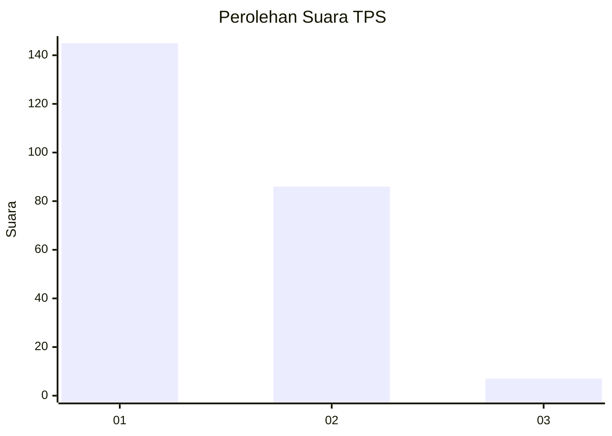
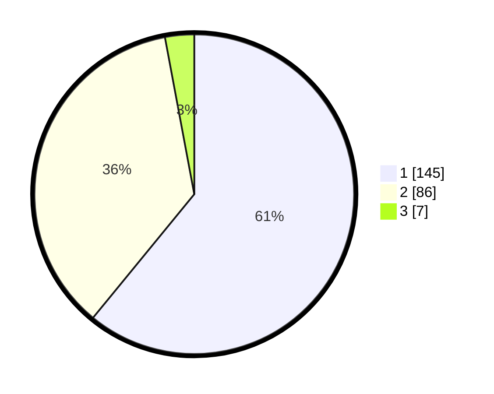

# Hasil

## Grafik

## Tabel

| No. | Nama Paslon    | Suara | Suara (raw) | Persentase |
|:--- |:-------------- | -----:| -----------:| ----------:|
| 1   | ANIES MUHAIMIN | 145   | [145][p-1]  | 60,92      |
| 2   | PRABOWO GIBRAN | 86    | [86][p-2]   | 36,13      |
| 3   | GANJAR MAHFUD  | 7     | [7][p-3]    | 2,94       |

[p-1]: https://github.com/gigit-pemilu/pemilu-2024/blob/main/pilpres/hitung-suara/sub/35-jawa-timur/sub/28-pamekasan/sub/09-pakong/sub/2009-seddur/sub/011-tps/sub/paslon-1.txt
[p-2]: https://github.com/gigit-pemilu/pemilu-2024/blob/main/pilpres/hitung-suara/sub/35-jawa-timur/sub/28-pamekasan/sub/09-pakong/sub/2009-seddur/sub/011-tps/sub/paslon-2.txt
[p-3]: https://github.com/gigit-pemilu/pemilu-2024/blob/main/pilpres/hitung-suara/sub/35-jawa-timur/sub/28-pamekasan/sub/09-pakong/sub/2009-seddur/sub/011-tps/sub/paslon-3.txt

## Foto C Plano

https://sirekap-obj-formc.kpu.go.id/0148/pemilu/ppwp/35/28/09/20/09/3528092009011-20240214-222749--d7c7e8c8-e943-4357-88b9-6ce0a9943fc0.jpg

https://sirekap-obj-formc.kpu.go.id/0148/pemilu/ppwp/35/28/09/20/09/3528092009011-20240214-222902--49069027-cdcf-4baf-b764-1cfb02affdda.jpg

https://sirekap-obj-formc.kpu.go.id/0148/pemilu/ppwp/35/28/09/20/09/3528092009011-20240214-223036--1728de4b-846e-4808-8ccc-538f828787bd.jpg

## Metadata

| Key        | Value               |
| ---------- | ------------------- |
| Time Stamp | 2024-02-15 22:30:27 |

