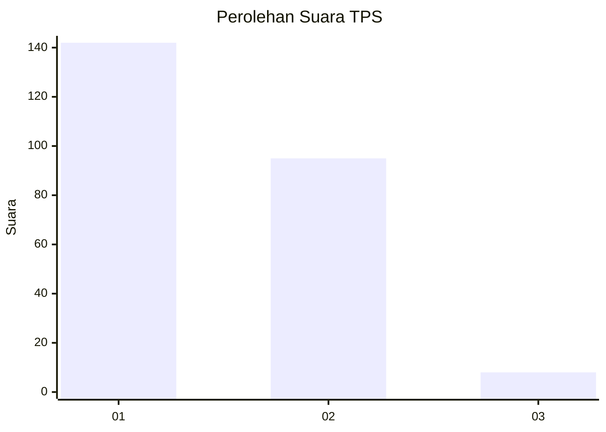
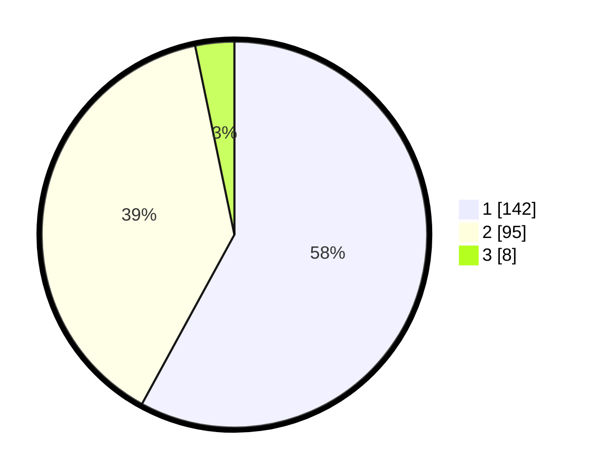

# Hasil

## Grafik

## Tabel

| No. | Nama Paslon    | Suara | Suara (raw) | Persentase |
|:--- |:-------------- | -----:| -----------:| ----------:|
| 1   | ANIES MUHAIMIN | 142   | [142][p-1]  | 57,96      |
| 2   | PRABOWO GIBRAN | 95    | [95][p-2]   | 38,78      |
| 3   | GANJAR MAHFUD  | 8     | [8][p-3]    | 3,27       |

[p-1]: https://github.com/gigit-pemilu/pemilu-2024/blob/main/pilpres/hitung-suara/sub/35-jawa-timur/sub/28-pamekasan/sub/09-pakong/sub/2009-seddur/sub/013-tps/sub/paslon-1.txt
[p-2]: https://github.com/gigit-pemilu/pemilu-2024/blob/main/pilpres/hitung-suara/sub/35-jawa-timur/sub/28-pamekasan/sub/09-pakong/sub/2009-seddur/sub/013-tps/sub/paslon-2.txt
[p-3]: https://github.com/gigit-pemilu/pemilu-2024/blob/main/pilpres/hitung-suara/sub/35-jawa-timur/sub/28-pamekasan/sub/09-pakong/sub/2009-seddur/sub/013-tps/sub/paslon-3.txt

## Foto C Plano

https://sirekap-obj-formc.kpu.go.id/0362/pemilu/ppwp/35/28/09/20/09/3528092009013-20240214-225536--53b525a9-4fd1-4593-a05d-a74f05419dce.jpg

https://sirekap-obj-formc.kpu.go.id/0362/pemilu/ppwp/35/28/09/20/09/3528092009013-20240214-225647--224627ac-37a3-4e00-bad7-a71ee76fa114.jpg

https://sirekap-obj-formc.kpu.go.id/0362/pemilu/ppwp/35/28/09/20/09/3528092009013-20240214-225740--7043cfd7-35db-4112-a821-bc17e9a6c1f6.jpg

## Metadata

| Key        | Value               |
| ---------- | ------------------- |
| Time Stamp | 2024-02-25 12:00:00 |

