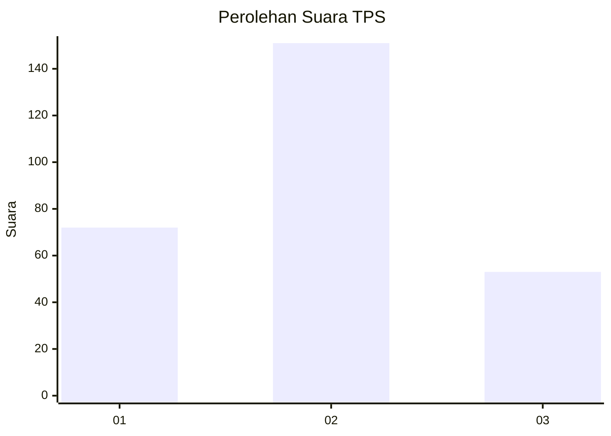
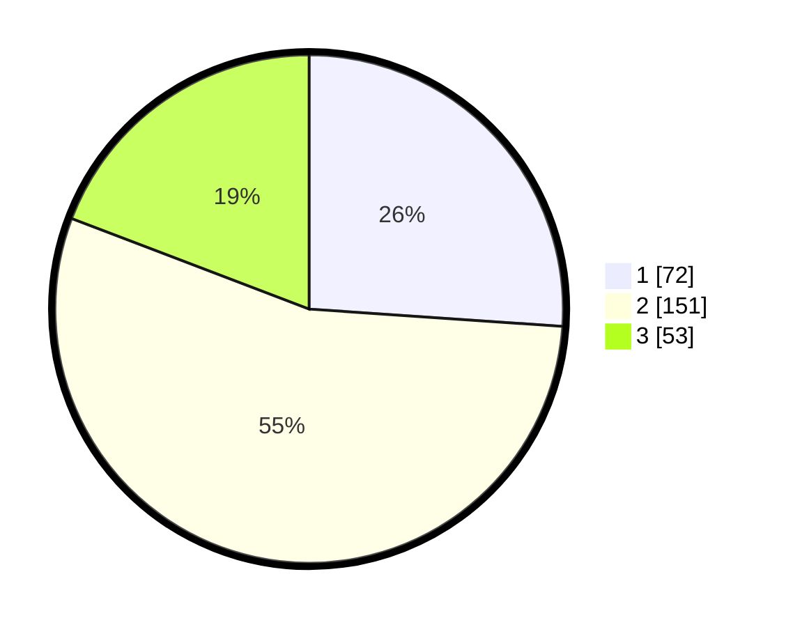

# Hasil

## Grafik

## Tabel

| No. | Nama Paslon    | Suara | Suara (raw) | Persentase |
|:--- |:-------------- | -----:| -----------:| ----------:|
| 1   | ANIES MUHAIMIN | 72    | [72][p-1]   | 26,09      |
| 2   | PRABOWO GIBRAN | 151   | [151][p-2]  | 54,71      |
| 3   | GANJAR MAHFUD  | 53    | [53][p-3]   | 19,20      |

[p-1]: https://github.com/gigit-pemilu/pemilu-2024/blob/main/pilpres/hitung-suara/sub/35-jawa-timur/sub/28-pamekasan/sub/09-pakong/sub/2009-seddur/sub/015-tps/sub/paslon-1.txt
[p-2]: https://github.com/gigit-pemilu/pemilu-2024/blob/main/pilpres/hitung-suara/sub/35-jawa-timur/sub/28-pamekasan/sub/09-pakong/sub/2009-seddur/sub/015-tps/sub/paslon-2.txt
[p-3]: https://github.com/gigit-pemilu/pemilu-2024/blob/main/pilpres/hitung-suara/sub/35-jawa-timur/sub/28-pamekasan/sub/09-pakong/sub/2009-seddur/sub/015-tps/sub/paslon-3.txt

## Foto C Plano

https://sirekap-obj-formc.kpu.go.id/5c42/pemilu/ppwp/35/28/09/20/09/3528092009015-20240214-235941--421edf42-9221-4c9d-b230-b02edf20300d.jpg

https://sirekap-obj-formc.kpu.go.id/5c42/pemilu/ppwp/35/28/09/20/09/3528092009015-20240215-000029--21586c38-ba24-4b68-996b-6573c31a2100.jpg

https://sirekap-obj-formc.kpu.go.id/5c42/pemilu/ppwp/35/28/09/20/09/3528092009015-20240215-000104--dd5b226c-6933-4d4a-9d45-40917647665b.jpg

## Metadata

| Key        | Value               |
| ---------- | ------------------- |
| Time Stamp | 2024-02-25 12:00:00 |

