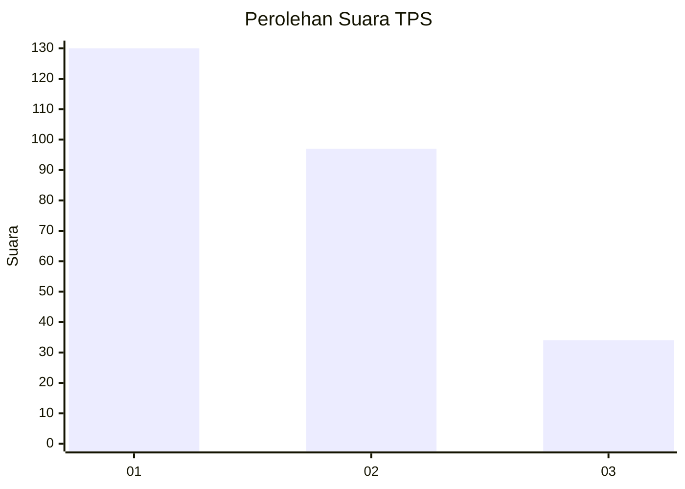
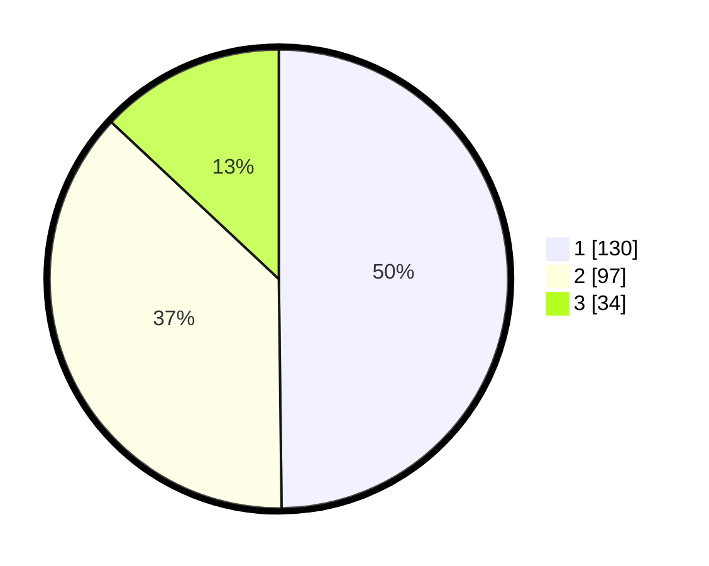

# Hasil

## Grafik

## Tabel

| No. | Nama Paslon    | Suara | Suara (raw) | Persentase |
|:--- |:-------------- | -----:| -----------:| ----------:|
| 1   | ANIES MUHAIMIN | 130   | [130][p-1]  | 49,81      |
| 2   | PRABOWO GIBRAN | 97    | [97][p-2]   | 37,16      |
| 3   | GANJAR MAHFUD  | 34    | [34][p-3]   | 13,03      |

[p-1]: https://github.com/gigit-pemilu/pemilu-2024-35-jawa-timur/blob/main/pilpres/hitung-suara/sub/35-jawa-timur/sub/28-pamekasan/sub/09-pakong/sub/2010-pakong/sub/004-tps/sub/paslon-1.txt
[p-2]: https://github.com/gigit-pemilu/pemilu-2024-35-jawa-timur/blob/main/pilpres/hitung-suara/sub/35-jawa-timur/sub/28-pamekasan/sub/09-pakong/sub/2010-pakong/sub/004-tps/sub/paslon-2.txt
[p-3]: https://github.com/gigit-pemilu/pemilu-2024-35-jawa-timur/blob/main/pilpres/hitung-suara/sub/35-jawa-timur/sub/28-pamekasan/sub/09-pakong/sub/2010-pakong/sub/004-tps/sub/paslon-3.txt

## Foto C Plano

https://sirekap-obj-formc.kpu.go.id/ca08/pemilu/ppwp/35/28/09/20/10/3528092010004-20240215-014659--5af0d5a5-8470-43ac-ba5d-c1900c42cdd3.jpg

https://sirekap-obj-formc.kpu.go.id/ca08/pemilu/ppwp/35/28/09/20/10/3528092010004-20240215-014703--0d044774-b600-44e7-b537-b323fd56eafb.jpg

https://sirekap-obj-formc.kpu.go.id/ca08/pemilu/ppwp/35/28/09/20/10/3528092010004-20240215-014706--7b8a5b20-d036-4b4b-8d90-f1ac590923b5.jpg

## Metadata

| Key        | Value               |
| ---------- | ------------------- |
| Time Stamp | 2024-02-24 22:31:28 |

