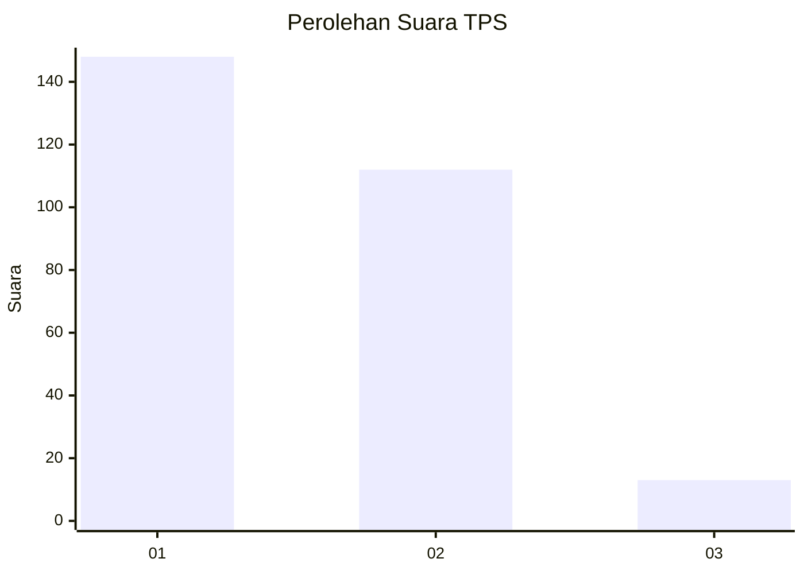
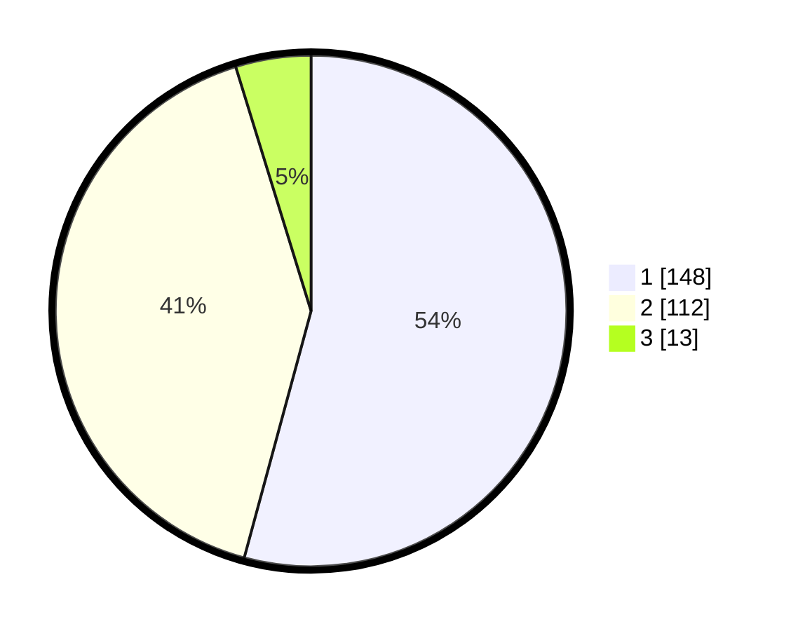

# Hasil

## Grafik

## Tabel

| No. | Nama Paslon    | Suara | Suara (raw) | Persentase |
|:--- |:-------------- | -----:| -----------:| ----------:|
| 1   | ANIES MUHAIMIN | 148   | [148][p-1]  | 54,21      |
| 2   | PRABOWO GIBRAN | 112   | [112][p-2]  | 41,03      |
| 3   | GANJAR MAHFUD  | 13    | [13][p-3]   | 4,76       |

[p-1]: https://github.com/gigit-pemilu/pemilu-2024/blob/main/pilpres/hitung-suara/sub/35-jawa-timur/sub/28-pamekasan/sub/09-pakong/sub/2010-pakong/sub/005-tps/sub/paslon-1.txt
[p-2]: https://github.com/gigit-pemilu/pemilu-2024/blob/main/pilpres/hitung-suara/sub/35-jawa-timur/sub/28-pamekasan/sub/09-pakong/sub/2010-pakong/sub/005-tps/sub/paslon-2.txt
[p-3]: https://github.com/gigit-pemilu/pemilu-2024/blob/main/pilpres/hitung-suara/sub/35-jawa-timur/sub/28-pamekasan/sub/09-pakong/sub/2010-pakong/sub/005-tps/sub/paslon-3.txt

## Foto C Plano

https://sirekap-obj-formc.kpu.go.id/659f/pemilu/ppwp/35/28/09/20/10/3528092010005-20240215-033237--13ca9bd9-2210-45c7-a650-5e478a2e0d9b.jpg

https://sirekap-obj-formc.kpu.go.id/659f/pemilu/ppwp/35/28/09/20/10/3528092010005-20240215-033331--ce807664-1891-4857-a349-7c9a954a5ee2.jpg

https://sirekap-obj-formc.kpu.go.id/659f/pemilu/ppwp/35/28/09/20/10/3528092010005-20240215-033447--01943c3c-4077-4f4a-931a-848fa5bb8a78.jpg

## Metadata

| Key        | Value               |
| ---------- | ------------------- |
| Time Stamp | 2024-02-15 22:40:13 |

