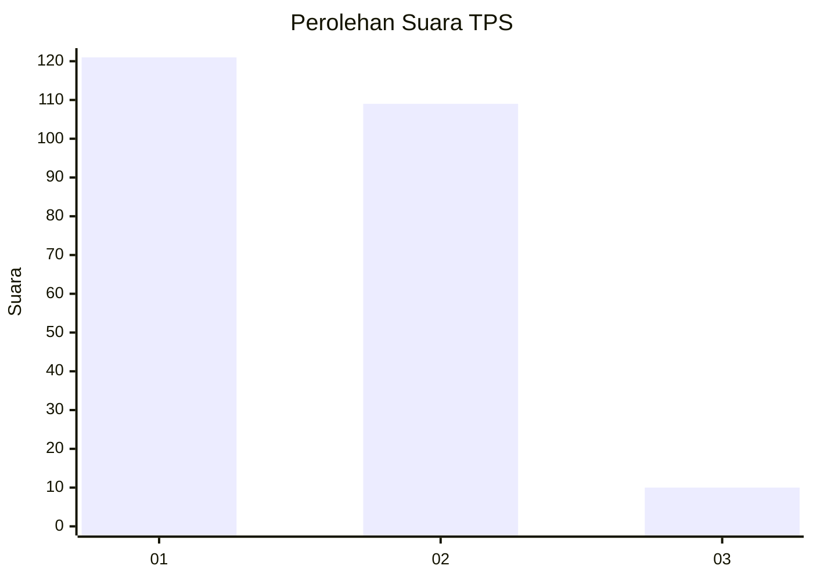
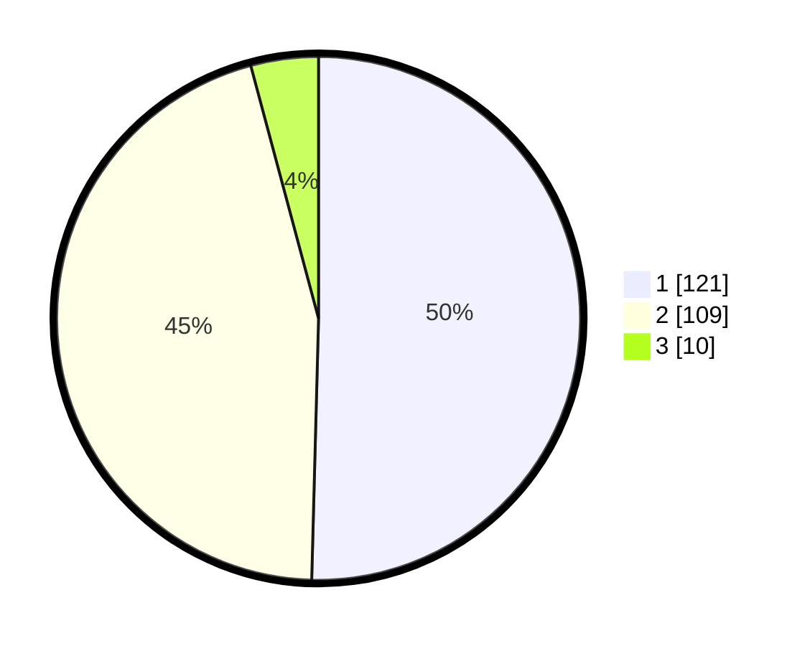

# Hasil

## Grafik

## Tabel

| No. | Nama Paslon    | Suara | Suara (raw) | Persentase |
|:--- |:-------------- | -----:| -----------:| ----------:|
| 1   | ANIES MUHAIMIN | 121   | [121][p-1]  | 50,42      |
| 2   | PRABOWO GIBRAN | 109   | [109][p-2]  | 45,42      |
| 3   | GANJAR MAHFUD  | 10    | [10][p-3]   | 4,17       |

[p-1]: https://github.com/gigit-pemilu/pemilu-2024-35-jawa-timur/blob/main/pilpres/hitung-suara/sub/35-jawa-timur/sub/28-pamekasan/sub/09-pakong/sub/2010-pakong/sub/006-tps/sub/paslon-1.txt
[p-2]: https://github.com/gigit-pemilu/pemilu-2024-35-jawa-timur/blob/main/pilpres/hitung-suara/sub/35-jawa-timur/sub/28-pamekasan/sub/09-pakong/sub/2010-pakong/sub/006-tps/sub/paslon-2.txt
[p-3]: https://github.com/gigit-pemilu/pemilu-2024-35-jawa-timur/blob/main/pilpres/hitung-suara/sub/35-jawa-timur/sub/28-pamekasan/sub/09-pakong/sub/2010-pakong/sub/006-tps/sub/paslon-3.txt

## Foto C Plano

https://sirekap-obj-formc.kpu.go.id/b630/pemilu/ppwp/35/28/09/20/10/3528092010006-20240215-045047--1cd46240-acd9-459e-b88f-9dd85ae821dc.jpg

https://sirekap-obj-formc.kpu.go.id/b630/pemilu/ppwp/35/28/09/20/10/3528092010006-20240215-044614--50385ef6-efb0-4bb7-8237-dc3a572ac931.jpg

https://sirekap-obj-formc.kpu.go.id/b630/pemilu/ppwp/35/28/09/20/10/3528092010006-20240214-230724--e24dcf11-1918-48cd-9faa-57827387194e.jpg

## Metadata

| Key        | Value               |
| ---------- | ------------------- |
| Time Stamp | 2024-02-15 22:40:13 |

