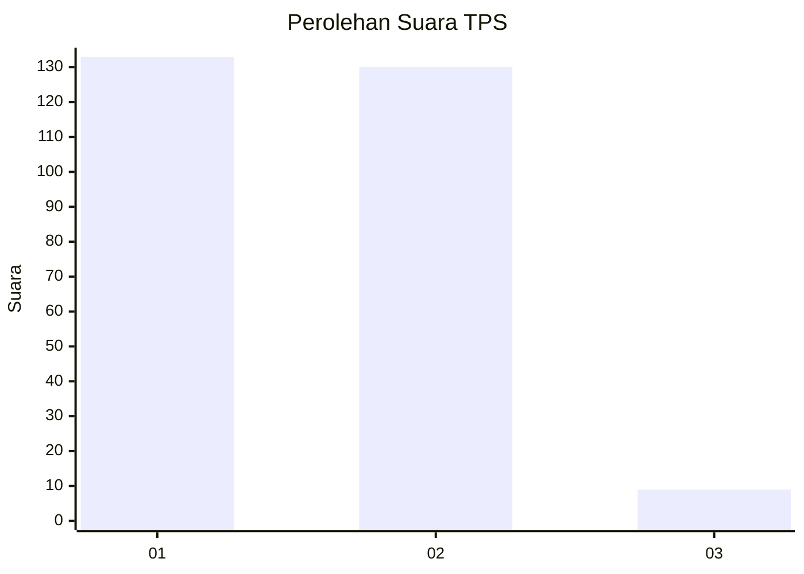
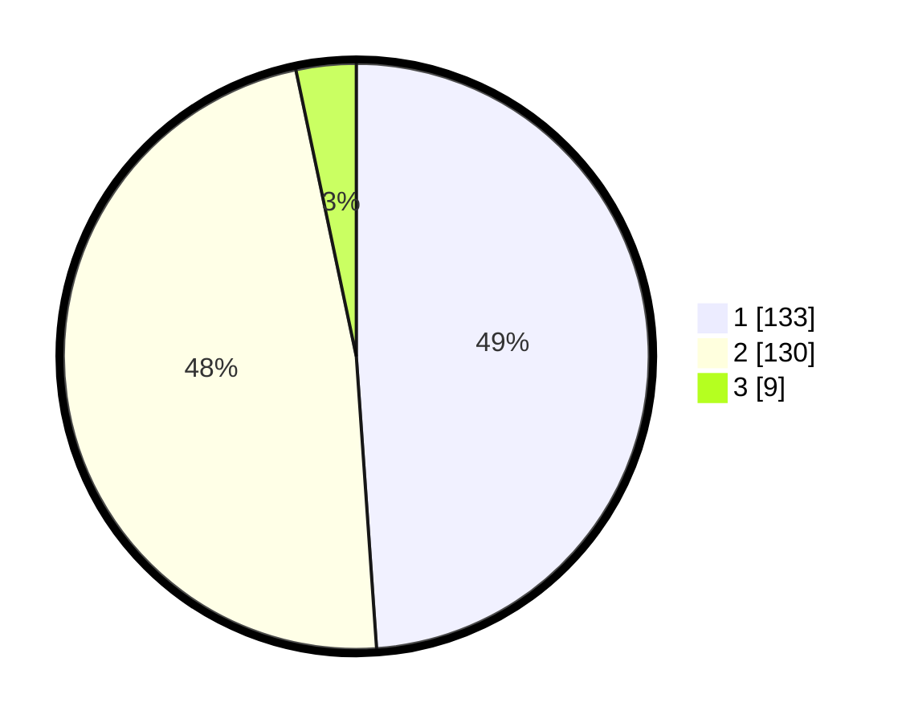

# Hasil

## Grafik

## Tabel

| No. | Nama Paslon    | Suara | Suara (raw) | Persentase |
|:--- |:-------------- | -----:| -----------:| ----------:|
| 1   | ANIES MUHAIMIN | 133   | [133][p-1]  | 48,90      |
| 2   | PRABOWO GIBRAN | 130   | [130][p-2]  | 47,79      |
| 3   | GANJAR MAHFUD  | 9     | [9][p-3]    | 3,31       |

[p-1]: https://github.com/gigit-pemilu/pemilu-2024-35-jawa-timur/blob/main/pilpres/hitung-suara/sub/35-jawa-timur/sub/28-pamekasan/sub/09-pakong/sub/2010-pakong/sub/007-tps/sub/paslon-1.txt
[p-2]: https://github.com/gigit-pemilu/pemilu-2024-35-jawa-timur/blob/main/pilpres/hitung-suara/sub/35-jawa-timur/sub/28-pamekasan/sub/09-pakong/sub/2010-pakong/sub/007-tps/sub/paslon-2.txt
[p-3]: https://github.com/gigit-pemilu/pemilu-2024-35-jawa-timur/blob/main/pilpres/hitung-suara/sub/35-jawa-timur/sub/28-pamekasan/sub/09-pakong/sub/2010-pakong/sub/007-tps/sub/paslon-3.txt

## Foto C Plano

https://sirekap-obj-formc.kpu.go.id/29e0/pemilu/ppwp/35/28/09/20/10/3528092010007-20240214-223240--8fbe36aa-a0bf-4f5b-8d07-fff94c737dd1.jpg

https://sirekap-obj-formc.kpu.go.id/29e0/pemilu/ppwp/35/28/09/20/10/3528092010007-20240214-191912--ab21c4c9-48d0-4b88-8001-027222902576.jpg

https://sirekap-obj-formc.kpu.go.id/29e0/pemilu/ppwp/35/28/09/20/10/3528092010007-20240214-191922--9633f1b9-a57b-42f0-84f3-9d1d78562d62.jpg

## Metadata

| Key        | Value               |
| ---------- | ------------------- |
| Time Stamp | 2024-02-15 19:00:26 |

