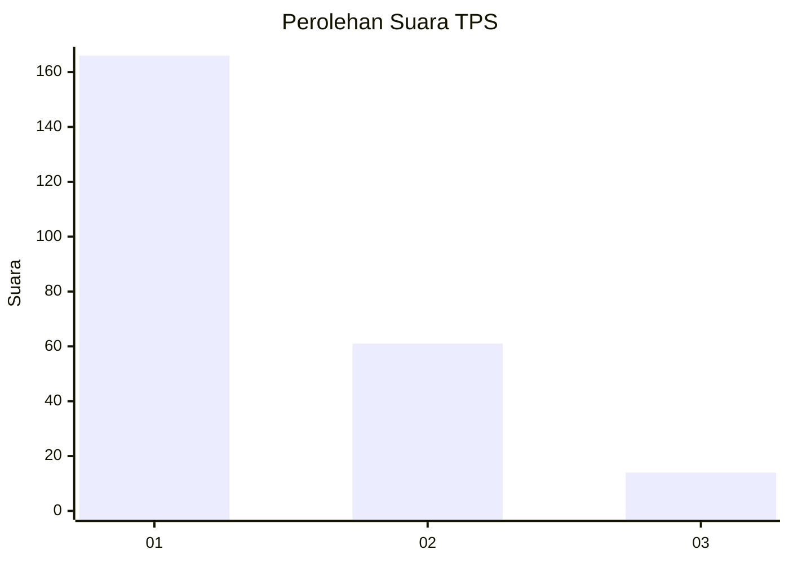
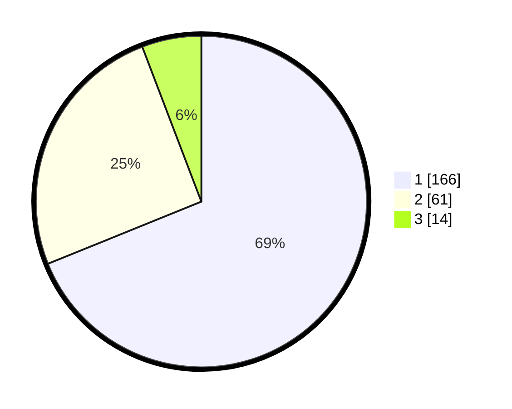

# Hasil

## Grafik

## Tabel

| No. | Nama Paslon    | Suara | Suara (raw) | Persentase |
|:--- |:-------------- | -----:| -----------:| ----------:|
| 1   | ANIES MUHAIMIN | 166   | [166][p-1]  | 68,88      |
| 2   | PRABOWO GIBRAN | 61    | [61][p-2]   | 25,31      |
| 3   | GANJAR MAHFUD  | 14    | [14][p-3]   | 5,81       |

[p-1]: https://github.com/gigit-pemilu/pemilu-2024/blob/main/pilpres/hitung-suara/sub/35-jawa-timur/sub/28-pamekasan/sub/09-pakong/sub/2010-pakong/sub/008-tps/sub/paslon-1.txt
[p-2]: https://github.com/gigit-pemilu/pemilu-2024/blob/main/pilpres/hitung-suara/sub/35-jawa-timur/sub/28-pamekasan/sub/09-pakong/sub/2010-pakong/sub/008-tps/sub/paslon-2.txt
[p-3]: https://github.com/gigit-pemilu/pemilu-2024/blob/main/pilpres/hitung-suara/sub/35-jawa-timur/sub/28-pamekasan/sub/09-pakong/sub/2010-pakong/sub/008-tps/sub/paslon-3.txt

## Foto C Plano

https://sirekap-obj-formc.kpu.go.id/be11/pemilu/ppwp/35/28/09/20/10/3528092010008-20240217-093341--fac18ba7-d758-458a-ac82-afc3b0018133.jpg

https://sirekap-obj-formc.kpu.go.id/be11/pemilu/ppwp/35/28/09/20/10/3528092010008-20240217-093505--2da9090d-27df-43c6-a99b-6b1c5886caf2.jpg

https://sirekap-obj-formc.kpu.go.id/be11/pemilu/ppwp/35/28/09/20/10/3528092010008-20240217-093727--4cd4d286-40ee-46fe-b64f-a0d5b7de723d.jpg

## Metadata

| Key        | Value               |
| ---------- | ------------------- |
| Time Stamp | 2024-02-17 13:37:34 |

