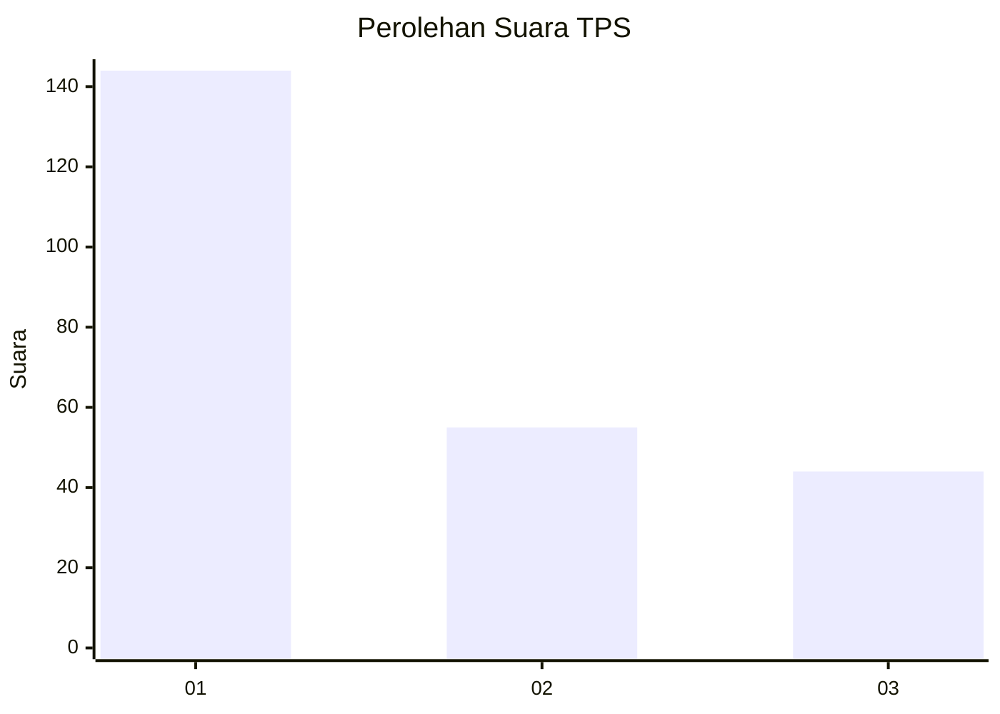
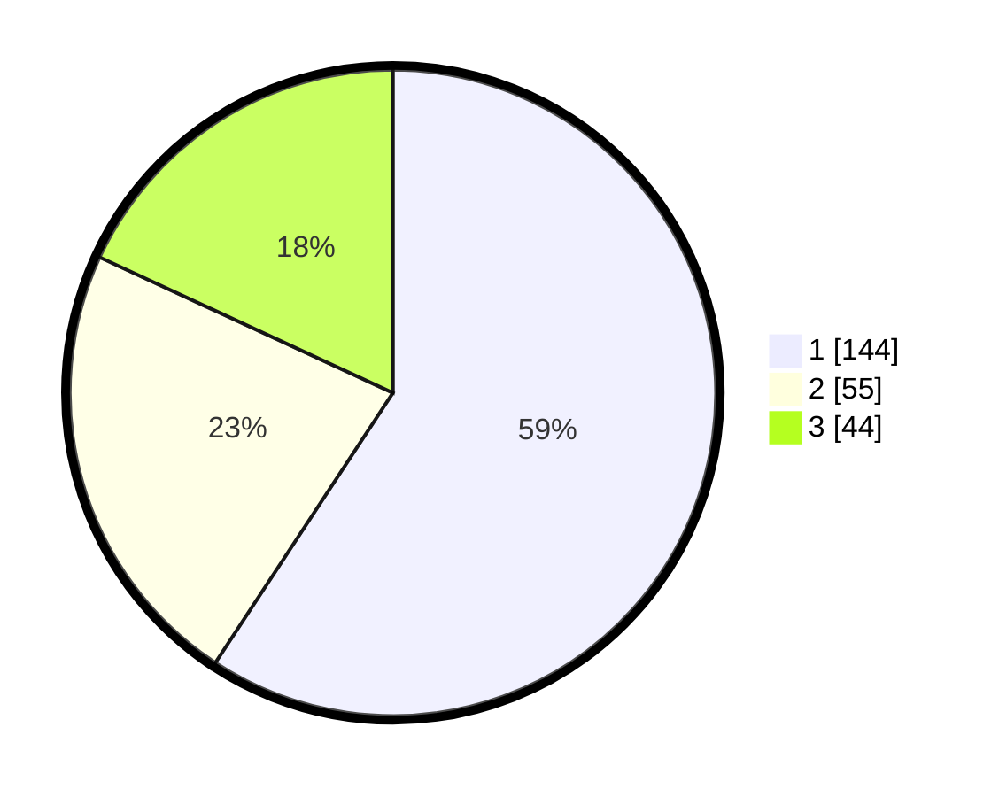

# Hasil

## Grafik

## Tabel

| No. | Nama Paslon    | Suara | Suara (raw) | Persentase |
|:--- |:-------------- | -----:| -----------:| ----------:|
| 1   | ANIES MUHAIMIN | 144   | [144][p-1]  | 59,26      |
| 2   | PRABOWO GIBRAN | 55    | [55][p-2]   | 22,63      |
| 3   | GANJAR MAHFUD  | 44    | [44][p-3]   | 18,11      |

[p-1]: https://github.com/gigit-pemilu/pemilu-2024-35-jawa-timur/blob/main/pilpres/hitung-suara/sub/35-jawa-timur/sub/28-pamekasan/sub/09-pakong/sub/2010-pakong/sub/012-tps/sub/paslon-1.txt
[p-2]: https://github.com/gigit-pemilu/pemilu-2024-35-jawa-timur/blob/main/pilpres/hitung-suara/sub/35-jawa-timur/sub/28-pamekasan/sub/09-pakong/sub/2010-pakong/sub/012-tps/sub/paslon-2.txt
[p-3]: https://github.com/gigit-pemilu/pemilu-2024-35-jawa-timur/blob/main/pilpres/hitung-suara/sub/35-jawa-timur/sub/28-pamekasan/sub/09-pakong/sub/2010-pakong/sub/012-tps/sub/paslon-3.txt

## Foto C Plano

https://sirekap-obj-formc.kpu.go.id/757a/pemilu/ppwp/35/28/09/20/10/3528092010012-20240214-213446--2c436b6b-b86f-4ee6-958f-88d96a44fc7b.jpg

https://sirekap-obj-formc.kpu.go.id/757a/pemilu/ppwp/35/28/09/20/10/3528092010012-20240214-211226--fb69529d-9006-4cf5-9ad4-f2a8541aa5ee.jpg

https://sirekap-obj-formc.kpu.go.id/757a/pemilu/ppwp/35/28/09/20/10/3528092010012-20240214-213803--623f40dd-e9b1-4c3b-8d35-26ace1d99f97.jpg

## Metadata

| Key        | Value               |
| ---------- | ------------------- |
| Time Stamp | 2024-02-15 23:29:50 |

