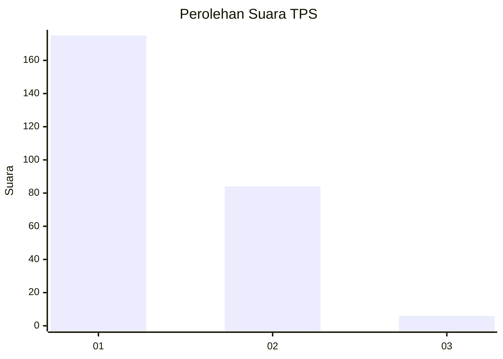
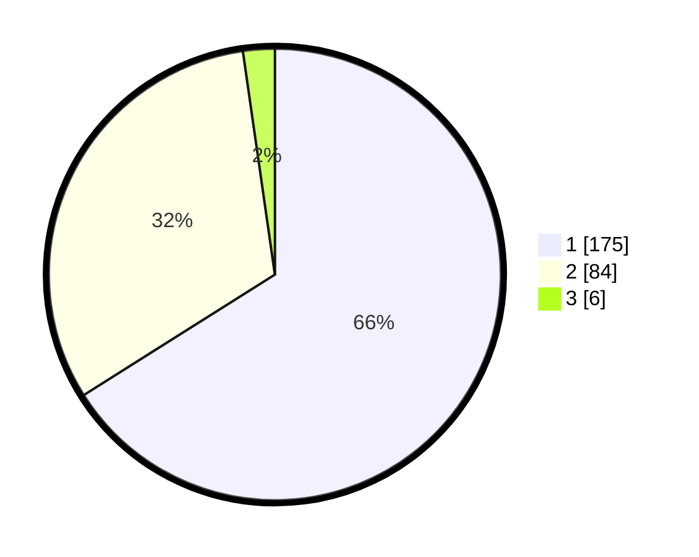

# Hasil

## Grafik

## Tabel

| No. | Nama Paslon    | Suara | Suara (raw) | Persentase |
|:--- |:-------------- | -----:| -----------:| ----------:|
| 1   | ANIES MUHAIMIN | 175   | [175][p-1]  | 66,04      |
| 2   | PRABOWO GIBRAN | 84    | [84][p-2]   | 31,70      |
| 3   | GANJAR MAHFUD  | 6     | [6][p-3]    | 2,26       |

[p-1]: https://github.com/gigit-pemilu/pemilu-2024/blob/main/pilpres/hitung-suara/sub/35-jawa-timur/sub/28-pamekasan/sub/09-pakong/sub/2011-bandungan/sub/003-tps/sub/paslon-1.txt
[p-2]: https://github.com/gigit-pemilu/pemilu-2024/blob/main/pilpres/hitung-suara/sub/35-jawa-timur/sub/28-pamekasan/sub/09-pakong/sub/2011-bandungan/sub/003-tps/sub/paslon-2.txt
[p-3]: https://github.com/gigit-pemilu/pemilu-2024/blob/main/pilpres/hitung-suara/sub/35-jawa-timur/sub/28-pamekasan/sub/09-pakong/sub/2011-bandungan/sub/003-tps/sub/paslon-3.txt

## Foto C Plano

https://sirekap-obj-formc.kpu.go.id/43e5/pemilu/ppwp/35/28/09/20/11/3528092011003-20240215-013402--41d1c73a-e378-49bf-acf3-5770560f80f8.jpg

https://sirekap-obj-formc.kpu.go.id/43e5/pemilu/ppwp/35/28/09/20/11/3528092011003-20240215-013557--ec2e2bfa-5789-4f6c-a6d9-9b36a63bb3bb.jpg

https://sirekap-obj-formc.kpu.go.id/43e5/pemilu/ppwp/35/28/09/20/11/3528092011003-20240215-013817--8f2eed96-0fa7-4f69-a85c-038b87e2c54e.jpg

## Metadata

| Key        | Value               |
| ---------- | ------------------- |
| Time Stamp | 2024-02-25 12:00:00 |

