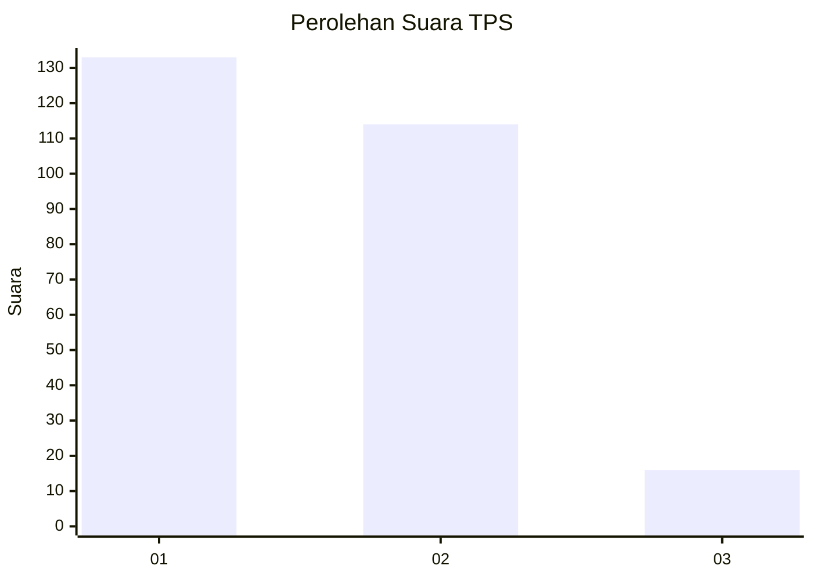
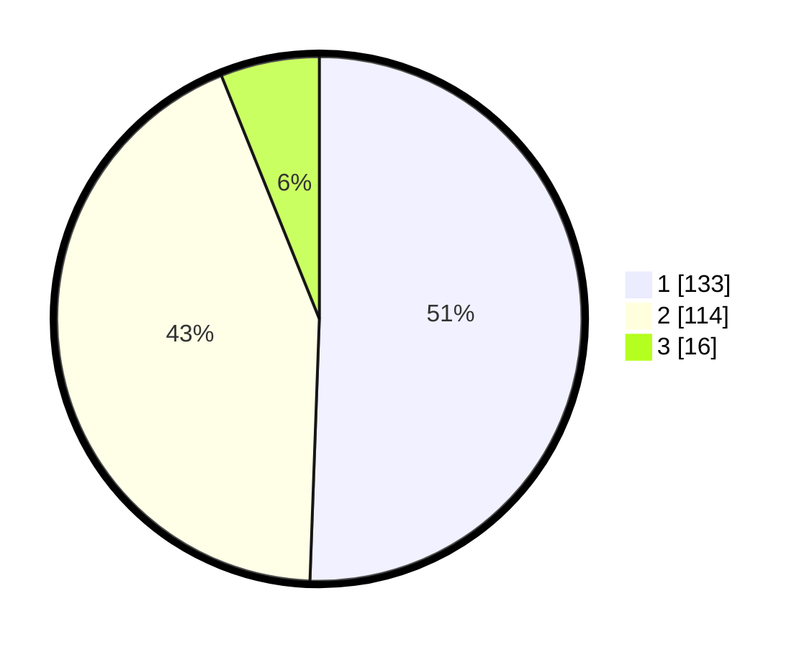

# Hasil

## Grafik

## Tabel

| No. | Nama Paslon    | Suara | Suara (raw) | Persentase |
|:--- |:-------------- | -----:| -----------:| ----------:|
| 1   | ANIES MUHAIMIN | 133   | [133][p-1]  | 50,57      |
| 2   | PRABOWO GIBRAN | 114   | [114][p-2]  | 43,35      |
| 3   | GANJAR MAHFUD  | 16    | [16][p-3]   | 6,08       |

[p-1]: https://github.com/gigit-pemilu/pemilu-2024/blob/main/pilpres/hitung-suara/sub/35-jawa-timur/sub/28-pamekasan/sub/09-pakong/sub/2012-lebbek/sub/001-tps/sub/paslon-1.txt
[p-2]: https://github.com/gigit-pemilu/pemilu-2024/blob/main/pilpres/hitung-suara/sub/35-jawa-timur/sub/28-pamekasan/sub/09-pakong/sub/2012-lebbek/sub/001-tps/sub/paslon-2.txt
[p-3]: https://github.com/gigit-pemilu/pemilu-2024/blob/main/pilpres/hitung-suara/sub/35-jawa-timur/sub/28-pamekasan/sub/09-pakong/sub/2012-lebbek/sub/001-tps/sub/paslon-3.txt

## Foto C Plano

https://sirekap-obj-formc.kpu.go.id/181a/pemilu/ppwp/35/28/09/20/12/3528092012001-20240215-081329--e8711ac9-3a9b-4ba6-9059-9f8ab1c075b5.jpg

https://sirekap-obj-formc.kpu.go.id/181a/pemilu/ppwp/35/28/09/20/12/3528092012001-20240215-081420--ef84b40c-4173-48f2-9c4d-b50dbdebd677.jpg

https://sirekap-obj-formc.kpu.go.id/181a/pemilu/ppwp/35/28/09/20/12/3528092012001-20240215-081540--9537fc3d-81d2-4d7d-9b73-d4bad51c819f.jpg

## Metadata

| Key        | Value               |
| ---------- | ------------------- |
| Time Stamp | 2024-02-25 16:00:00 |

