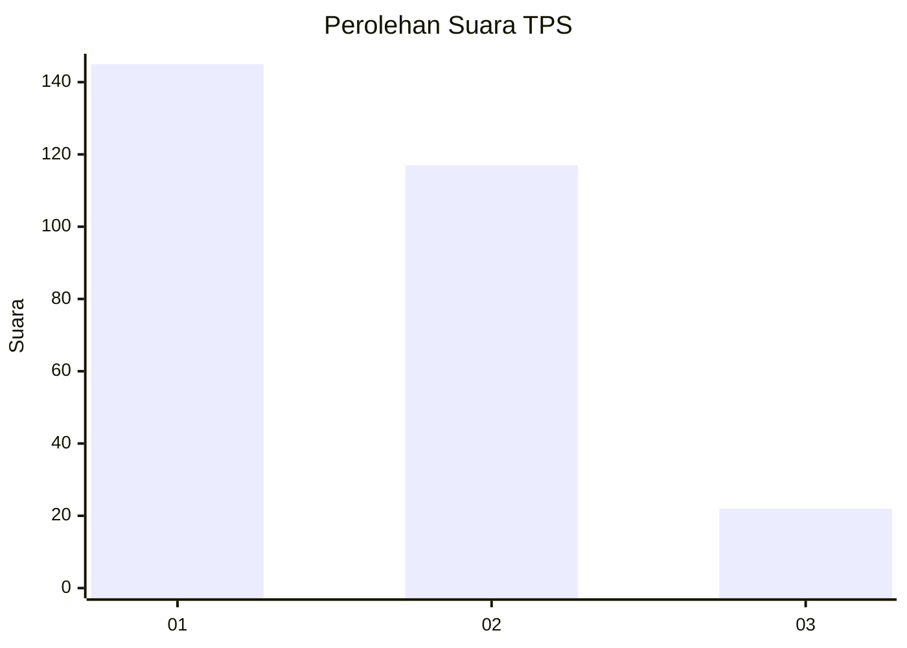
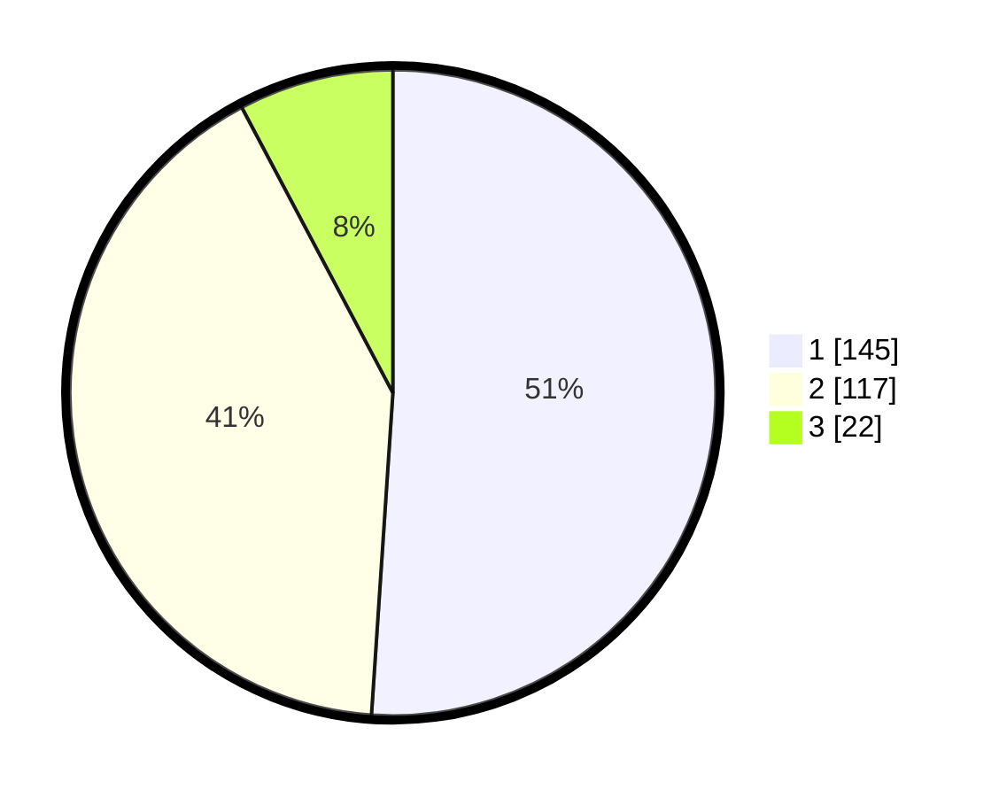

# Hasil

## Grafik

## Tabel

| No. | Nama Paslon    | Suara | Suara (raw) | Persentase |
|:--- |:-------------- | -----:| -----------:| ----------:|
| 1   | ANIES MUHAIMIN | 145   | [145][p-1]  | 51,06      |
| 2   | PRABOWO GIBRAN | 117   | [117][p-2]  | 41,20      |
| 3   | GANJAR MAHFUD  | 22    | [22][p-3]   | 7,75       |

[p-1]: https://github.com/gigit-pemilu/pemilu-2024/blob/main/pilpres/hitung-suara/sub/35-jawa-timur/sub/28-pamekasan/sub/09-pakong/sub/2012-lebbek/sub/002-tps/sub/paslon-1.txt
[p-2]: https://github.com/gigit-pemilu/pemilu-2024/blob/main/pilpres/hitung-suara/sub/35-jawa-timur/sub/28-pamekasan/sub/09-pakong/sub/2012-lebbek/sub/002-tps/sub/paslon-2.txt
[p-3]: https://github.com/gigit-pemilu/pemilu-2024/blob/main/pilpres/hitung-suara/sub/35-jawa-timur/sub/28-pamekasan/sub/09-pakong/sub/2012-lebbek/sub/002-tps/sub/paslon-3.txt

## Foto C Plano

https://sirekap-obj-formc.kpu.go.id/8958/pemilu/ppwp/35/28/09/20/12/3528092012002-20240215-055014--96738c51-02cd-45ec-9621-7b3abe8fbaac.jpg

https://sirekap-obj-formc.kpu.go.id/8958/pemilu/ppwp/35/28/09/20/12/3528092012002-20240215-055051--c88492c1-a4f4-4a7d-b706-fde4d0f5d1ec.jpg

https://sirekap-obj-formc.kpu.go.id/8958/pemilu/ppwp/35/28/09/20/12/3528092012002-20240215-055138--4f029ff6-afd8-411d-a0e0-dec5069eec80.jpg

## Metadata

| Key        | Value               |
| ---------- | ------------------- |
| Time Stamp | 2024-02-16 14:00:34 |

