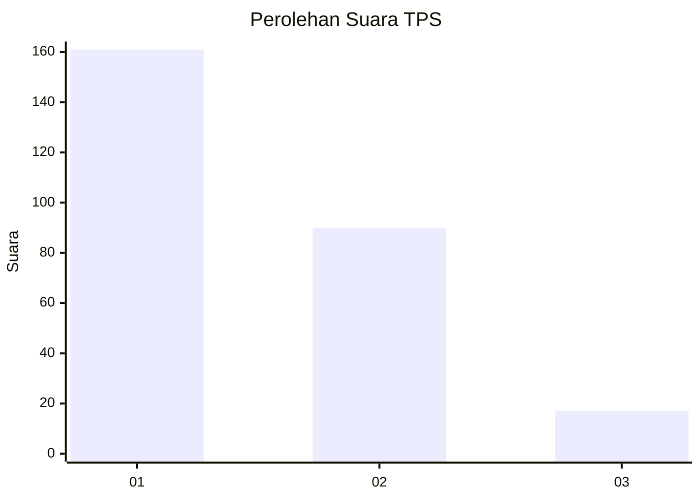
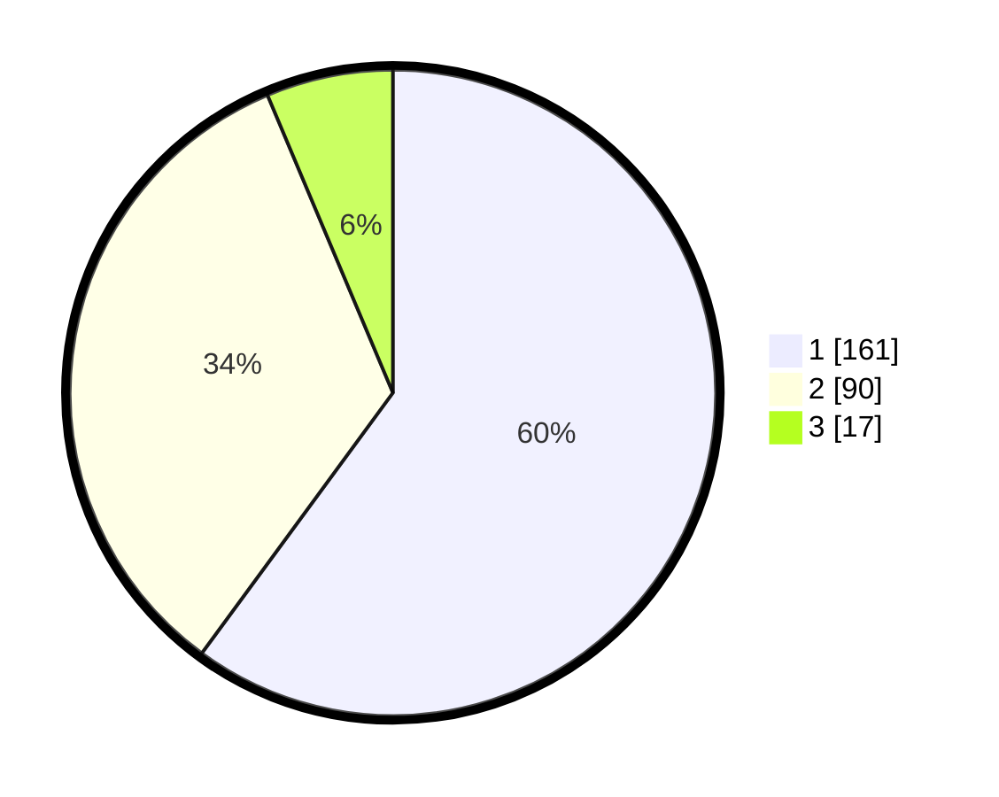

# Hasil

## Grafik

## Tabel

| No. | Nama Paslon    | Suara | Suara (raw) | Persentase |
|:--- |:-------------- | -----:| -----------:| ----------:|
| 1   | ANIES MUHAIMIN | 161   | [161][p-1]  | 60,07      |
| 2   | PRABOWO GIBRAN | 90    | [90][p-2]   | 33,58      |
| 3   | GANJAR MAHFUD  | 17    | [17][p-3]   | 6,34       |

[p-1]: https://github.com/gigit-pemilu/pemilu-2024/blob/main/pilpres/hitung-suara/sub/35-jawa-timur/sub/28-pamekasan/sub/09-pakong/sub/2012-lebbek/sub/003-tps/sub/paslon-1.txt
[p-2]: https://github.com/gigit-pemilu/pemilu-2024/blob/main/pilpres/hitung-suara/sub/35-jawa-timur/sub/28-pamekasan/sub/09-pakong/sub/2012-lebbek/sub/003-tps/sub/paslon-2.txt
[p-3]: https://github.com/gigit-pemilu/pemilu-2024/blob/main/pilpres/hitung-suara/sub/35-jawa-timur/sub/28-pamekasan/sub/09-pakong/sub/2012-lebbek/sub/003-tps/sub/paslon-3.txt

## Foto C Plano

https://sirekap-obj-formc.kpu.go.id/1644/pemilu/ppwp/35/28/09/20/12/3528092012003-20240214-201059--acb4de6c-1da2-45fa-9bbb-d56d303ed50b.jpg

https://sirekap-obj-formc.kpu.go.id/1644/pemilu/ppwp/35/28/09/20/12/3528092012003-20240214-201452--97e2ad86-d71f-49b7-bf1c-863dda281edd.jpg

https://sirekap-obj-formc.kpu.go.id/1644/pemilu/ppwp/35/28/09/20/12/3528092012003-20240214-201539--004a5a55-766d-4b50-869f-f72efce77169.jpg

## Metadata

| Key        | Value               |
| ---------- | ------------------- |
| Time Stamp | 2024-02-24 22:31:28 |

