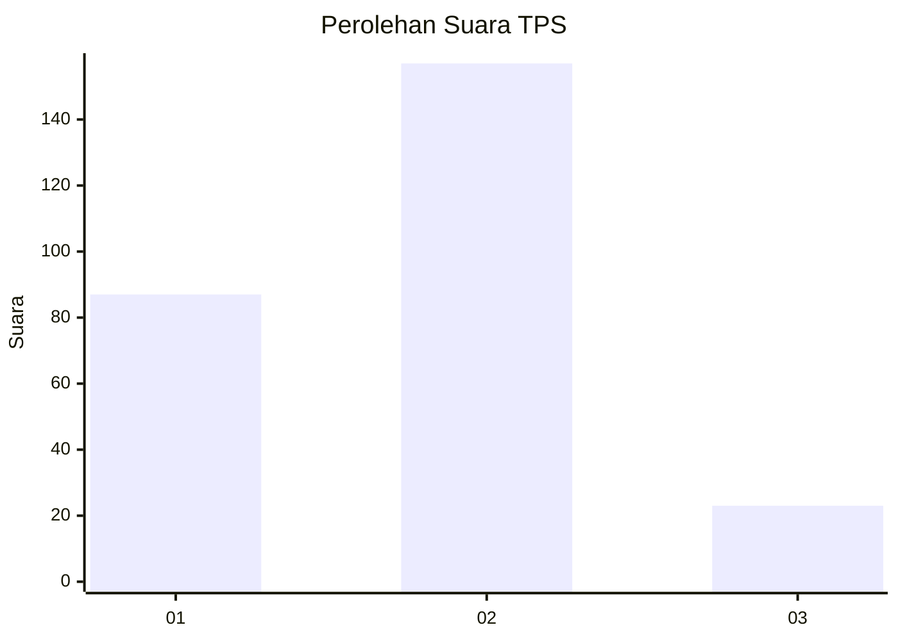
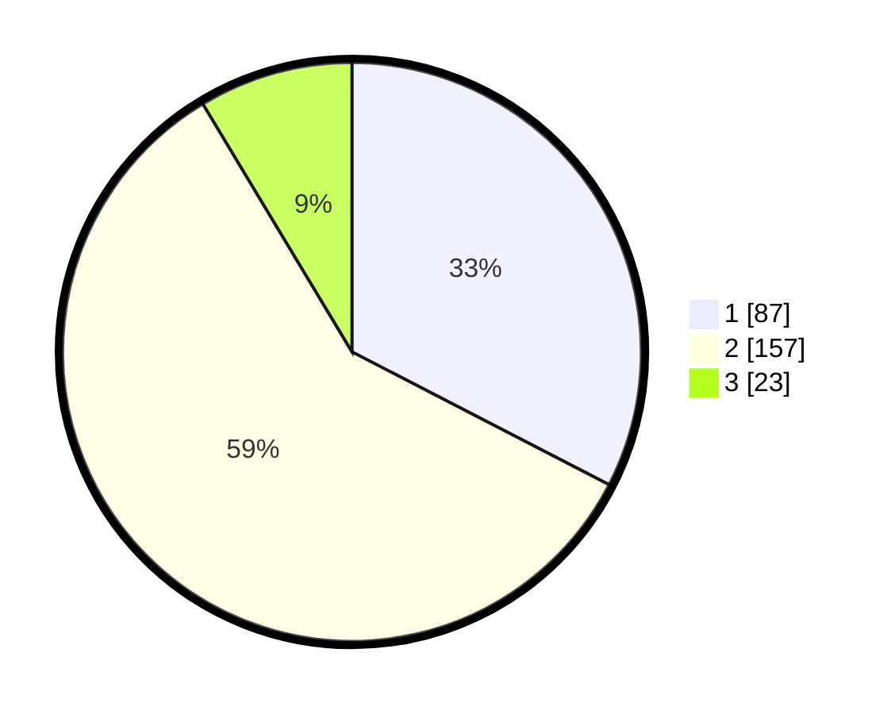

# Hasil

## Grafik

## Tabel

| No. | Nama Paslon    | Suara | Suara (raw) | Persentase |
|:--- |:-------------- | -----:| -----------:| ----------:|
| 1   | ANIES MUHAIMIN | 87    | [87][p-1]   | 32,58      |
| 2   | PRABOWO GIBRAN | 157   | [157][p-2]  | 58,80      |
| 3   | GANJAR MAHFUD  | 23    | [23][p-3]   | 8,61       |

[p-1]: https://github.com/gigit-pemilu/pemilu-2024-35-jawa-timur/blob/main/pilpres/hitung-suara/sub/35-jawa-timur/sub/28-pamekasan/sub/09-pakong/sub/2012-lebbek/sub/010-tps/sub/paslon-1.txt
[p-2]: https://github.com/gigit-pemilu/pemilu-2024-35-jawa-timur/blob/main/pilpres/hitung-suara/sub/35-jawa-timur/sub/28-pamekasan/sub/09-pakong/sub/2012-lebbek/sub/010-tps/sub/paslon-2.txt
[p-3]: https://github.com/gigit-pemilu/pemilu-2024-35-jawa-timur/blob/main/pilpres/hitung-suara/sub/35-jawa-timur/sub/28-pamekasan/sub/09-pakong/sub/2012-lebbek/sub/010-tps/sub/paslon-3.txt

## Foto C Plano

https://sirekap-obj-formc.kpu.go.id/15cd/pemilu/ppwp/35/28/09/20/12/3528092012010-20240215-062633--c9f89d75-ac5c-4b85-a8ee-9ecfa1d8b972.jpg

https://sirekap-obj-formc.kpu.go.id/15cd/pemilu/ppwp/35/28/09/20/12/3528092012010-20240214-225127--b3802b41-a2cd-4728-8d32-b56ee2b68f95.jpg

https://sirekap-obj-formc.kpu.go.id/15cd/pemilu/ppwp/35/28/09/20/12/3528092012010-20240214-225231--bf3b273c-5bad-484c-acf9-13cb4a565e99.jpg

## Metadata

| Key        | Value               |
| ---------- | ------------------- |
| Time Stamp | 2024-02-25 15:00:00 |

