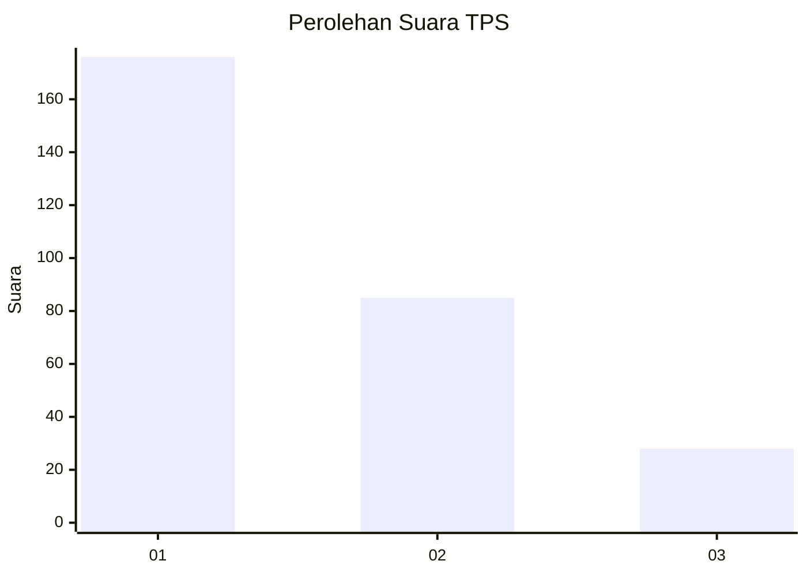
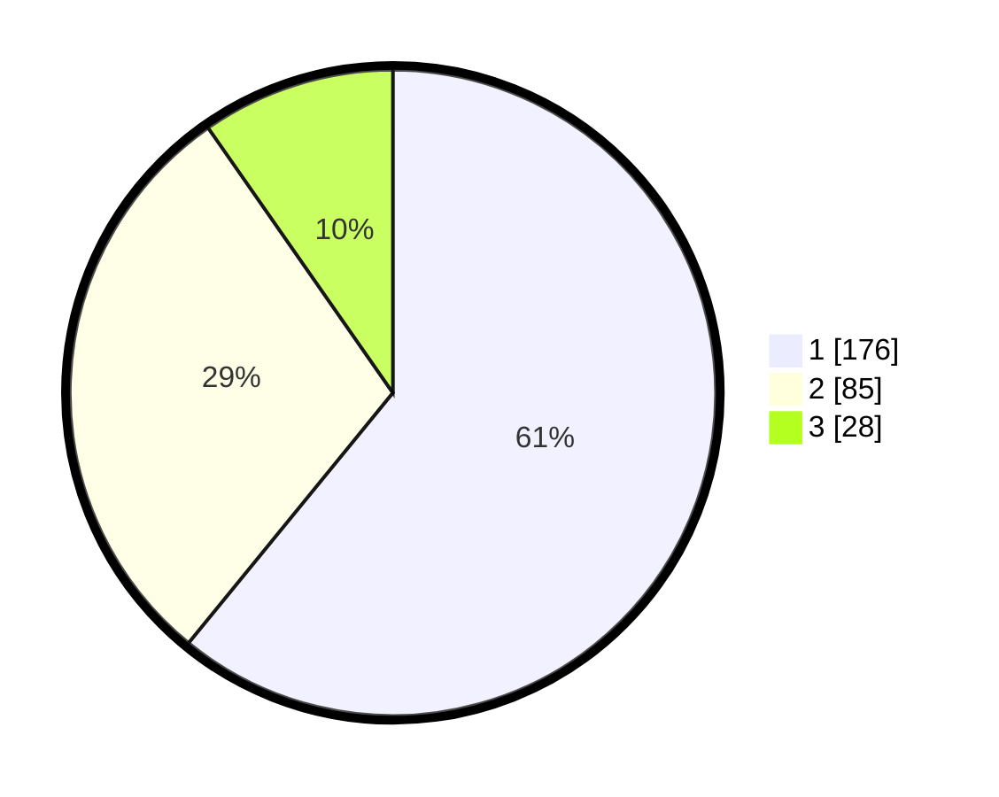

# Hasil

## Grafik

## Tabel

| No. | Nama Paslon    | Suara | Suara (raw) | Persentase |
|:--- |:-------------- | -----:| -----------:| ----------:|
| 1   | ANIES MUHAIMIN | 176   | [176][p-1]  | 60,90      |
| 2   | PRABOWO GIBRAN | 85    | [85][p-2]   | 29,41      |
| 3   | GANJAR MAHFUD  | 28    | [28][p-3]   | 9,69       |

[p-1]: https://github.com/gigit-pemilu/pemilu-2024/blob/main/pilpres/hitung-suara/sub/35-jawa-timur/sub/28-pamekasan/sub/10-waru/sub/2001-bajur/sub/008-tps/sub/paslon-1.txt
[p-2]: https://github.com/gigit-pemilu/pemilu-2024/blob/main/pilpres/hitung-suara/sub/35-jawa-timur/sub/28-pamekasan/sub/10-waru/sub/2001-bajur/sub/008-tps/sub/paslon-2.txt
[p-3]: https://github.com/gigit-pemilu/pemilu-2024/blob/main/pilpres/hitung-suara/sub/35-jawa-timur/sub/28-pamekasan/sub/10-waru/sub/2001-bajur/sub/008-tps/sub/paslon-3.txt

## Foto C Plano

https://sirekap-obj-formc.kpu.go.id/e253/pemilu/ppwp/35/28/10/20/01/3528102001008-20240215-054804--0cfc3dfb-94d9-4cfe-92e5-7e8eef436154.jpg

https://sirekap-obj-formc.kpu.go.id/e253/pemilu/ppwp/35/28/10/20/01/3528102001008-20240215-054439--d20f8ce8-e7c0-4975-a280-4e0f0479f1a3.jpg

https://sirekap-obj-formc.kpu.go.id/e253/pemilu/ppwp/35/28/10/20/01/3528102001008-20240214-205651--4880de38-bc0c-4c71-b759-b5c3f53aad4f.jpg

## Metadata

| Key        | Value               |
| ---------- | ------------------- |
| Time Stamp | 2024-02-15 15:00:29 |

## DATA PEMILIH TETAP

Jumlah pemilih dalam DPT: **299**.
 * L: **139**.
 * P: **160**.

## DATA PENGGUNA HAK PILIH

Jumlah pengguna hak pilih dalam DPT: **297**.
 * L: **137**.
 * P: **160**.

Jumlah pengguna hak pilih dalam DPTb: **0**.
 * L: **0**.
 * P: **0**.

Jumlah pengguna hak pilih dalam DPK: **5**.
 * L: **2**.
 * P: **3**.

Jumlah pengguna hak pilih: **302**.
 * L: **139**.
 * P: **163**.

## JUMLAH SUARA SAH DAN TIDAK SAH

JUMLAH SELURUH SUARA SAH: **289**.

JUMLAH SUARA TIDAK SAH: **13**.

JUMLAH SELURUH SUARA SAH DAN SUARA TIDAK SAH: **302**.

