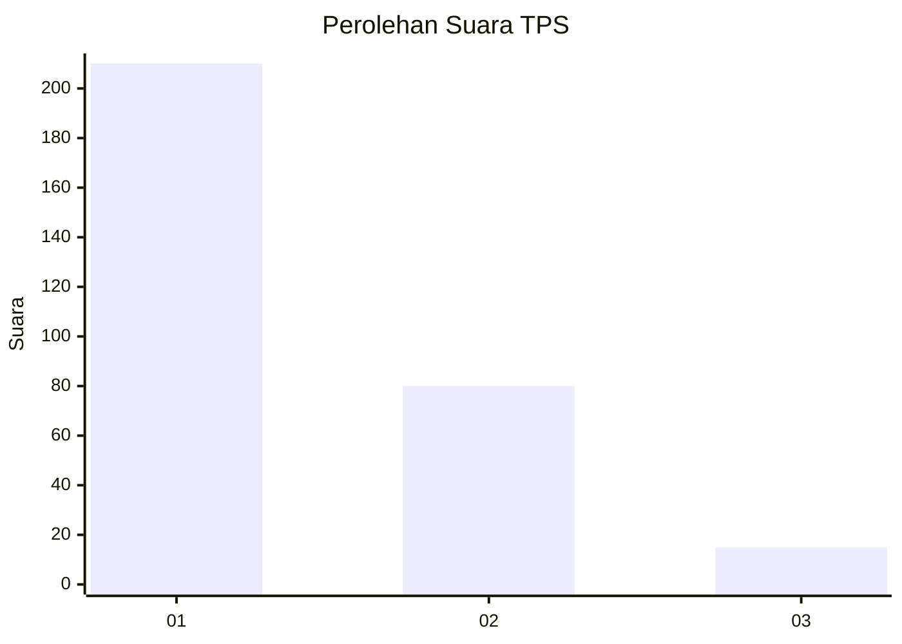
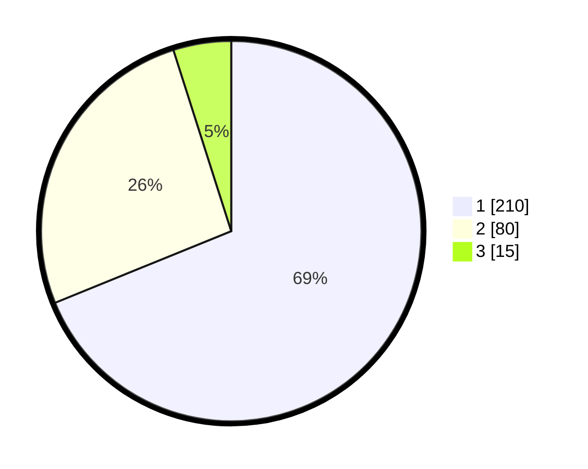

# Hasil

## Grafik

## Tabel

| No. | Nama Paslon    | Suara | Suara (raw) | Persentase |
|:--- |:-------------- | -----:| -----------:| ----------:|
| 1   | ANIES MUHAIMIN | 210   | [210][p-1]  | 68,85      |
| 2   | PRABOWO GIBRAN | 80    | [80][p-2]   | 26,23      |
| 3   | GANJAR MAHFUD  | 15    | [15][p-3]   | 4,92       |

[p-1]: https://github.com/gigit-pemilu/pemilu-2024/blob/main/pilpres/hitung-suara/sub/35-jawa-timur/sub/28-pamekasan/sub/10-waru/sub/2001-bajur/sub/009-tps/sub/paslon-1.txt
[p-2]: https://github.com/gigit-pemilu/pemilu-2024/blob/main/pilpres/hitung-suara/sub/35-jawa-timur/sub/28-pamekasan/sub/10-waru/sub/2001-bajur/sub/009-tps/sub/paslon-2.txt
[p-3]: https://github.com/gigit-pemilu/pemilu-2024/blob/main/pilpres/hitung-suara/sub/35-jawa-timur/sub/28-pamekasan/sub/10-waru/sub/2001-bajur/sub/009-tps/sub/paslon-3.txt

## Foto C Plano

https://sirekap-obj-formc.kpu.go.id/9e13/pemilu/ppwp/35/28/10/20/01/3528102001009-20240214-194107--4cad7412-6c54-4aef-a89a-1f8097cb111c.jpg

https://sirekap-obj-formc.kpu.go.id/9e13/pemilu/ppwp/35/28/10/20/01/3528102001009-20240214-200655--ab365a85-2a61-45a0-a027-bc055b59d207.jpg

https://sirekap-obj-formc.kpu.go.id/9e13/pemilu/ppwp/35/28/10/20/01/3528102001009-20240214-194244--f3b8f9c2-486b-4abe-9100-f20c3733f8a3.jpg

## Metadata

| Key        | Value               |
| ---------- | ------------------- |
| Time Stamp | 2024-02-14 21:46:01 |

## DATA PEMILIH TETAP

Jumlah pemilih dalam DPT: **300**.
 * L: **139**.
 * P: **161**.

## DATA PENGGUNA HAK PILIH

Jumlah pengguna hak pilih dalam DPT: **299**.
 * L: **139**.
 * P: **160**.

Jumlah pengguna hak pilih dalam DPTb: **5**.
 * L: **4**.
 * P: **1**.

Jumlah pengguna hak pilih dalam DPK: **1**.
 * L: **1**.
 * P: **0**.

Jumlah pengguna hak pilih: **305**.
 * L: **144**.
 * P: **161**.

## JUMLAH SUARA SAH DAN TIDAK SAH

JUMLAH SELURUH SUARA SAH: **305**.

JUMLAH SUARA TIDAK SAH: **1**.

JUMLAH SELURUH SUARA SAH DAN SUARA TIDAK SAH: **306**.

