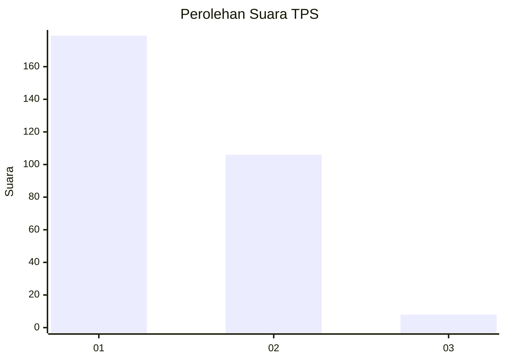
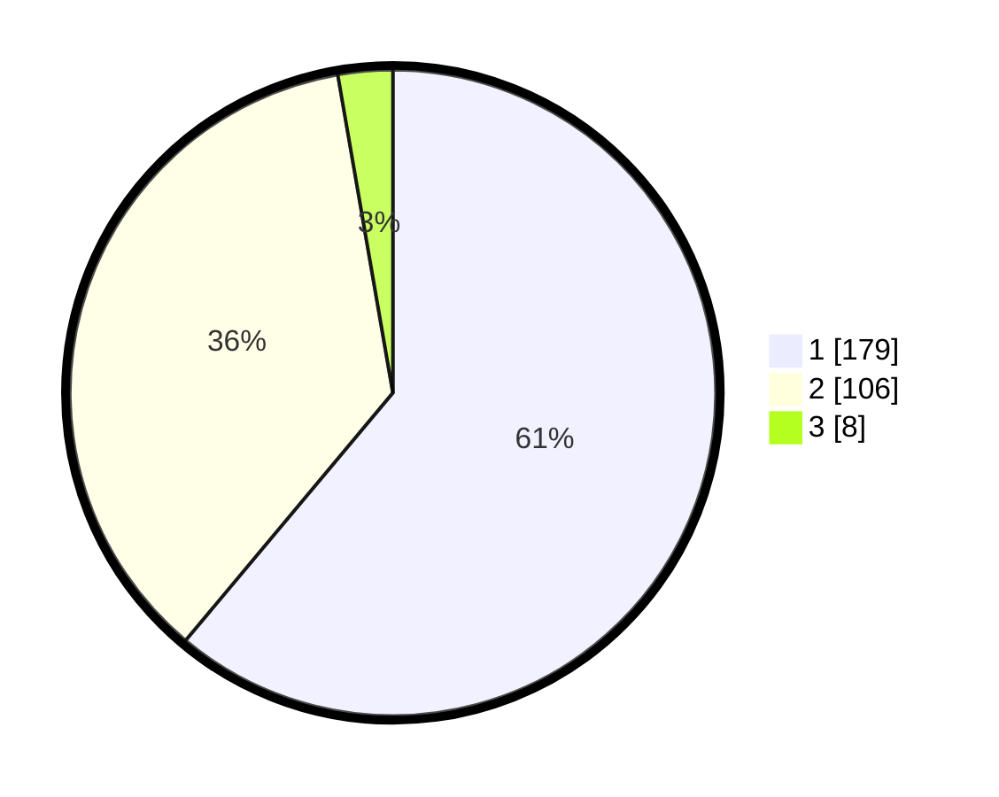

# Hasil

## Grafik

## Tabel

| No. | Nama Paslon    | Suara | Suara (raw) | Persentase |
|:--- |:-------------- | -----:| -----------:| ----------:|
| 1   | ANIES MUHAIMIN | 179   | [179][p-1]  | 61,09      |
| 2   | PRABOWO GIBRAN | 106   | [106][p-2]  | 36,18      |
| 3   | GANJAR MAHFUD  | 8     | [8][p-3]    | 2,73       |

[p-1]: https://github.com/gigit-pemilu/pemilu-2024/blob/main/pilpres/hitung-suara/sub/35-jawa-timur/sub/28-pamekasan/sub/10-waru/sub/2001-bajur/sub/012-tps/sub/paslon-1.txt
[p-2]: https://github.com/gigit-pemilu/pemilu-2024/blob/main/pilpres/hitung-suara/sub/35-jawa-timur/sub/28-pamekasan/sub/10-waru/sub/2001-bajur/sub/012-tps/sub/paslon-2.txt
[p-3]: https://github.com/gigit-pemilu/pemilu-2024/blob/main/pilpres/hitung-suara/sub/35-jawa-timur/sub/28-pamekasan/sub/10-waru/sub/2001-bajur/sub/012-tps/sub/paslon-3.txt

## Foto C Plano

https://sirekap-obj-formc.kpu.go.id/16f9/pemilu/ppwp/35/28/10/20/01/3528102001012-20240214-212150--77083863-b3ec-423b-92e2-0606be06ea28.jpg

https://sirekap-obj-formc.kpu.go.id/16f9/pemilu/ppwp/35/28/10/20/01/3528102001012-20240214-185643--1510fda7-fe37-4c53-8e7d-8690f78fe0ac.jpg

https://sirekap-obj-formc.kpu.go.id/16f9/pemilu/ppwp/35/28/10/20/01/3528102001012-20240214-190013--4716b1d8-454e-4796-8bd4-ef6ec8806f58.jpg

## Metadata

| Key        | Value               |
| ---------- | ------------------- |
| Time Stamp | 2024-02-15 19:00:26 |

