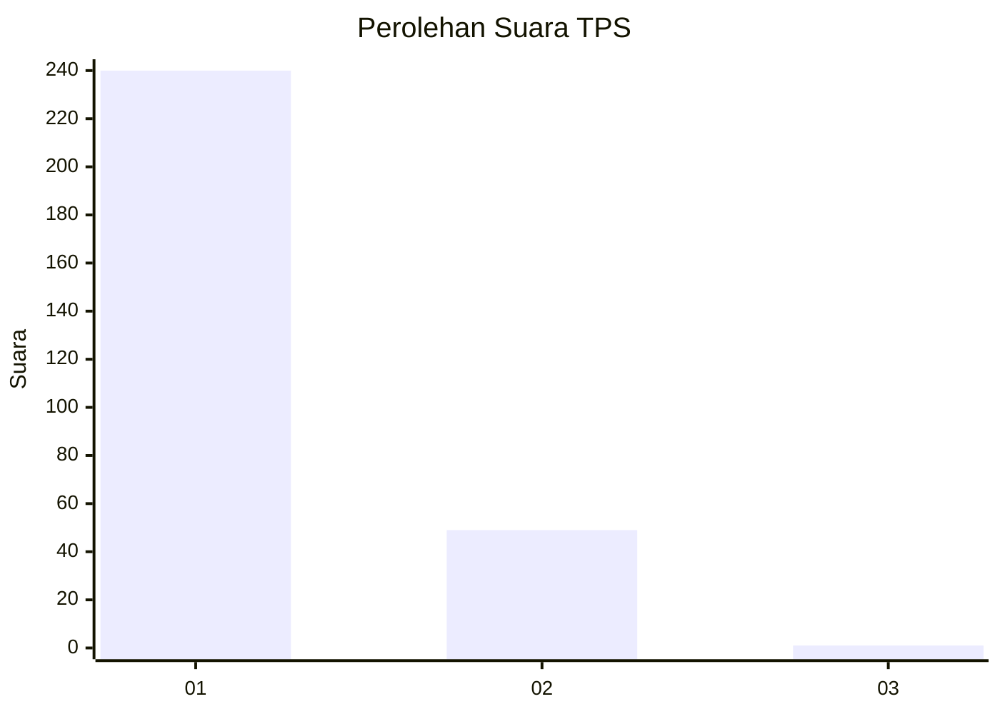
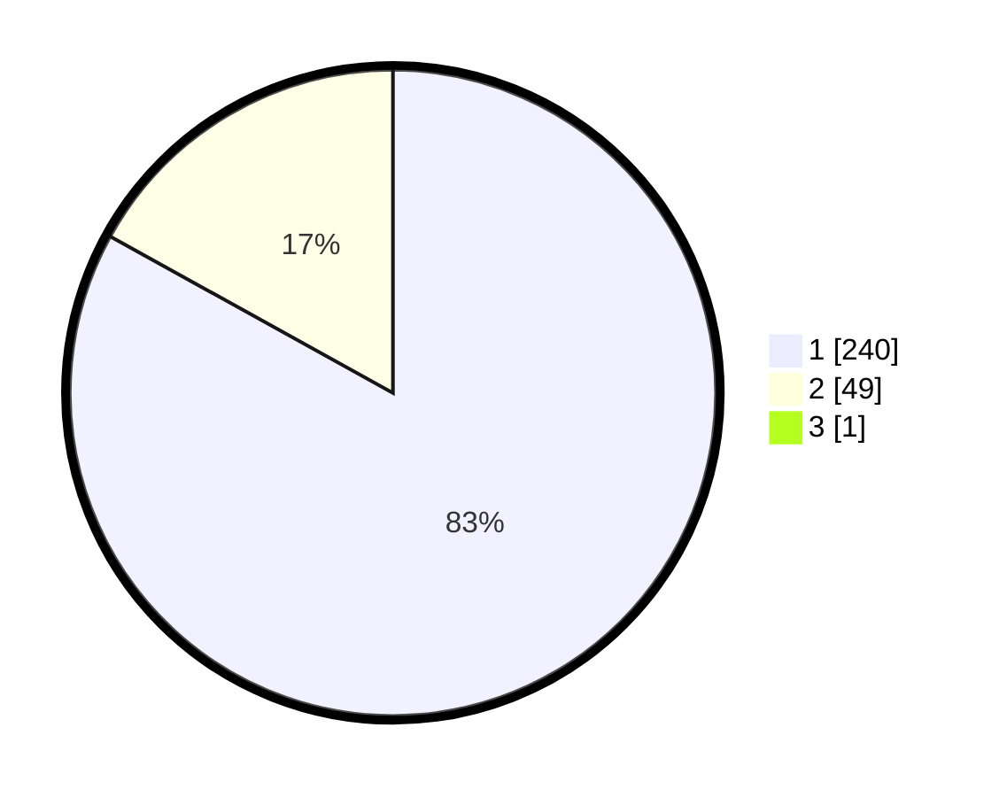

# Hasil

## Grafik

## Tabel

| No. | Nama Paslon    | Suara | Suara (raw) | Persentase |
|:--- |:-------------- | -----:| -----------:| ----------:|
| 1   | ANIES MUHAIMIN | 240   | [240][p-1]  | 82,76      |
| 2   | PRABOWO GIBRAN | 49    | [49][p-2]   | 16,90      |
| 3   | GANJAR MAHFUD  | 1     | [1][p-3]    | 0,34       |

[p-1]: https://github.com/gigit-pemilu/pemilu-2024-35-jawa-timur/blob/main/pilpres/hitung-suara/sub/35-jawa-timur/sub/28-pamekasan/sub/10-waru/sub/2002-sumber-waru/sub/001-tps/sub/paslon-1.txt
[p-2]: https://github.com/gigit-pemilu/pemilu-2024-35-jawa-timur/blob/main/pilpres/hitung-suara/sub/35-jawa-timur/sub/28-pamekasan/sub/10-waru/sub/2002-sumber-waru/sub/001-tps/sub/paslon-2.txt
[p-3]: https://github.com/gigit-pemilu/pemilu-2024-35-jawa-timur/blob/main/pilpres/hitung-suara/sub/35-jawa-timur/sub/28-pamekasan/sub/10-waru/sub/2002-sumber-waru/sub/001-tps/sub/paslon-3.txt

## Foto C Plano

https://sirekap-obj-formc.kpu.go.id/d04d/pemilu/ppwp/35/28/10/20/02/3528102002001-20240215-062350--a5e17464-f6bb-4040-94e4-8a0166165286.jpg

https://sirekap-obj-formc.kpu.go.id/d04d/pemilu/ppwp/35/28/10/20/02/3528102002001-20240215-055533--64ab0671-b780-4d82-a8e0-77bee35812b0.jpg

https://sirekap-obj-formc.kpu.go.id/d04d/pemilu/ppwp/35/28/10/20/02/3528102002001-20240215-055734--e6c889e5-1fad-42ba-bfea-531b351d4041.jpg

## Metadata

| Key        | Value               |
| ---------- | ------------------- |
| Time Stamp | 2024-02-15 22:00:27 |

