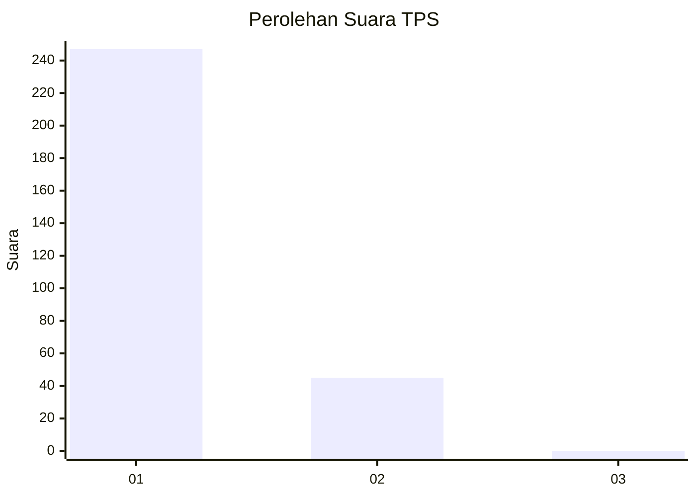
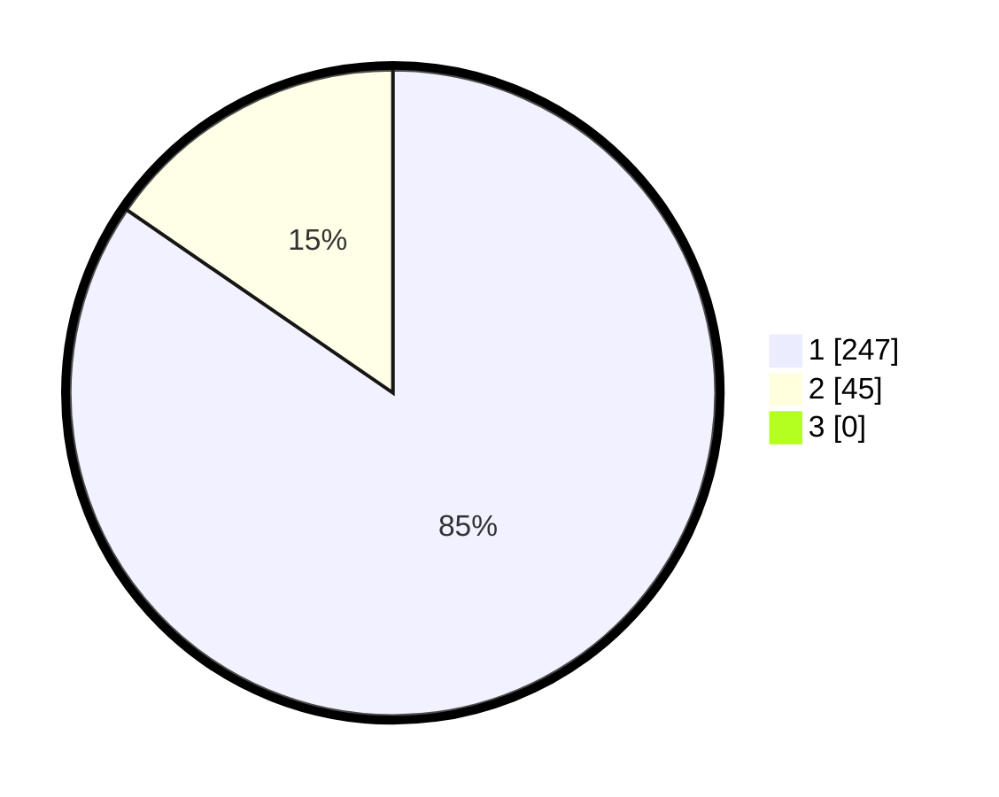

# Hasil

## Grafik

## Tabel

| No. | Nama Paslon    | Suara | Suara (raw) | Persentase |
|:--- |:-------------- | -----:| -----------:| ----------:|
| 1   | ANIES MUHAIMIN | 247   | [247][p-1]  | 84,59      |
| 2   | PRABOWO GIBRAN | 45    | [45][p-2]   | 15,41      |
| 3   | GANJAR MAHFUD  | 0     | [0][p-3]    | 0,00       |

[p-1]: https://github.com/gigit-pemilu/pemilu-2024-35-jawa-timur/blob/main/pilpres/hitung-suara/sub/35-jawa-timur/sub/28-pamekasan/sub/10-waru/sub/2002-sumber-waru/sub/002-tps/sub/paslon-1.txt
[p-2]: https://github.com/gigit-pemilu/pemilu-2024-35-jawa-timur/blob/main/pilpres/hitung-suara/sub/35-jawa-timur/sub/28-pamekasan/sub/10-waru/sub/2002-sumber-waru/sub/002-tps/sub/paslon-2.txt
[p-3]: https://github.com/gigit-pemilu/pemilu-2024-35-jawa-timur/blob/main/pilpres/hitung-suara/sub/35-jawa-timur/sub/28-pamekasan/sub/10-waru/sub/2002-sumber-waru/sub/002-tps/sub/paslon-3.txt

## Foto C Plano

https://sirekap-obj-formc.kpu.go.id/af9d/pemilu/ppwp/35/28/10/20/02/3528102002002-20240214-232641--8f8c206b-8993-4967-8388-9a1361988a88.jpg

https://sirekap-obj-formc.kpu.go.id/af9d/pemilu/ppwp/35/28/10/20/02/3528102002002-20240214-232858--65af9d86-a212-4bfe-9bac-ef7ec542dd6e.jpg

https://sirekap-obj-formc.kpu.go.id/af9d/pemilu/ppwp/35/28/10/20/02/3528102002002-20240214-233442--0d974c0f-aa26-4dd9-b3e2-11d6ae1ccf3e.jpg

## Metadata

| Key        | Value               |
| ---------- | ------------------- |
| Time Stamp | 2024-02-15 22:00:27 |

