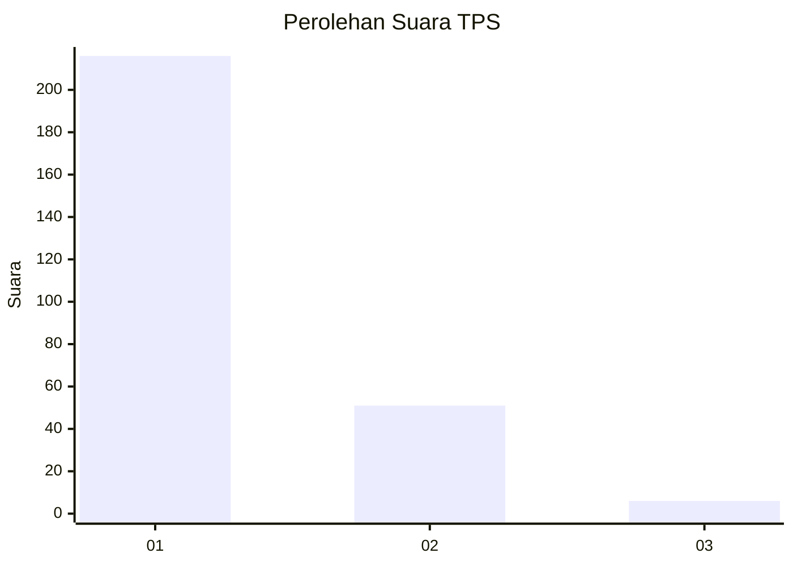
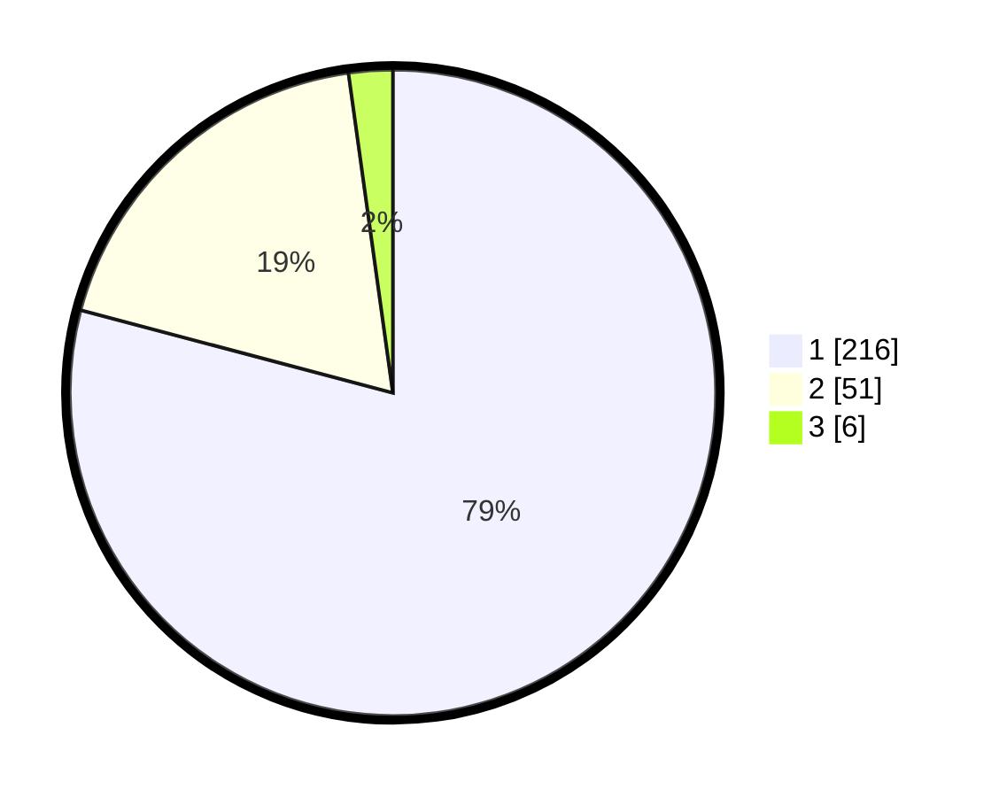

# Hasil

## Grafik

## Tabel

| No. | Nama Paslon    | Suara | Suara (raw) | Persentase |
|:--- |:-------------- | -----:| -----------:| ----------:|
| 1   | ANIES MUHAIMIN | 216   | [216][p-1]  | 79,12      |
| 2   | PRABOWO GIBRAN | 51    | [51][p-2]   | 18,68      |
| 3   | GANJAR MAHFUD  | 6     | [6][p-3]    | 2,20       |

[p-1]: https://github.com/gigit-pemilu/pemilu-2024/blob/main/pilpres/hitung-suara/sub/35-jawa-timur/sub/28-pamekasan/sub/10-waru/sub/2002-sumber-waru/sub/007-tps/sub/paslon-1.txt
[p-2]: https://github.com/gigit-pemilu/pemilu-2024/blob/main/pilpres/hitung-suara/sub/35-jawa-timur/sub/28-pamekasan/sub/10-waru/sub/2002-sumber-waru/sub/007-tps/sub/paslon-2.txt
[p-3]: https://github.com/gigit-pemilu/pemilu-2024/blob/main/pilpres/hitung-suara/sub/35-jawa-timur/sub/28-pamekasan/sub/10-waru/sub/2002-sumber-waru/sub/007-tps/sub/paslon-3.txt

## Foto C Plano

https://sirekap-obj-formc.kpu.go.id/ad69/pemilu/ppwp/35/28/10/20/02/3528102002007-20240215-065953--ed56671f-eb64-4599-ab15-47a4cf3fe96e.jpg

https://sirekap-obj-formc.kpu.go.id/ad69/pemilu/ppwp/35/28/10/20/02/3528102002007-20240215-065814--8f4e9f7e-371e-4904-bc9e-64ad8a16a1fd.jpg

https://sirekap-obj-formc.kpu.go.id/ad69/pemilu/ppwp/35/28/10/20/02/3528102002007-20240215-052611--f4828cc9-2bb4-42f2-a5df-c4dffcbae2ff.jpg

## Metadata

| Key        | Value               |
| ---------- | ------------------- |
| Time Stamp | 2024-02-15 21:01:18 |

