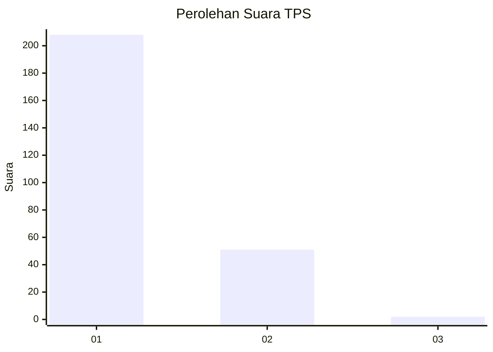
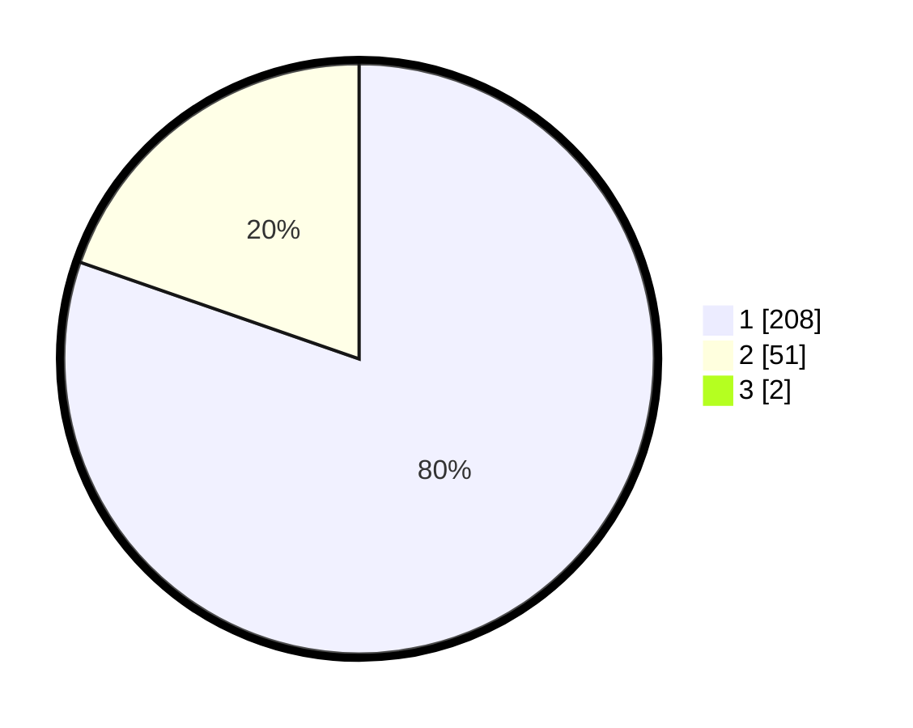

# Hasil

## Grafik

## Tabel

| No. | Nama Paslon    | Suara | Suara (raw) | Persentase |
|:--- |:-------------- | -----:| -----------:| ----------:|
| 1   | ANIES MUHAIMIN | 208   | [208][p-1]  | 79,69      |
| 2   | PRABOWO GIBRAN | 51    | [51][p-2]   | 19,54      |
| 3   | GANJAR MAHFUD  | 2     | [2][p-3]    | 0,77       |

[p-1]: https://github.com/gigit-pemilu/pemilu-2024-35-jawa-timur/blob/main/pilpres/hitung-suara/sub/35-jawa-timur/sub/28-pamekasan/sub/10-waru/sub/2002-sumber-waru/sub/008-tps/sub/paslon-1.txt
[p-2]: https://github.com/gigit-pemilu/pemilu-2024-35-jawa-timur/blob/main/pilpres/hitung-suara/sub/35-jawa-timur/sub/28-pamekasan/sub/10-waru/sub/2002-sumber-waru/sub/008-tps/sub/paslon-2.txt
[p-3]: https://github.com/gigit-pemilu/pemilu-2024-35-jawa-timur/blob/main/pilpres/hitung-suara/sub/35-jawa-timur/sub/28-pamekasan/sub/10-waru/sub/2002-sumber-waru/sub/008-tps/sub/paslon-3.txt

## Foto C Plano

https://sirekap-obj-formc.kpu.go.id/86e7/pemilu/ppwp/35/28/10/20/02/3528102002008-20240215-065041--1a069882-bce4-41f9-9440-e5b914882a44.jpg

https://sirekap-obj-formc.kpu.go.id/86e7/pemilu/ppwp/35/28/10/20/02/3528102002008-20240215-065118--3bc3708a-9f2a-4eae-be70-837e302bec0c.jpg

https://sirekap-obj-formc.kpu.go.id/86e7/pemilu/ppwp/35/28/10/20/02/3528102002008-20240215-065146--56765523-61b6-4d40-9da9-af7769a35e56.jpg

## Metadata

| Key        | Value               |
| ---------- | ------------------- |
| Time Stamp | 2024-02-15 22:00:27 |

