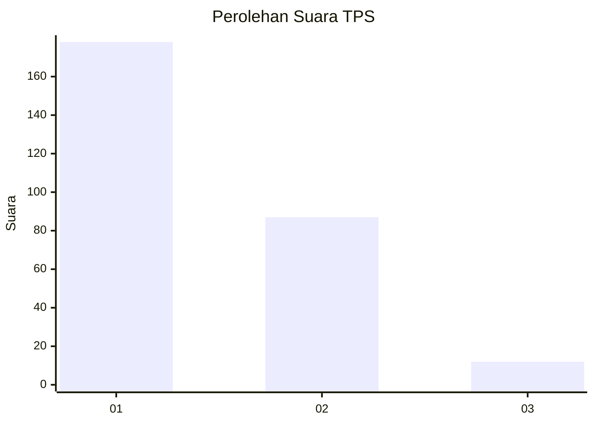
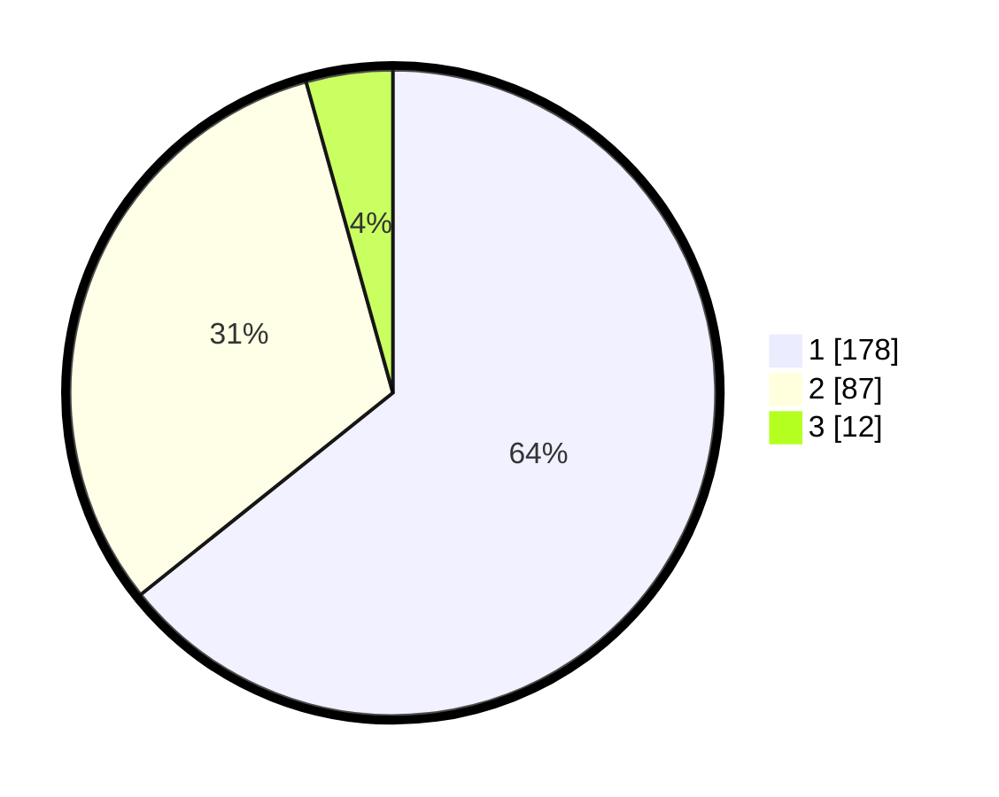

# Hasil

## Grafik

## Tabel

| No. | Nama Paslon    | Suara | Suara (raw) | Persentase |
|:--- |:-------------- | -----:| -----------:| ----------:|
| 1   | ANIES MUHAIMIN | 178   | [178][p-1]  | 64,26      |
| 2   | PRABOWO GIBRAN | 87    | [87][p-2]   | 31,41      |
| 3   | GANJAR MAHFUD  | 12    | [12][p-3]   | 4,33       |

[p-1]: https://github.com/gigit-pemilu/pemilu-2024-35-jawa-timur/blob/main/pilpres/hitung-suara/sub/35-jawa-timur/sub/28-pamekasan/sub/10-waru/sub/2002-sumber-waru/sub/012-tps/sub/paslon-1.txt
[p-2]: https://github.com/gigit-pemilu/pemilu-2024-35-jawa-timur/blob/main/pilpres/hitung-suara/sub/35-jawa-timur/sub/28-pamekasan/sub/10-waru/sub/2002-sumber-waru/sub/012-tps/sub/paslon-2.txt
[p-3]: https://github.com/gigit-pemilu/pemilu-2024-35-jawa-timur/blob/main/pilpres/hitung-suara/sub/35-jawa-timur/sub/28-pamekasan/sub/10-waru/sub/2002-sumber-waru/sub/012-tps/sub/paslon-3.txt

## Foto C Plano

https://sirekap-obj-formc.kpu.go.id/e3bb/pemilu/ppwp/35/28/10/20/02/3528102002012-20240215-010956--65e0ee5b-9533-46f4-a152-ee71ad75f6f2.jpg

https://sirekap-obj-formc.kpu.go.id/e3bb/pemilu/ppwp/35/28/10/20/02/3528102002012-20240215-011059--eec23bd3-e552-4f63-afed-4522b5617bac.jpg

https://sirekap-obj-formc.kpu.go.id/e3bb/pemilu/ppwp/35/28/10/20/02/3528102002012-20240215-011138--525cb596-2970-4c65-bdb6-766bd73c7bcd.jpg

## Metadata

| Key        | Value               |
| ---------- | ------------------- |
| Time Stamp | 2024-02-15 22:00:27 |

