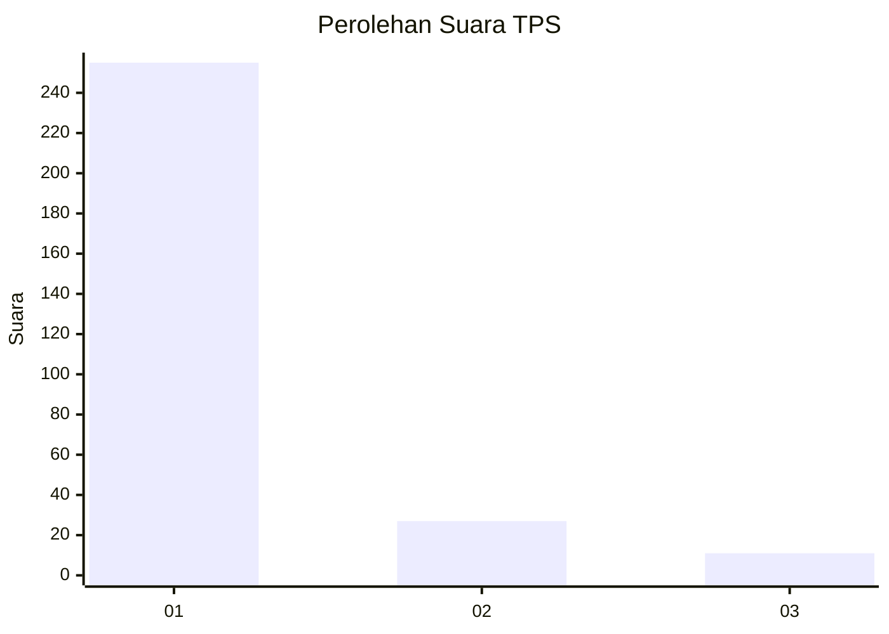
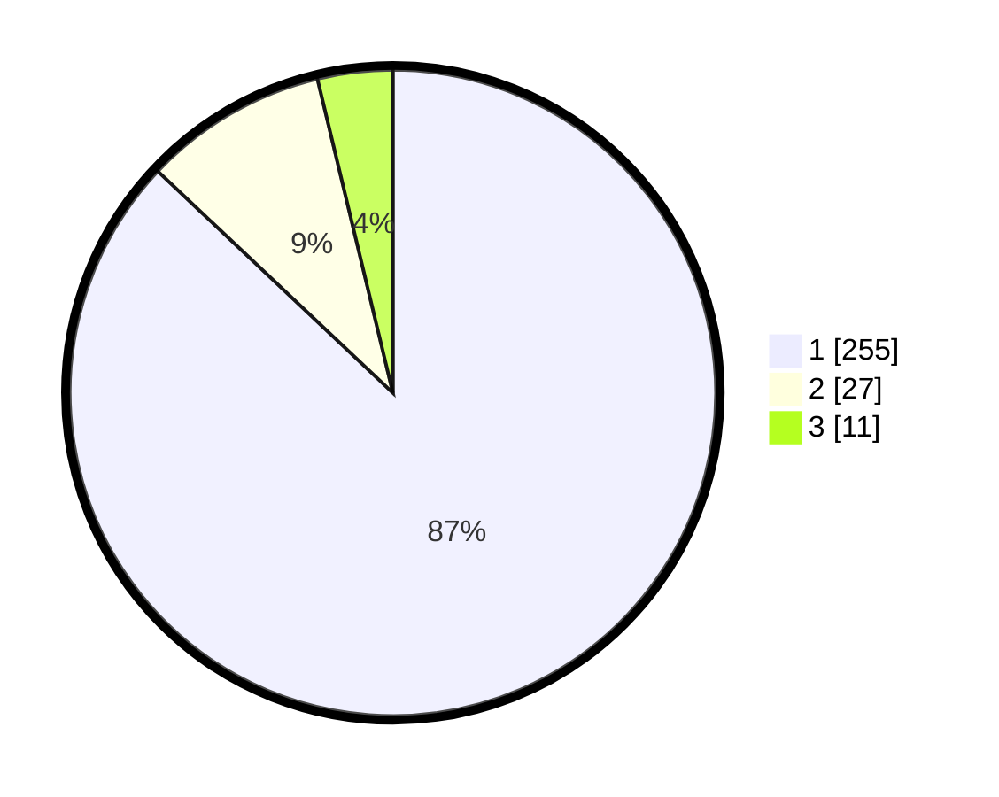

# Hasil

## Grafik

## Tabel

| No. | Nama Paslon    | Suara | Suara (raw) | Persentase |
|:--- |:-------------- | -----:| -----------:| ----------:|
| 1   | ANIES MUHAIMIN | 255   | [255][p-1]  | 87,03      |
| 2   | PRABOWO GIBRAN | 27    | [27][p-2]   | 9,22       |
| 3   | GANJAR MAHFUD  | 11    | [11][p-3]   | 3,75       |

[p-1]: https://github.com/gigit-pemilu/pemilu-2024/blob/main/pilpres/hitung-suara/sub/35-jawa-timur/sub/28-pamekasan/sub/10-waru/sub/2002-sumber-waru/sub/014-tps/sub/paslon-1.txt
[p-2]: https://github.com/gigit-pemilu/pemilu-2024/blob/main/pilpres/hitung-suara/sub/35-jawa-timur/sub/28-pamekasan/sub/10-waru/sub/2002-sumber-waru/sub/014-tps/sub/paslon-2.txt
[p-3]: https://github.com/gigit-pemilu/pemilu-2024/blob/main/pilpres/hitung-suara/sub/35-jawa-timur/sub/28-pamekasan/sub/10-waru/sub/2002-sumber-waru/sub/014-tps/sub/paslon-3.txt

## Foto C Plano

https://sirekap-obj-formc.kpu.go.id/feac/pemilu/ppwp/35/28/10/20/02/3528102002014-20240215-094322--c9be65d1-5ec8-443b-9d92-5823b3c9d8bf.jpg

https://sirekap-obj-formc.kpu.go.id/feac/pemilu/ppwp/35/28/10/20/02/3528102002014-20240215-094813--099f15f7-1653-490d-b305-a0c0a1621751.jpg

https://sirekap-obj-formc.kpu.go.id/feac/pemilu/ppwp/35/28/10/20/02/3528102002014-20240215-095804--58ccb4e9-dc25-4b40-be9a-f06f6aee50d8.jpg

## Metadata

| Key        | Value               |
| ---------- | ------------------- |
| Time Stamp | 2024-02-15 22:00:27 |

