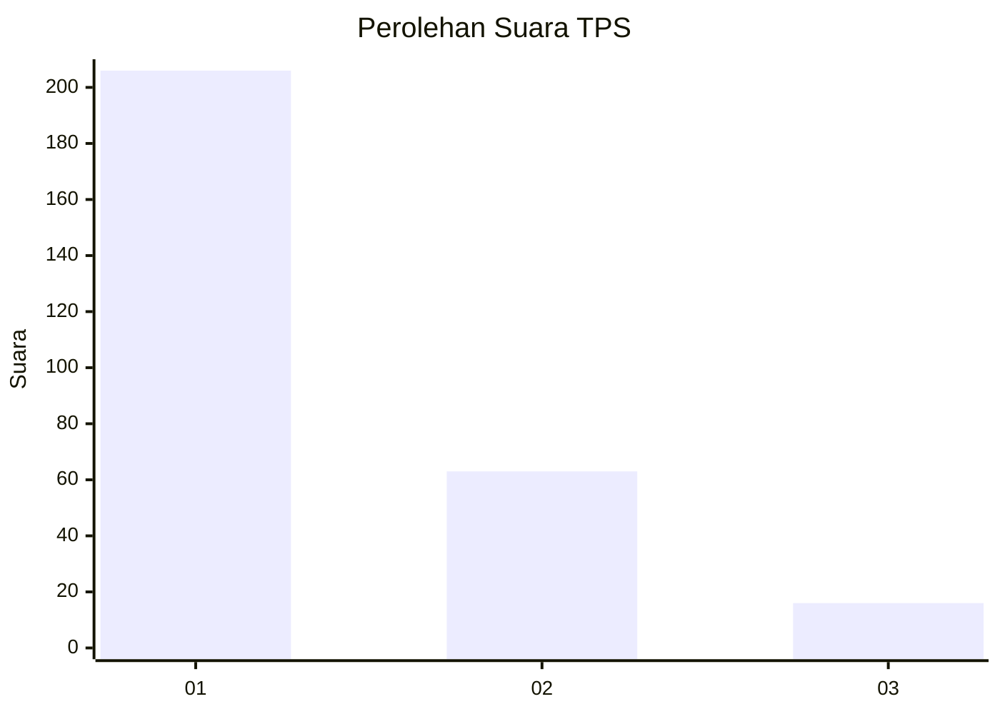
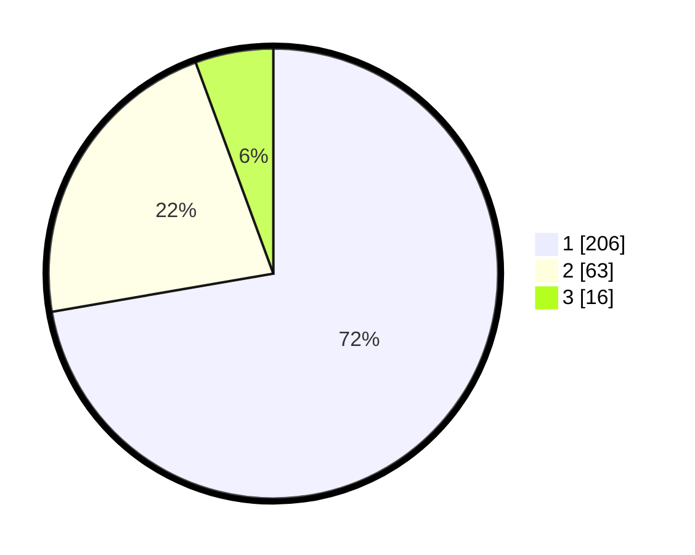

# Hasil

## Grafik

## Tabel

| No. | Nama Paslon    | Suara | Suara (raw) | Persentase |
|:--- |:-------------- | -----:| -----------:| ----------:|
| 1   | ANIES MUHAIMIN | 206   | [206][p-1]  | 72,28      |
| 2   | PRABOWO GIBRAN | 63    | [63][p-2]   | 22,11      |
| 3   | GANJAR MAHFUD  | 16    | [16][p-3]   | 5,61       |

[p-1]: https://github.com/gigit-pemilu/pemilu-2024/blob/main/pilpres/hitung-suara/sub/35-jawa-timur/sub/28-pamekasan/sub/10-waru/sub/2002-sumber-waru/sub/016-tps/sub/paslon-1.txt
[p-2]: https://github.com/gigit-pemilu/pemilu-2024/blob/main/pilpres/hitung-suara/sub/35-jawa-timur/sub/28-pamekasan/sub/10-waru/sub/2002-sumber-waru/sub/016-tps/sub/paslon-2.txt
[p-3]: https://github.com/gigit-pemilu/pemilu-2024/blob/main/pilpres/hitung-suara/sub/35-jawa-timur/sub/28-pamekasan/sub/10-waru/sub/2002-sumber-waru/sub/016-tps/sub/paslon-3.txt

## Foto C Plano

https://sirekap-obj-formc.kpu.go.id/b493/pemilu/ppwp/35/28/10/20/02/3528102002016-20240215-003630--d3151a39-92a0-473a-b0dd-e04c2722f579.jpg

https://sirekap-obj-formc.kpu.go.id/b493/pemilu/ppwp/35/28/10/20/02/3528102002016-20240215-060753--08b02211-abef-4470-be26-8ba674396802.jpg

https://sirekap-obj-formc.kpu.go.id/b493/pemilu/ppwp/35/28/10/20/02/3528102002016-20240215-060850--3b4543e6-8320-4519-8f6f-24b84071ed61.jpg

## Metadata

| Key        | Value               |
| ---------- | ------------------- |
| Time Stamp | 2024-02-25 16:00:00 |

