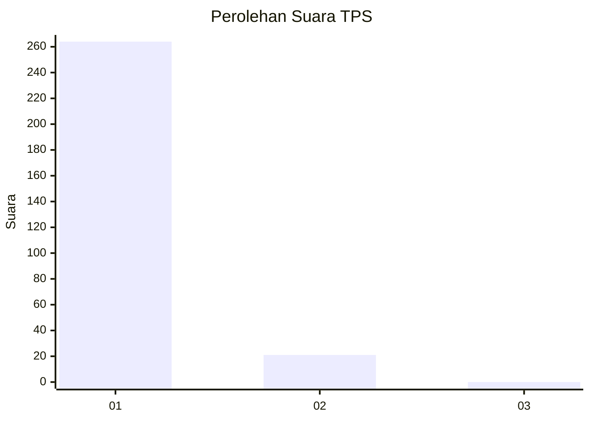
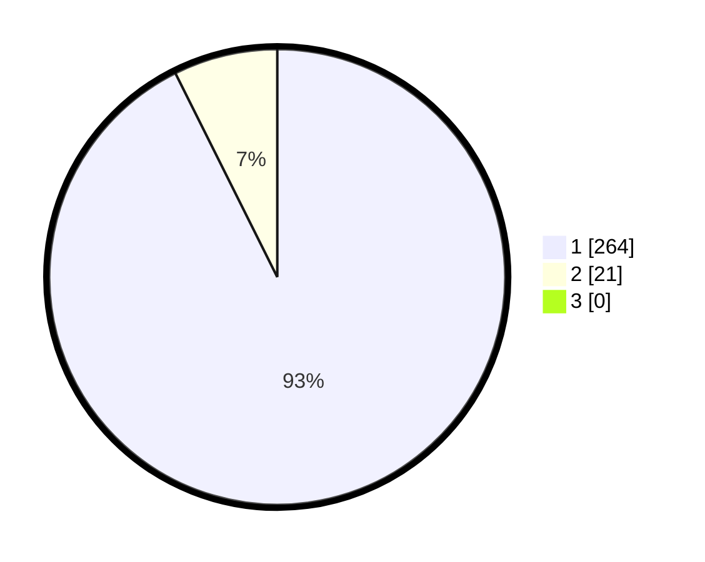

# Hasil

## Grafik

## Tabel

| No. | Nama Paslon    | Suara | Suara (raw) | Persentase |
|:--- |:-------------- | -----:| -----------:| ----------:|
| 1   | ANIES MUHAIMIN | 264   | [264][p-1]  | 92,63      |
| 2   | PRABOWO GIBRAN | 21    | [21][p-2]   | 7,37       |
| 3   | GANJAR MAHFUD  | 0     | [0][p-3]    | 0,00       |

[p-1]: https://github.com/gigit-pemilu/pemilu-2024/blob/main/pilpres/hitung-suara/sub/35-jawa-timur/sub/28-pamekasan/sub/10-waru/sub/2003-tampojung-pregih/sub/002-tps/sub/paslon-1.txt
[p-2]: https://github.com/gigit-pemilu/pemilu-2024/blob/main/pilpres/hitung-suara/sub/35-jawa-timur/sub/28-pamekasan/sub/10-waru/sub/2003-tampojung-pregih/sub/002-tps/sub/paslon-2.txt
[p-3]: https://github.com/gigit-pemilu/pemilu-2024/blob/main/pilpres/hitung-suara/sub/35-jawa-timur/sub/28-pamekasan/sub/10-waru/sub/2003-tampojung-pregih/sub/002-tps/sub/paslon-3.txt

## Foto C Plano

https://sirekap-obj-formc.kpu.go.id/707c/pemilu/ppwp/35/28/10/20/03/3528102003002-20240215-090442--d9f25c63-7d93-46df-93af-43e54ba1244c.jpg

https://sirekap-obj-formc.kpu.go.id/707c/pemilu/ppwp/35/28/10/20/03/3528102003002-20240215-090950--e1b8903c-cbad-4547-b4b3-eed2539e9a5f.jpg

https://sirekap-obj-formc.kpu.go.id/707c/pemilu/ppwp/35/28/10/20/03/3528102003002-20240215-091855--f97b702b-4ff6-4dbc-b3aa-1ae992f1e504.jpg

## Metadata

| Key        | Value               |
| ---------- | ------------------- |
| Time Stamp | 2024-02-15 22:00:27 |

