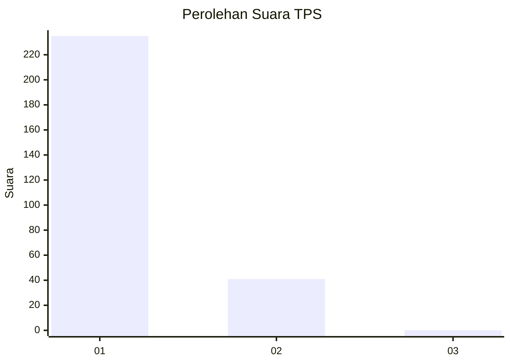
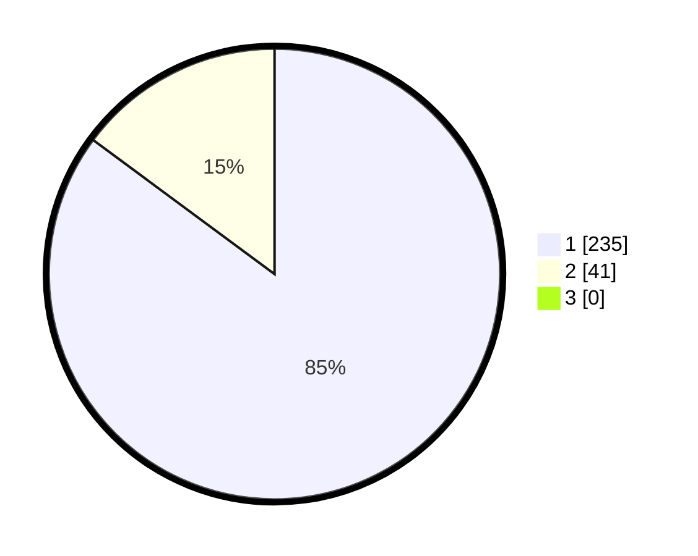

# Hasil

## Grafik

## Tabel

| No. | Nama Paslon    | Suara | Suara (raw) | Persentase |
|:--- |:-------------- | -----:| -----------:| ----------:|
| 1   | ANIES MUHAIMIN | 235   | [235][p-1]  | 85,14      |
| 2   | PRABOWO GIBRAN | 41    | [41][p-2]   | 14,86      |
| 3   | GANJAR MAHFUD  | 0     | [0][p-3]    | 0,00       |

[p-1]: https://github.com/gigit-pemilu/pemilu-2024-35-jawa-timur/blob/main/pilpres/hitung-suara/sub/35-jawa-timur/sub/28-pamekasan/sub/10-waru/sub/2003-tampojung-pregih/sub/009-tps/sub/paslon-1.txt
[p-2]: https://github.com/gigit-pemilu/pemilu-2024-35-jawa-timur/blob/main/pilpres/hitung-suara/sub/35-jawa-timur/sub/28-pamekasan/sub/10-waru/sub/2003-tampojung-pregih/sub/009-tps/sub/paslon-2.txt
[p-3]: https://github.com/gigit-pemilu/pemilu-2024-35-jawa-timur/blob/main/pilpres/hitung-suara/sub/35-jawa-timur/sub/28-pamekasan/sub/10-waru/sub/2003-tampojung-pregih/sub/009-tps/sub/paslon-3.txt

## Foto C Plano

https://sirekap-obj-formc.kpu.go.id/2af5/pemilu/ppwp/35/28/10/20/03/3528102003009-20240215-075530--3fb0b973-4c76-42da-9aca-e8510210d087.jpg

https://sirekap-obj-formc.kpu.go.id/2af5/pemilu/ppwp/35/28/10/20/03/3528102003009-20240215-002155--5368bd62-54c3-4c34-b821-f0bc2cec1c13.jpg

https://sirekap-obj-formc.kpu.go.id/2af5/pemilu/ppwp/35/28/10/20/03/3528102003009-20240215-002353--64f78407-99f8-4ae6-81e0-d2f566990466.jpg

## Metadata

| Key        | Value               |
| ---------- | ------------------- |
| Time Stamp | 2024-02-15 22:00:27 |

