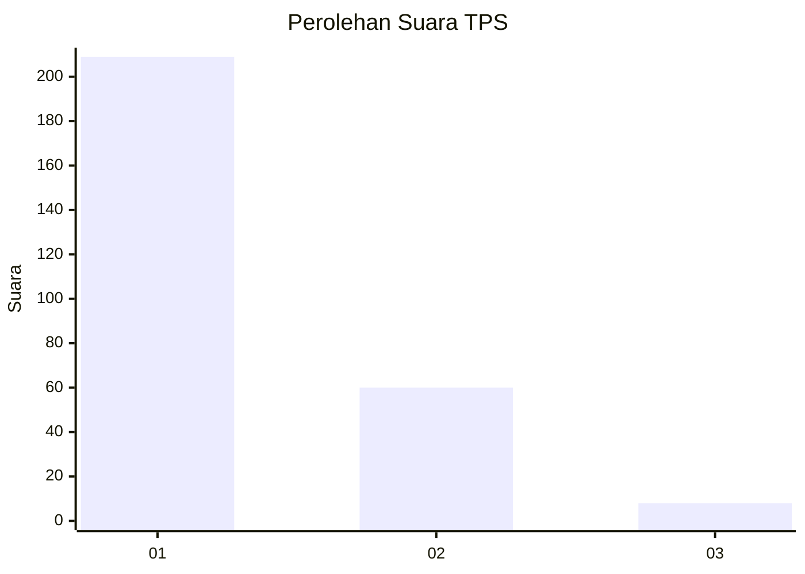
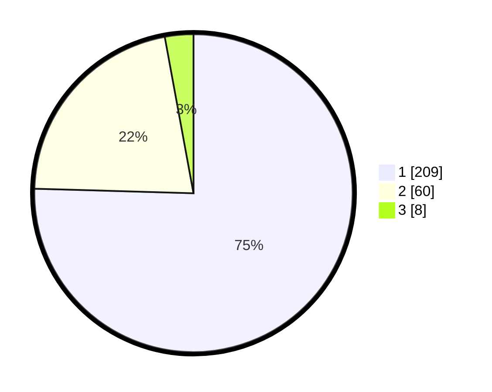

# Hasil

## Grafik

## Tabel

| No. | Nama Paslon    | Suara | Suara (raw) | Persentase |
|:--- |:-------------- | -----:| -----------:| ----------:|
| 1   | ANIES MUHAIMIN | 209   | [209][p-1]  | 75,45      |
| 2   | PRABOWO GIBRAN | 60    | [60][p-2]   | 21,66      |
| 3   | GANJAR MAHFUD  | 8     | [8][p-3]    | 2,89       |

[p-1]: https://github.com/gigit-pemilu/pemilu-2024/blob/main/pilpres/hitung-suara/sub/35-jawa-timur/sub/28-pamekasan/sub/10-waru/sub/2003-tampojung-pregih/sub/010-tps/sub/paslon-1.txt
[p-2]: https://github.com/gigit-pemilu/pemilu-2024/blob/main/pilpres/hitung-suara/sub/35-jawa-timur/sub/28-pamekasan/sub/10-waru/sub/2003-tampojung-pregih/sub/010-tps/sub/paslon-2.txt
[p-3]: https://github.com/gigit-pemilu/pemilu-2024/blob/main/pilpres/hitung-suara/sub/35-jawa-timur/sub/28-pamekasan/sub/10-waru/sub/2003-tampojung-pregih/sub/010-tps/sub/paslon-3.txt

## Foto C Plano

https://sirekap-obj-formc.kpu.go.id/cc12/pemilu/ppwp/35/28/10/20/03/3528102003010-20240214-225739--fe5aaea3-dc7a-4265-8a8f-33aa58b2d6f1.jpg

https://sirekap-obj-formc.kpu.go.id/cc12/pemilu/ppwp/35/28/10/20/03/3528102003010-20240214-230621--bf49f52b-db20-4cad-ab04-0eabb890f004.jpg

https://sirekap-obj-formc.kpu.go.id/cc12/pemilu/ppwp/35/28/10/20/03/3528102003010-20240214-230713--71ae2fe4-e190-4290-8466-ce6af22ead61.jpg

## Metadata

| Key        | Value               |
| ---------- | ------------------- |
| Time Stamp | 2024-02-25 23:00:00 |

