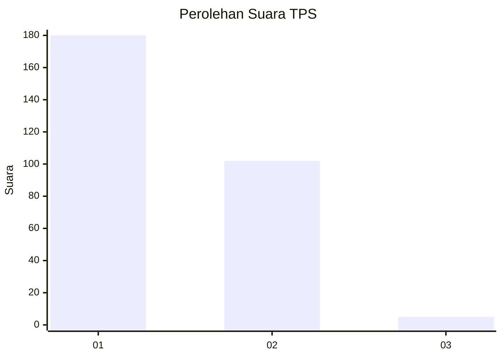
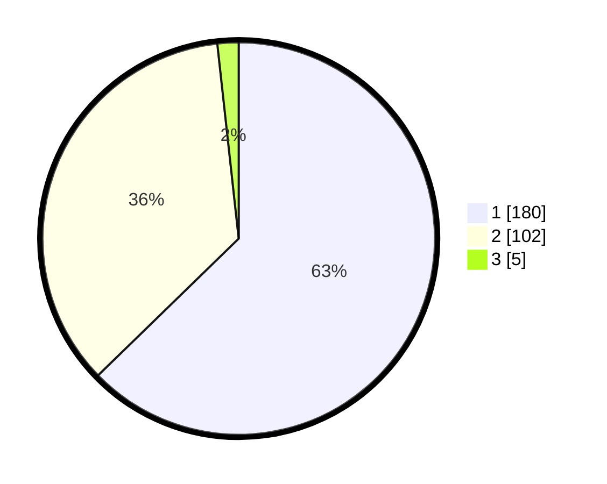

# Hasil

## Grafik

## Tabel

| No. | Nama Paslon    | Suara | Suara (raw) | Persentase |
|:--- |:-------------- | -----:| -----------:| ----------:|
| 1   | ANIES MUHAIMIN | 180   | [180][p-1]  | 62,72      |
| 2   | PRABOWO GIBRAN | 102   | [102][p-2]  | 35,54      |
| 3   | GANJAR MAHFUD  | 5     | [5][p-3]    | 1,74       |

[p-1]: https://github.com/gigit-pemilu/pemilu-2024/blob/main/pilpres/hitung-suara/sub/35-jawa-timur/sub/28-pamekasan/sub/10-waru/sub/2003-tampojung-pregih/sub/011-tps/sub/paslon-1.txt
[p-2]: https://github.com/gigit-pemilu/pemilu-2024/blob/main/pilpres/hitung-suara/sub/35-jawa-timur/sub/28-pamekasan/sub/10-waru/sub/2003-tampojung-pregih/sub/011-tps/sub/paslon-2.txt
[p-3]: https://github.com/gigit-pemilu/pemilu-2024/blob/main/pilpres/hitung-suara/sub/35-jawa-timur/sub/28-pamekasan/sub/10-waru/sub/2003-tampojung-pregih/sub/011-tps/sub/paslon-3.txt

## Foto C Plano

https://sirekap-obj-formc.kpu.go.id/b43b/pemilu/ppwp/35/28/10/20/03/3528102003011-20240214-222406--35250597-e2f3-467a-bbc9-746c64349409.jpg

https://sirekap-obj-formc.kpu.go.id/b43b/pemilu/ppwp/35/28/10/20/03/3528102003011-20240214-222537--82480233-10cf-466b-b55f-423d5d470013.jpg

https://sirekap-obj-formc.kpu.go.id/b43b/pemilu/ppwp/35/28/10/20/03/3528102003011-20240214-222647--e7a917e3-aaff-420a-97d8-53b32c367efa.jpg

## Metadata

| Key        | Value               |
| ---------- | ------------------- |
| Time Stamp | 2024-02-15 22:00:27 |

