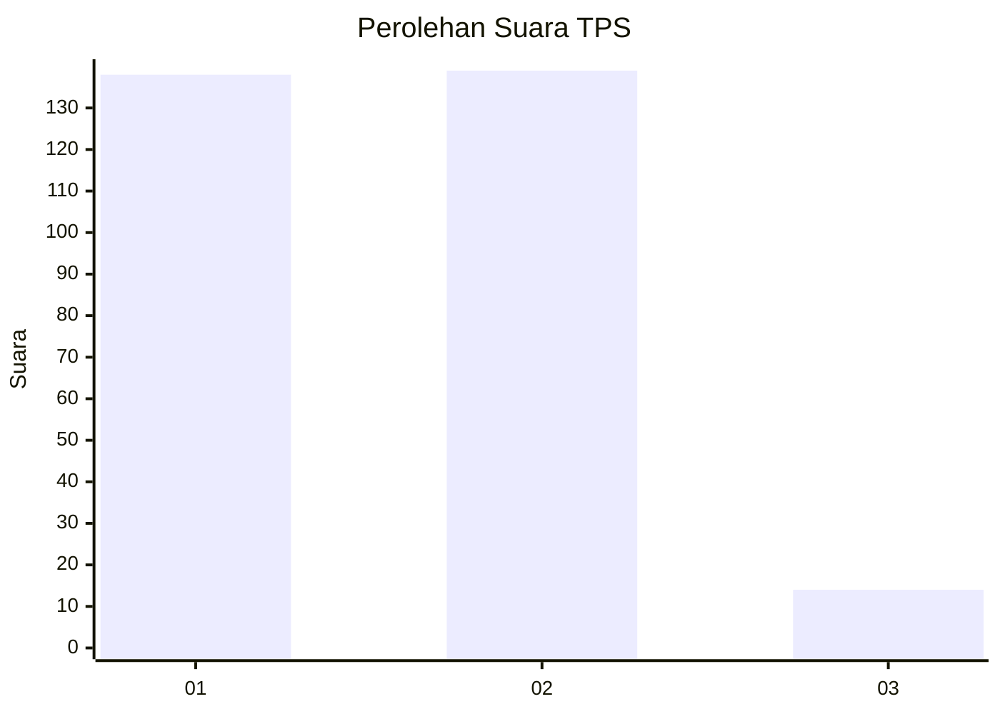
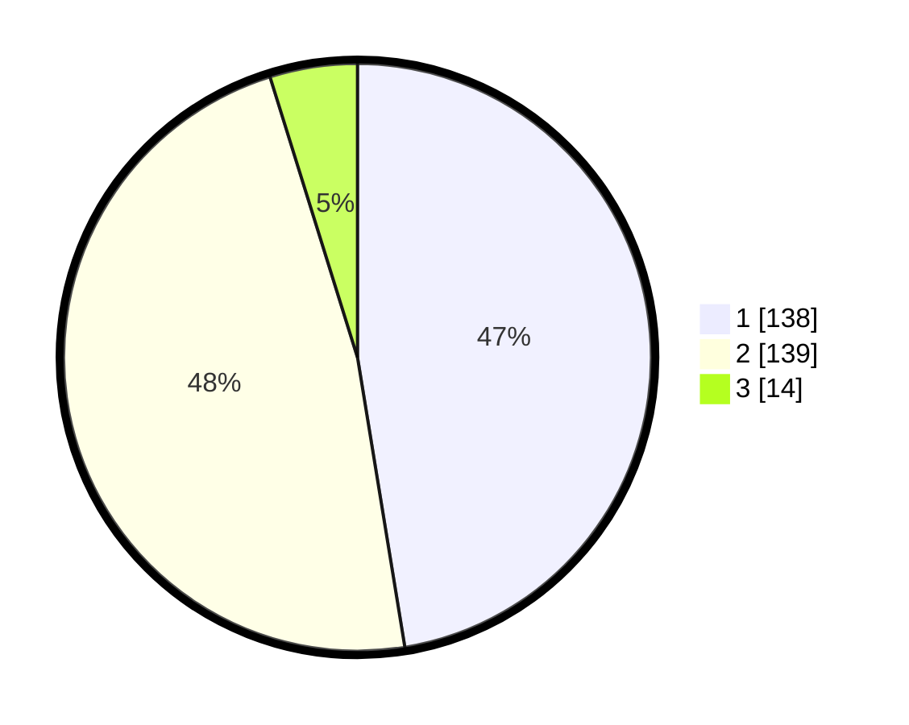

# Hasil

## Grafik

## Tabel

| No. | Nama Paslon    | Suara | Suara (raw) | Persentase |
|:--- |:-------------- | -----:| -----------:| ----------:|
| 1   | ANIES MUHAIMIN | 138   | [138][p-1]  | 47,42      |
| 2   | PRABOWO GIBRAN | 139   | [139][p-2]  | 47,77      |
| 3   | GANJAR MAHFUD  | 14    | [14][p-3]   | 4,81       |

[p-1]: https://github.com/gigit-pemilu/pemilu-2024/blob/main/pilpres/hitung-suara/sub/35-jawa-timur/sub/28-pamekasan/sub/10-waru/sub/2005-tampojung-tengah/sub/007-tps/sub/paslon-1.txt
[p-2]: https://github.com/gigit-pemilu/pemilu-2024/blob/main/pilpres/hitung-suara/sub/35-jawa-timur/sub/28-pamekasan/sub/10-waru/sub/2005-tampojung-tengah/sub/007-tps/sub/paslon-2.txt
[p-3]: https://github.com/gigit-pemilu/pemilu-2024/blob/main/pilpres/hitung-suara/sub/35-jawa-timur/sub/28-pamekasan/sub/10-waru/sub/2005-tampojung-tengah/sub/007-tps/sub/paslon-3.txt

## Foto C Plano

https://sirekap-obj-formc.kpu.go.id/9f10/pemilu/ppwp/35/28/10/20/05/3528102005007-20240214-203504--67ab3d56-9420-4d19-8d70-bb96b250d935.jpg

https://sirekap-obj-formc.kpu.go.id/9f10/pemilu/ppwp/35/28/10/20/05/3528102005007-20240214-203759--19ceae88-a966-4cf5-b61e-7623182ef197.jpg

https://sirekap-obj-formc.kpu.go.id/9f10/pemilu/ppwp/35/28/10/20/05/3528102005007-20240214-203915--11984303-96d8-4375-b824-07417f435cd7.jpg

## Metadata

| Key        | Value               |
| ---------- | ------------------- |
| Time Stamp | 2024-02-15 22:00:27 |

