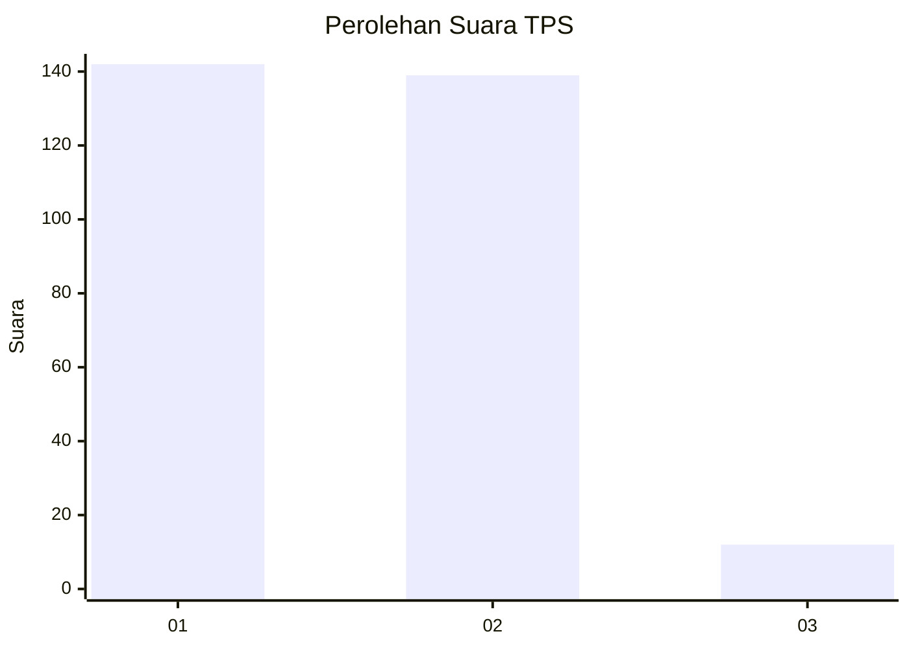
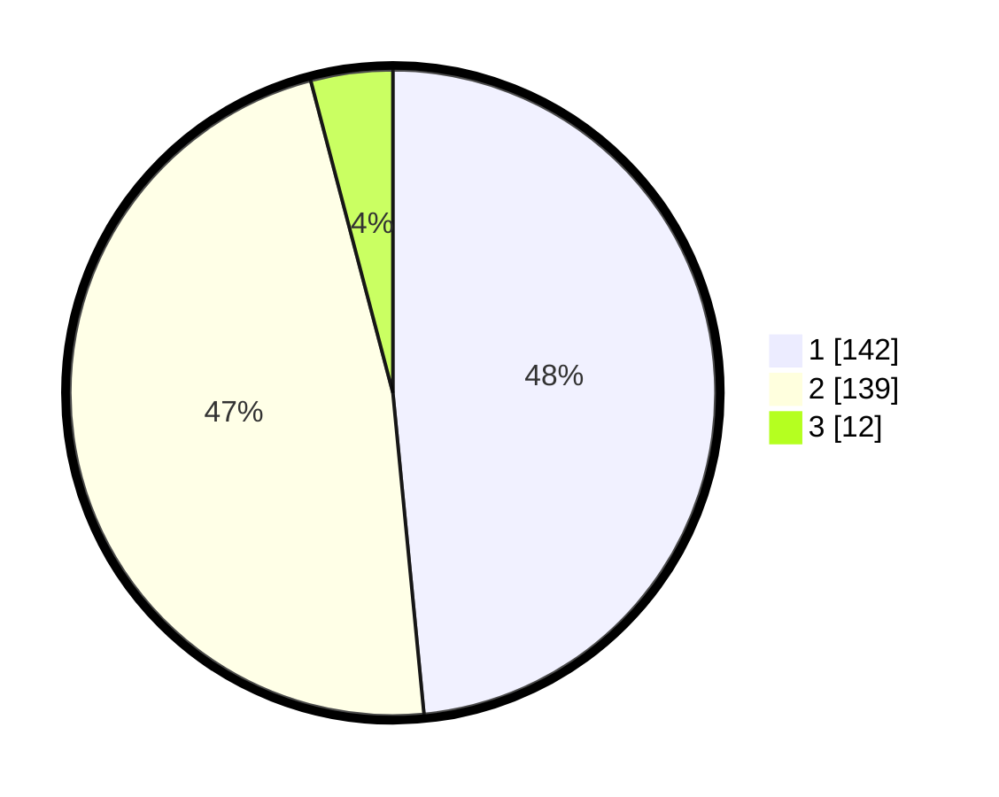

# Hasil

## Grafik

## Tabel

| No. | Nama Paslon    | Suara | Suara (raw) | Persentase |
|:--- |:-------------- | -----:| -----------:| ----------:|
| 1   | ANIES MUHAIMIN | 142   | [142][p-1]  | 48,46      |
| 2   | PRABOWO GIBRAN | 139   | [139][p-2]  | 47,44      |
| 3   | GANJAR MAHFUD  | 12    | [12][p-3]   | 4,10       |

[p-1]: https://github.com/gigit-pemilu/pemilu-2024/blob/main/pilpres/hitung-suara/sub/35-jawa-timur/sub/28-pamekasan/sub/10-waru/sub/2007-ragang/sub/001-tps/sub/paslon-1.txt
[p-2]: https://github.com/gigit-pemilu/pemilu-2024/blob/main/pilpres/hitung-suara/sub/35-jawa-timur/sub/28-pamekasan/sub/10-waru/sub/2007-ragang/sub/001-tps/sub/paslon-2.txt
[p-3]: https://github.com/gigit-pemilu/pemilu-2024/blob/main/pilpres/hitung-suara/sub/35-jawa-timur/sub/28-pamekasan/sub/10-waru/sub/2007-ragang/sub/001-tps/sub/paslon-3.txt

## Foto C Plano

https://sirekap-obj-formc.kpu.go.id/87eb/pemilu/ppwp/35/28/10/20/07/3528102007001-20240214-213309--80ec8e98-31a4-40ac-a40f-47670f587b00.jpg

https://sirekap-obj-formc.kpu.go.id/87eb/pemilu/ppwp/35/28/10/20/07/3528102007001-20240214-213556--e442ce21-37e1-49ae-8b2a-4ae4d9c35fd8.jpg

## Metadata

| Key        | Value               |
| ---------- | ------------------- |
| Time Stamp | 2024-02-26 12:00:00 |

