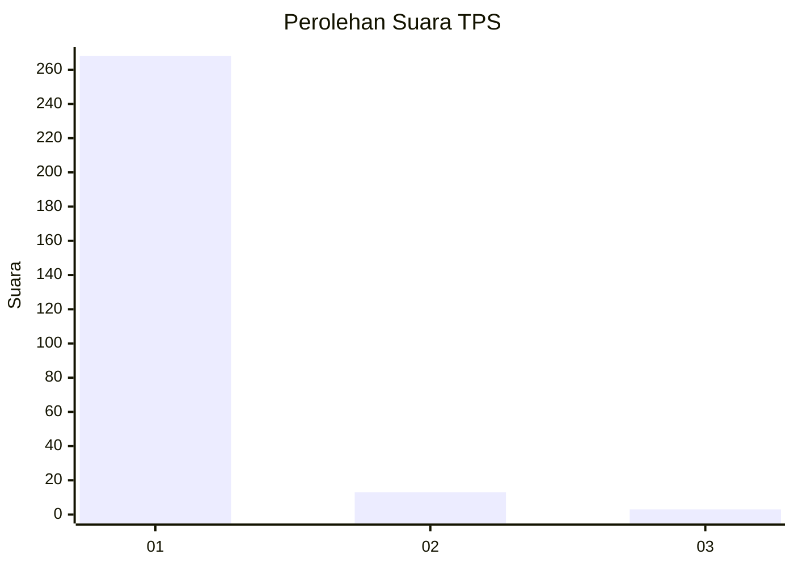
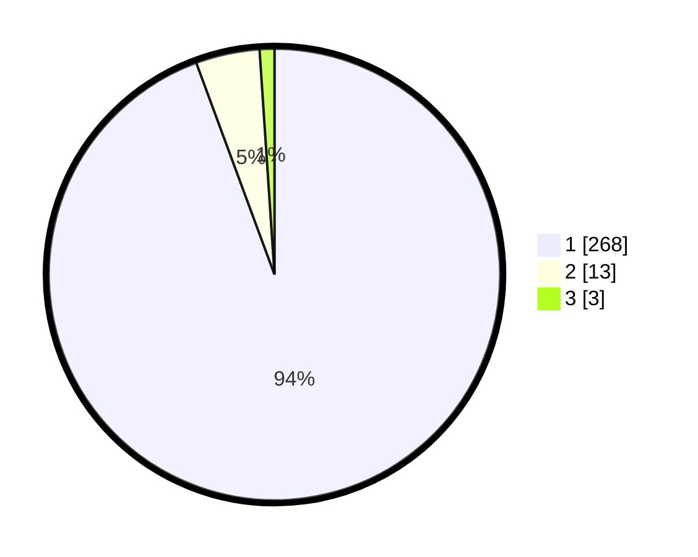

# Hasil

## Grafik

## Tabel

| No. | Nama Paslon    | Suara | Suara (raw) | Persentase |
|:--- |:-------------- | -----:| -----------:| ----------:|
| 1   | ANIES MUHAIMIN | 268   | [268][p-1]  | 94,37      |
| 2   | PRABOWO GIBRAN | 13    | [13][p-2]   | 4,58       |
| 3   | GANJAR MAHFUD  | 3     | [3][p-3]    | 1,06       |

[p-1]: https://github.com/gigit-pemilu/pemilu-2024/blob/main/pilpres/hitung-suara/sub/35-jawa-timur/sub/28-pamekasan/sub/10-waru/sub/2007-ragang/sub/004-tps/sub/paslon-1.txt
[p-2]: https://github.com/gigit-pemilu/pemilu-2024/blob/main/pilpres/hitung-suara/sub/35-jawa-timur/sub/28-pamekasan/sub/10-waru/sub/2007-ragang/sub/004-tps/sub/paslon-2.txt
[p-3]: https://github.com/gigit-pemilu/pemilu-2024/blob/main/pilpres/hitung-suara/sub/35-jawa-timur/sub/28-pamekasan/sub/10-waru/sub/2007-ragang/sub/004-tps/sub/paslon-3.txt

## Foto C Plano

https://sirekap-obj-formc.kpu.go.id/f28f/pemilu/ppwp/35/28/10/20/07/3528102007004-20240214-220741--0434138a-f24e-4a7c-9f2f-58e33ce0f737.jpg

https://sirekap-obj-formc.kpu.go.id/f28f/pemilu/ppwp/35/28/10/20/07/3528102007004-20240214-220930--87de74c7-0fce-434e-b5e6-16a5f87ce4e3.jpg

https://sirekap-obj-formc.kpu.go.id/f28f/pemilu/ppwp/35/28/10/20/07/3528102007004-20240214-221046--a80bc512-6e26-4c0b-88cc-4e51cae1312c.jpg

## Metadata

| Key        | Value               |
| ---------- | ------------------- |
| Time Stamp | 2024-02-25 16:00:00 |

