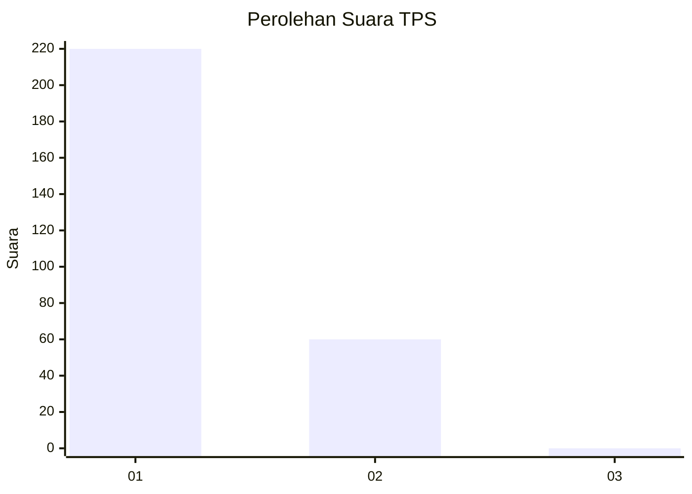
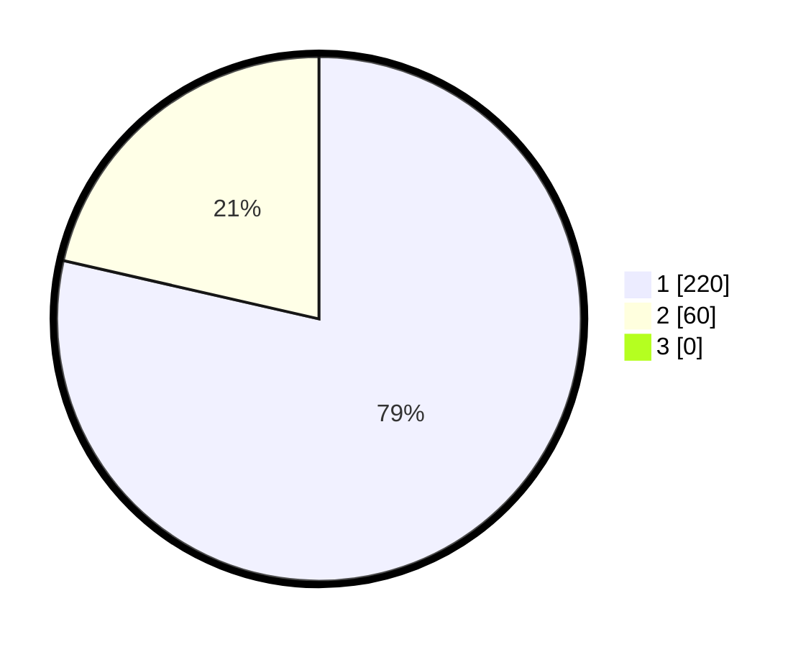

# Hasil

## Grafik

## Tabel

| No. | Nama Paslon    | Suara | Suara (raw) | Persentase |
|:--- |:-------------- | -----:| -----------:| ----------:|
| 1   | ANIES MUHAIMIN | 220   | [220][p-1]  | 78,57      |
| 2   | PRABOWO GIBRAN | 60    | [60][p-2]   | 21,43      |
| 3   | GANJAR MAHFUD  | 0     | [0][p-3]    | 0,00       |

[p-1]: https://github.com/gigit-pemilu/pemilu-2024-35-jawa-timur/blob/main/pilpres/hitung-suara/sub/35-jawa-timur/sub/28-pamekasan/sub/10-waru/sub/2007-ragang/sub/007-tps/sub/paslon-1.txt
[p-2]: https://github.com/gigit-pemilu/pemilu-2024-35-jawa-timur/blob/main/pilpres/hitung-suara/sub/35-jawa-timur/sub/28-pamekasan/sub/10-waru/sub/2007-ragang/sub/007-tps/sub/paslon-2.txt
[p-3]: https://github.com/gigit-pemilu/pemilu-2024-35-jawa-timur/blob/main/pilpres/hitung-suara/sub/35-jawa-timur/sub/28-pamekasan/sub/10-waru/sub/2007-ragang/sub/007-tps/sub/paslon-3.txt

## Foto C Plano

https://sirekap-obj-formc.kpu.go.id/99d7/pemilu/ppwp/35/28/10/20/07/3528102007007-20240215-202508--978f4c40-4201-4e51-acdf-9b6496d29ecc.jpg

https://sirekap-obj-formc.kpu.go.id/99d7/pemilu/ppwp/35/28/10/20/07/3528102007007-20240215-200019--68c3dca4-7221-4850-acb4-fc5c9b142ac3.jpg

https://sirekap-obj-formc.kpu.go.id/99d7/pemilu/ppwp/35/28/10/20/07/3528102007007-20240215-202638--68a7b8ae-8393-4d0b-9996-f0797806a695.jpg

## Metadata

| Key        | Value               |
| ---------- | ------------------- |
| Time Stamp | 2024-02-15 22:00:27 |

