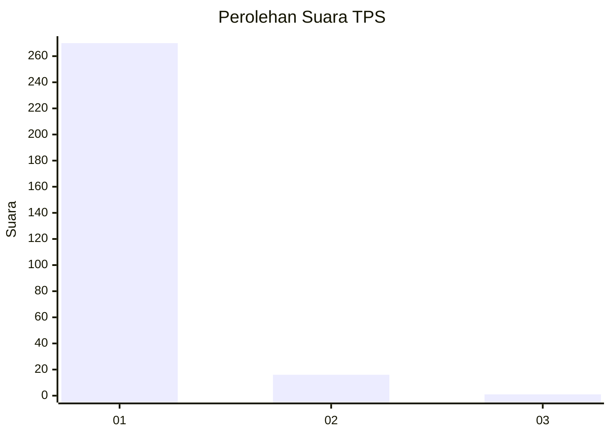
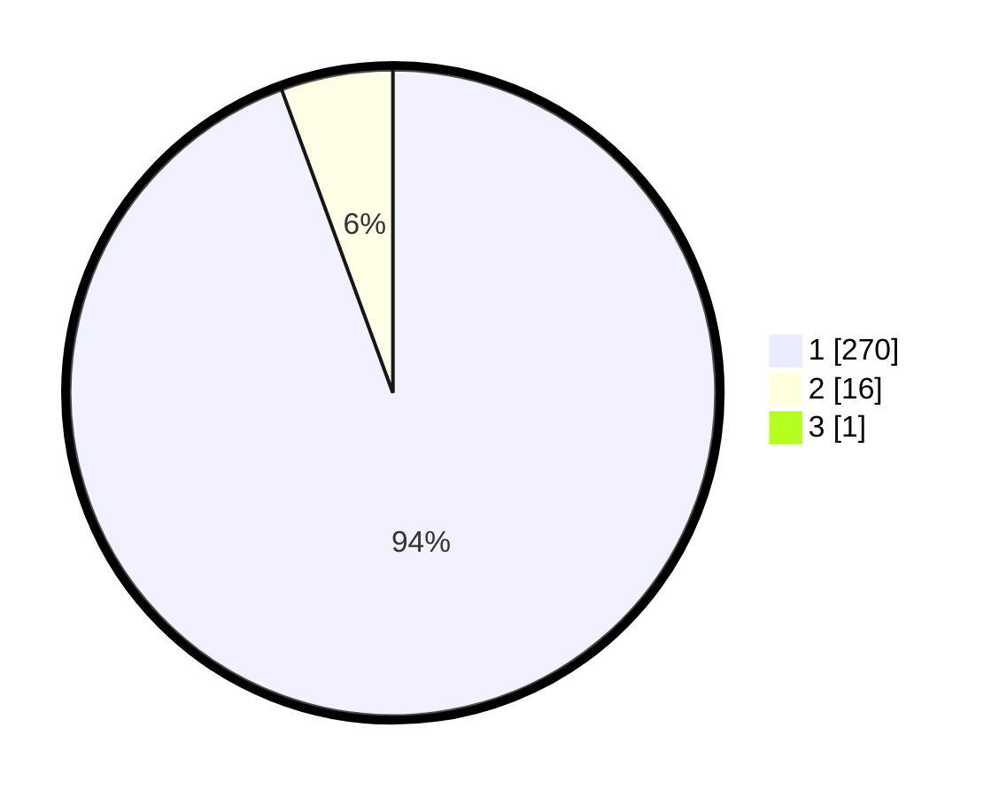

# Hasil

## Grafik

## Tabel

| No. | Nama Paslon    | Suara | Suara (raw) | Persentase |
|:--- |:-------------- | -----:| -----------:| ----------:|
| 1   | ANIES MUHAIMIN | 270   | [270][p-1]  | 94,08      |
| 2   | PRABOWO GIBRAN | 16    | [16][p-2]   | 5,57       |
| 3   | GANJAR MAHFUD  | 1     | [1][p-3]    | 0,35       |

[p-1]: https://github.com/gigit-pemilu/pemilu-2024-35-jawa-timur/blob/main/pilpres/hitung-suara/sub/35-jawa-timur/sub/28-pamekasan/sub/10-waru/sub/2007-ragang/sub/009-tps/sub/paslon-1.txt
[p-2]: https://github.com/gigit-pemilu/pemilu-2024-35-jawa-timur/blob/main/pilpres/hitung-suara/sub/35-jawa-timur/sub/28-pamekasan/sub/10-waru/sub/2007-ragang/sub/009-tps/sub/paslon-2.txt
[p-3]: https://github.com/gigit-pemilu/pemilu-2024-35-jawa-timur/blob/main/pilpres/hitung-suara/sub/35-jawa-timur/sub/28-pamekasan/sub/10-waru/sub/2007-ragang/sub/009-tps/sub/paslon-3.txt

## Foto C Plano

https://sirekap-obj-formc.kpu.go.id/2b21/pemilu/ppwp/35/28/10/20/07/3528102007009-20240214-195611--d42060bd-3090-41fb-8c66-b0ea794fc591.jpg

https://sirekap-obj-formc.kpu.go.id/2b21/pemilu/ppwp/35/28/10/20/07/3528102007009-20240214-195750--ea1fc6a8-369a-4c99-9674-09848009ff6c.jpg

https://sirekap-obj-formc.kpu.go.id/2b21/pemilu/ppwp/35/28/10/20/07/3528102007009-20240214-210456--5c493d8c-5e88-4cf8-90b0-4911332340b1.jpg

## Metadata

| Key        | Value               |
| ---------- | ------------------- |
| Time Stamp | 2024-02-15 22:00:27 |

