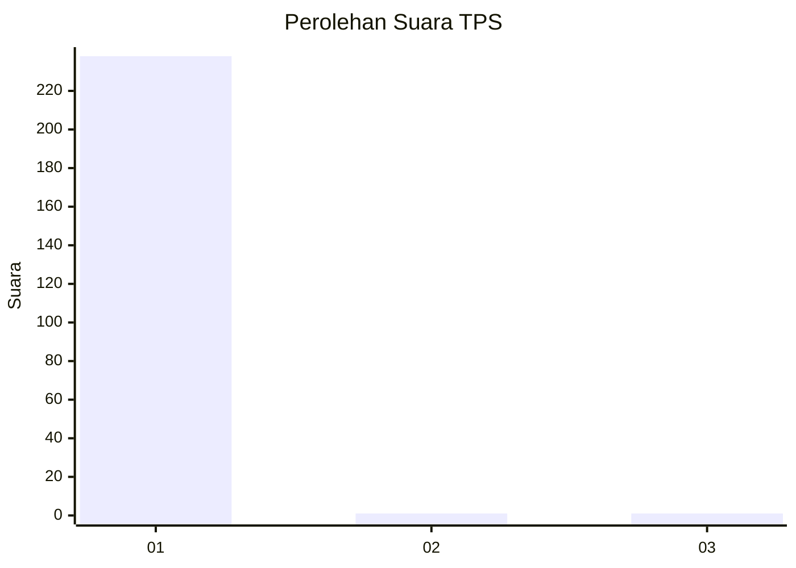
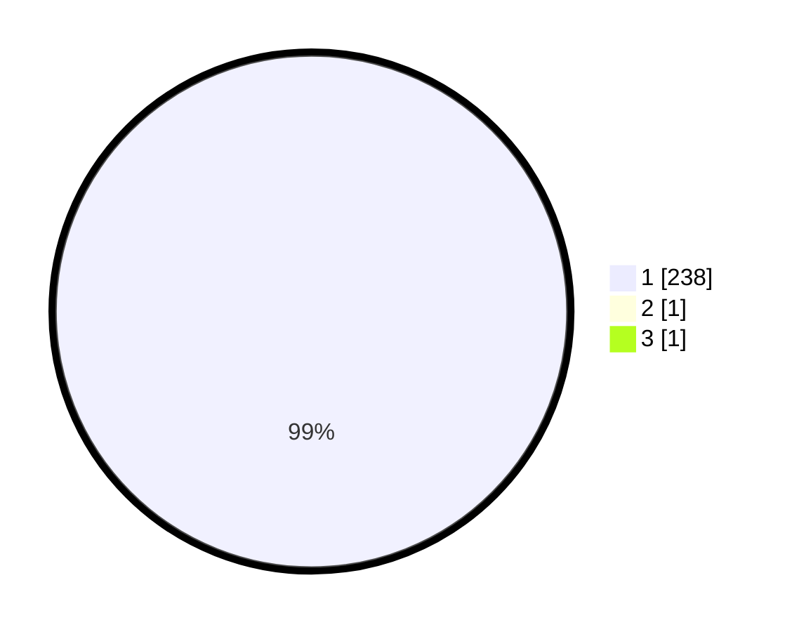

# Hasil

## Grafik

## Tabel

| No. | Nama Paslon    | Suara | Suara (raw) | Persentase |
|:--- |:-------------- | -----:| -----------:| ----------:|
| 1   | ANIES MUHAIMIN | 238   | [238][p-1]  | 99,17      |
| 2   | PRABOWO GIBRAN | 1     | [1][p-2]    | 0,42       |
| 3   | GANJAR MAHFUD  | 1     | [1][p-3]    | 0,42       |

[p-1]: https://github.com/gigit-pemilu/pemilu-2024/blob/main/pilpres/hitung-suara/sub/35-jawa-timur/sub/28-pamekasan/sub/10-waru/sub/2008-sana-laok/sub/010-tps/sub/paslon-1.txt
[p-2]: https://github.com/gigit-pemilu/pemilu-2024/blob/main/pilpres/hitung-suara/sub/35-jawa-timur/sub/28-pamekasan/sub/10-waru/sub/2008-sana-laok/sub/010-tps/sub/paslon-2.txt
[p-3]: https://github.com/gigit-pemilu/pemilu-2024/blob/main/pilpres/hitung-suara/sub/35-jawa-timur/sub/28-pamekasan/sub/10-waru/sub/2008-sana-laok/sub/010-tps/sub/paslon-3.txt

## Foto C Plano

https://sirekap-obj-formc.kpu.go.id/b9ce/pemilu/ppwp/35/28/10/20/08/3528102008010-20240214-155232--3447d002-a402-4324-bace-d8b10e6bf566.jpg

https://sirekap-obj-formc.kpu.go.id/b9ce/pemilu/ppwp/35/28/10/20/08/3528102008010-20240214-155521--083e7296-ae56-4852-9334-d82fdd4778d7.jpg

https://sirekap-obj-formc.kpu.go.id/b9ce/pemilu/ppwp/35/28/10/20/08/3528102008010-20240214-155645--aa5dacdc-aec5-4f14-9086-a4ed77082265.jpg

## Metadata

| Key        | Value               |
| ---------- | ------------------- |
| Time Stamp | 2024-02-25 18:00:00 |

