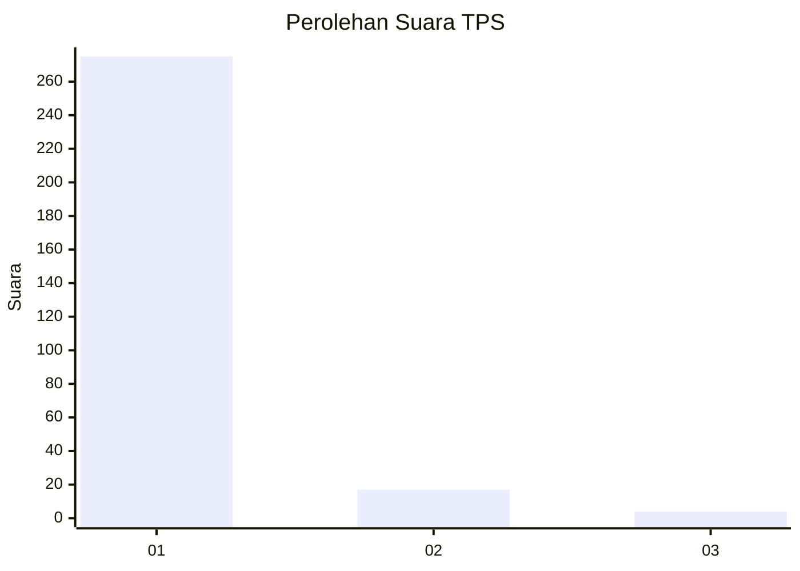
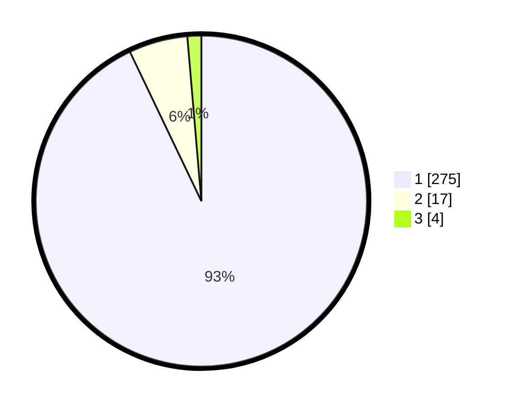

# Hasil

## Grafik

## Tabel

| No. | Nama Paslon    | Suara | Suara (raw) | Persentase |
|:--- |:-------------- | -----:| -----------:| ----------:|
| 1   | ANIES MUHAIMIN | 275   | [275][p-1]  | 92,91      |
| 2   | PRABOWO GIBRAN | 17    | [17][p-2]   | 5,74       |
| 3   | GANJAR MAHFUD  | 4     | [4][p-3]    | 1,35       |

[p-1]: https://github.com/gigit-pemilu/pemilu-2024-35-jawa-timur/blob/main/pilpres/hitung-suara/sub/35-jawa-timur/sub/28-pamekasan/sub/10-waru/sub/2008-sana-laok/sub/024-tps/sub/paslon-1.txt
[p-2]: https://github.com/gigit-pemilu/pemilu-2024-35-jawa-timur/blob/main/pilpres/hitung-suara/sub/35-jawa-timur/sub/28-pamekasan/sub/10-waru/sub/2008-sana-laok/sub/024-tps/sub/paslon-2.txt
[p-3]: https://github.com/gigit-pemilu/pemilu-2024-35-jawa-timur/blob/main/pilpres/hitung-suara/sub/35-jawa-timur/sub/28-pamekasan/sub/10-waru/sub/2008-sana-laok/sub/024-tps/sub/paslon-3.txt

## Foto C Plano

https://sirekap-obj-formc.kpu.go.id/718a/pemilu/ppwp/35/28/10/20/08/3528102008024-20240214-233521--eff46a31-8a11-4e59-be42-97b5d36424e0.jpg

https://sirekap-obj-formc.kpu.go.id/718a/pemilu/ppwp/35/28/10/20/08/3528102008024-20240214-233633--2cf49ea1-01ae-45ce-a868-392b8ffdfd19.jpg

https://sirekap-obj-formc.kpu.go.id/718a/pemilu/ppwp/35/28/10/20/08/3528102008024-20240214-233744--cac5ceba-266e-4651-b10c-cd9ca9c1096e.jpg

## Metadata

| Key        | Value               |
| ---------- | ------------------- |
| Time Stamp | 2024-02-24 22:31:28 |

