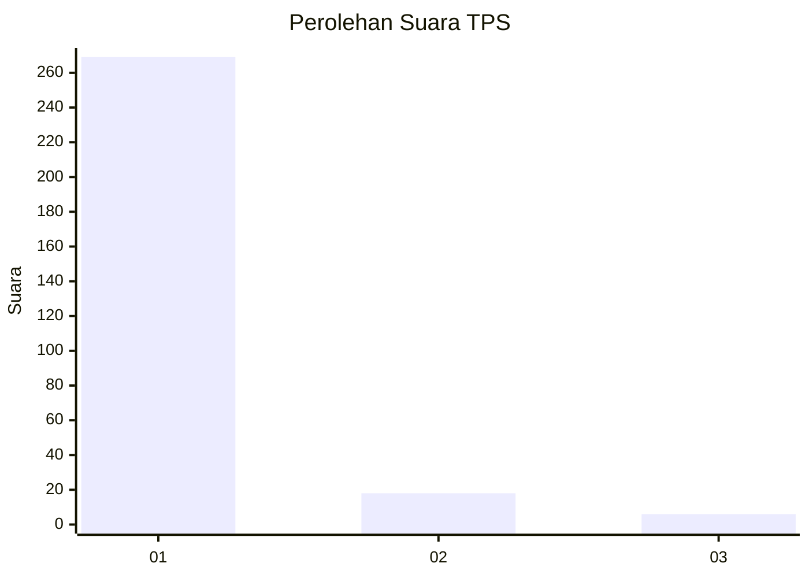
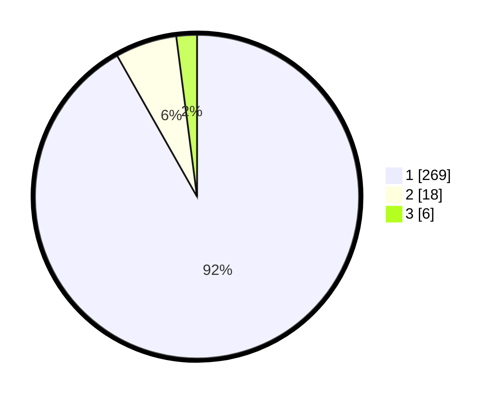

# Hasil

## Grafik

## Tabel

| No. | Nama Paslon    | Suara | Suara (raw) | Persentase |
|:--- |:-------------- | -----:| -----------:| ----------:|
| 1   | ANIES MUHAIMIN | 269   | [269][p-1]  | 91,81      |
| 2   | PRABOWO GIBRAN | 18    | [18][p-2]   | 6,14       |
| 3   | GANJAR MAHFUD  | 6     | [6][p-3]    | 2,05       |

[p-1]: https://github.com/gigit-pemilu/pemilu-2024-35-jawa-timur/blob/main/pilpres/hitung-suara/sub/35-jawa-timur/sub/28-pamekasan/sub/10-waru/sub/2009-waru-timur/sub/009-tps/sub/paslon-1.txt
[p-2]: https://github.com/gigit-pemilu/pemilu-2024-35-jawa-timur/blob/main/pilpres/hitung-suara/sub/35-jawa-timur/sub/28-pamekasan/sub/10-waru/sub/2009-waru-timur/sub/009-tps/sub/paslon-2.txt
[p-3]: https://github.com/gigit-pemilu/pemilu-2024-35-jawa-timur/blob/main/pilpres/hitung-suara/sub/35-jawa-timur/sub/28-pamekasan/sub/10-waru/sub/2009-waru-timur/sub/009-tps/sub/paslon-3.txt

## Foto C Plano

https://sirekap-obj-formc.kpu.go.id/6bd6/pemilu/ppwp/35/28/10/20/09/3528102009009-20240215-175611--0d2db451-000b-4328-b8cc-802af607f03c.jpg

https://sirekap-obj-formc.kpu.go.id/6bd6/pemilu/ppwp/35/28/10/20/09/3528102009009-20240215-175804--c00ffdce-5153-48e4-a692-539f59648b8f.jpg

https://sirekap-obj-formc.kpu.go.id/6bd6/pemilu/ppwp/35/28/10/20/09/3528102009009-20240215-180018--0b609547-ad0c-43e6-8b00-7553b6a5f759.jpg

## Metadata

| Key        | Value               |
| ---------- | ------------------- |
| Time Stamp | 2024-02-25 16:00:00 |

