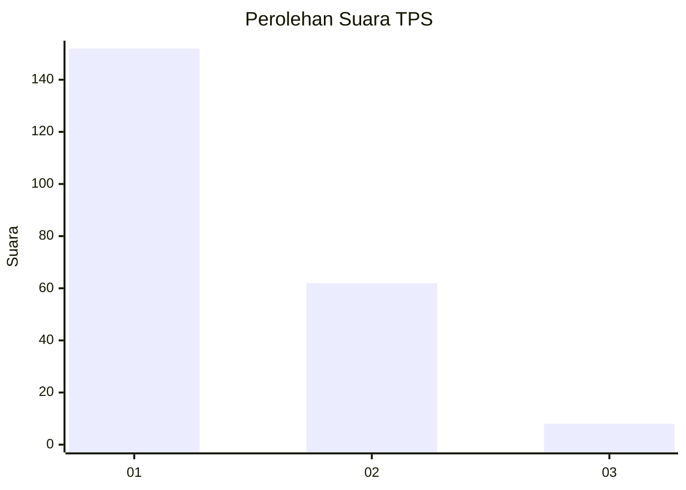
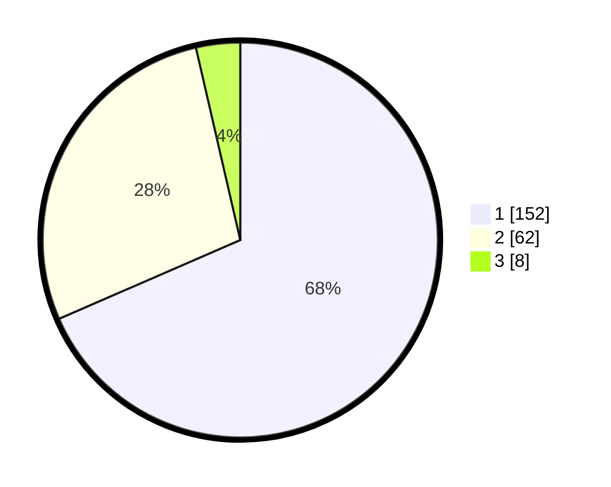

# Hasil

## Grafik

## Tabel

| No. | Nama Paslon    | Suara | Suara (raw) | Persentase |
|:--- |:-------------- | -----:| -----------:| ----------:|
| 1   | ANIES MUHAIMIN | 152   | [152][p-1]  | 68,47      |
| 2   | PRABOWO GIBRAN | 62    | [62][p-2]   | 27,93      |
| 3   | GANJAR MAHFUD  | 8     | [8][p-3]    | 3,60       |

[p-1]: https://github.com/gigit-pemilu/pemilu-2024-35-jawa-timur/blob/main/pilpres/hitung-suara/sub/35-jawa-timur/sub/28-pamekasan/sub/10-waru/sub/2009-waru-timur/sub/014-tps/sub/paslon-1.txt
[p-2]: https://github.com/gigit-pemilu/pemilu-2024-35-jawa-timur/blob/main/pilpres/hitung-suara/sub/35-jawa-timur/sub/28-pamekasan/sub/10-waru/sub/2009-waru-timur/sub/014-tps/sub/paslon-2.txt
[p-3]: https://github.com/gigit-pemilu/pemilu-2024-35-jawa-timur/blob/main/pilpres/hitung-suara/sub/35-jawa-timur/sub/28-pamekasan/sub/10-waru/sub/2009-waru-timur/sub/014-tps/sub/paslon-3.txt

## Foto C Plano

https://sirekap-obj-formc.kpu.go.id/6840/pemilu/ppwp/35/28/10/20/09/3528102009014-20240214-191913--2a88a527-cf95-43a4-acf0-ad13b8e6ae7f.jpg

https://sirekap-obj-formc.kpu.go.id/6840/pemilu/ppwp/35/28/10/20/09/3528102009014-20240214-191958--813ffac4-8ced-4e8f-ac71-2babea936922.jpg

https://sirekap-obj-formc.kpu.go.id/6840/pemilu/ppwp/35/28/10/20/09/3528102009014-20240214-192045--78ec8e04-62a0-49f7-95b0-0193d9fad114.jpg

## Metadata

| Key        | Value               |
| ---------- | ------------------- |
| Time Stamp | 2024-02-15 22:00:27 |

