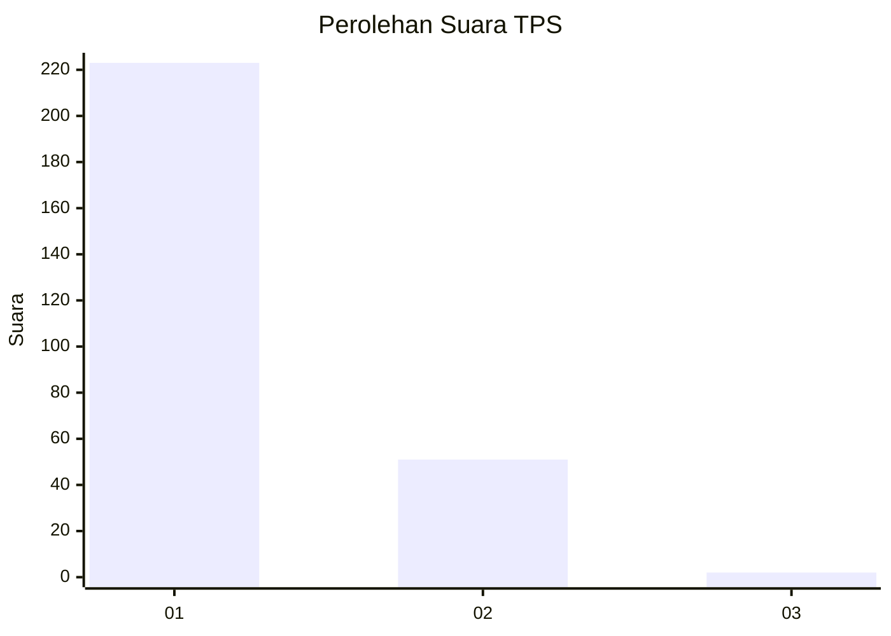
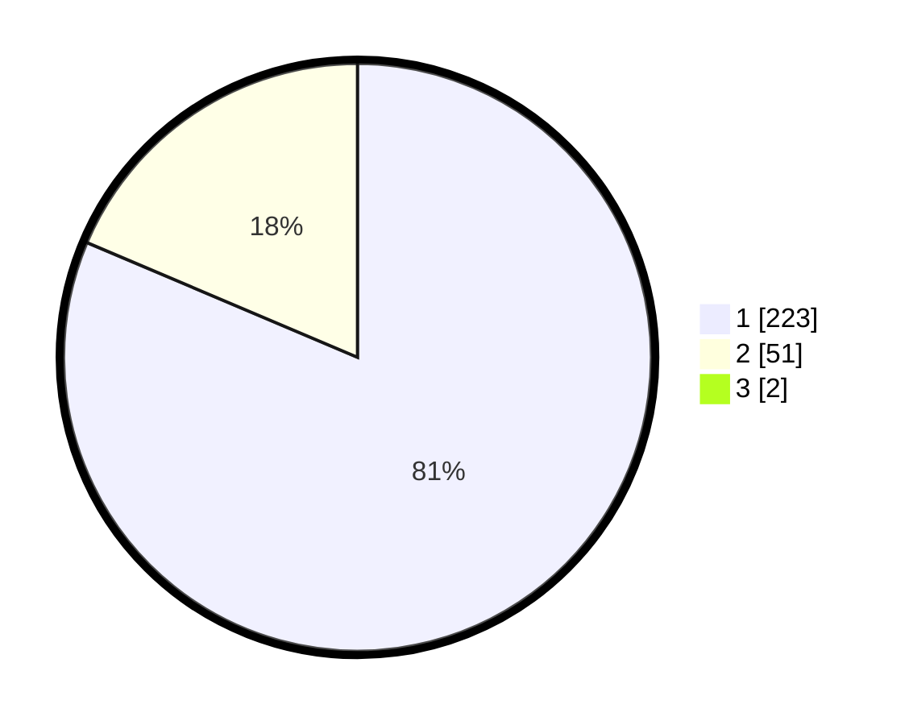

# Hasil

## Grafik

## Tabel

| No. | Nama Paslon    | Suara | Suara (raw) | Persentase |
|:--- |:-------------- | -----:| -----------:| ----------:|
| 1   | ANIES MUHAIMIN | 223   | [223][p-1]  | 80,80      |
| 2   | PRABOWO GIBRAN | 51    | [51][p-2]   | 18,48      |
| 3   | GANJAR MAHFUD  | 2     | [2][p-3]    | 0,72       |

[p-1]: https://github.com/gigit-pemilu/pemilu-2024-35-jawa-timur/blob/main/pilpres/hitung-suara/sub/35-jawa-timur/sub/28-pamekasan/sub/10-waru/sub/2010-waru-barat/sub/001-tps/sub/paslon-1.txt
[p-2]: https://github.com/gigit-pemilu/pemilu-2024-35-jawa-timur/blob/main/pilpres/hitung-suara/sub/35-jawa-timur/sub/28-pamekasan/sub/10-waru/sub/2010-waru-barat/sub/001-tps/sub/paslon-2.txt
[p-3]: https://github.com/gigit-pemilu/pemilu-2024-35-jawa-timur/blob/main/pilpres/hitung-suara/sub/35-jawa-timur/sub/28-pamekasan/sub/10-waru/sub/2010-waru-barat/sub/001-tps/sub/paslon-3.txt

## Foto C Plano

https://sirekap-obj-formc.kpu.go.id/d6b8/pemilu/ppwp/35/28/10/20/10/3528102010001-20240215-111109--45b61405-4685-4cd9-9d8e-42972a33003c.jpg

https://sirekap-obj-formc.kpu.go.id/d6b8/pemilu/ppwp/35/28/10/20/10/3528102010001-20240215-111122--975b156d-eb8e-4bf1-8949-47b56b882e38.jpg

https://sirekap-obj-formc.kpu.go.id/d6b8/pemilu/ppwp/35/28/10/20/10/3528102010001-20240215-101951--6f81e092-efca-426c-bc34-ebc474f58020.jpg

## Metadata

| Key        | Value               |
| ---------- | ------------------- |
| Time Stamp | 2024-02-15 22:00:27 |

