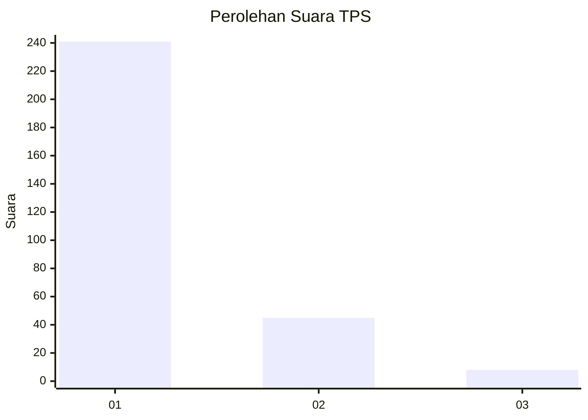
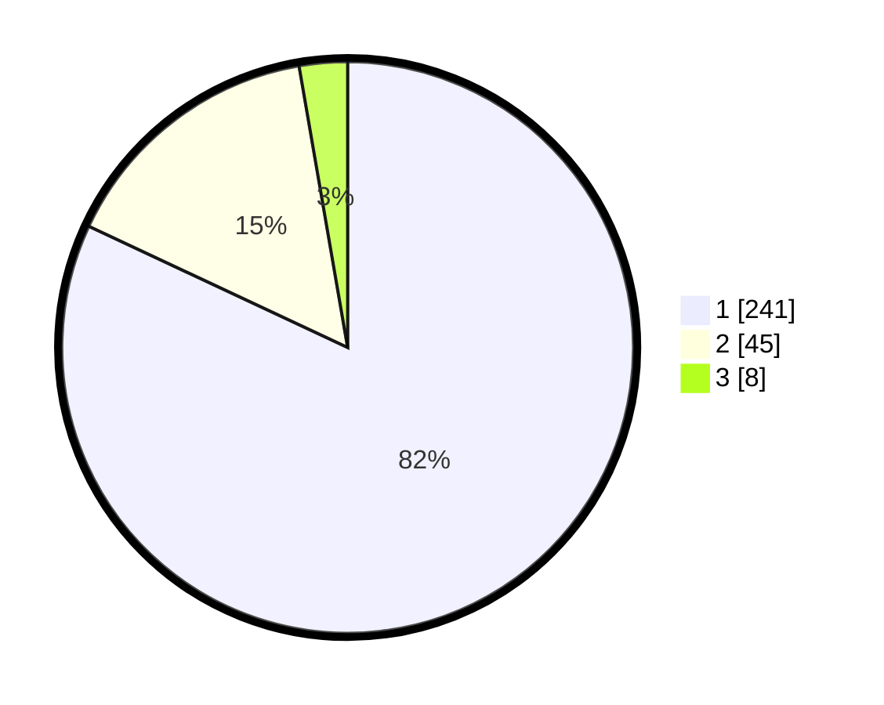

# Hasil

## Grafik

## Tabel

| No. | Nama Paslon    | Suara | Suara (raw) | Persentase |
|:--- |:-------------- | -----:| -----------:| ----------:|
| 1   | ANIES MUHAIMIN | 241   | [241][p-1]  | 81,97      |
| 2   | PRABOWO GIBRAN | 45    | [45][p-2]   | 15,31      |
| 3   | GANJAR MAHFUD  | 8     | [8][p-3]    | 2,72       |

[p-1]: https://github.com/gigit-pemilu/pemilu-2024-35-jawa-timur/blob/main/pilpres/hitung-suara/sub/35-jawa-timur/sub/28-pamekasan/sub/10-waru/sub/2010-waru-barat/sub/011-tps/sub/paslon-1.txt
[p-2]: https://github.com/gigit-pemilu/pemilu-2024-35-jawa-timur/blob/main/pilpres/hitung-suara/sub/35-jawa-timur/sub/28-pamekasan/sub/10-waru/sub/2010-waru-barat/sub/011-tps/sub/paslon-2.txt
[p-3]: https://github.com/gigit-pemilu/pemilu-2024-35-jawa-timur/blob/main/pilpres/hitung-suara/sub/35-jawa-timur/sub/28-pamekasan/sub/10-waru/sub/2010-waru-barat/sub/011-tps/sub/paslon-3.txt

## Foto C Plano

https://sirekap-obj-formc.kpu.go.id/ee06/pemilu/ppwp/35/28/10/20/10/3528102010011-20240215-090940--04f68e65-b7ed-4cd9-b12a-b6936e17d6fc.jpg

https://sirekap-obj-formc.kpu.go.id/ee06/pemilu/ppwp/35/28/10/20/10/3528102010011-20240215-091131--f3e88adb-b07a-42ab-a7a2-d3d07c9a74aa.jpg

https://sirekap-obj-formc.kpu.go.id/ee06/pemilu/ppwp/35/28/10/20/10/3528102010011-20240215-091300--1665798a-2afe-4f31-9e16-d2be8a1c5962.jpg

## Metadata

| Key        | Value               |
| ---------- | ------------------- |
| Time Stamp | 2024-02-24 22:31:28 |

