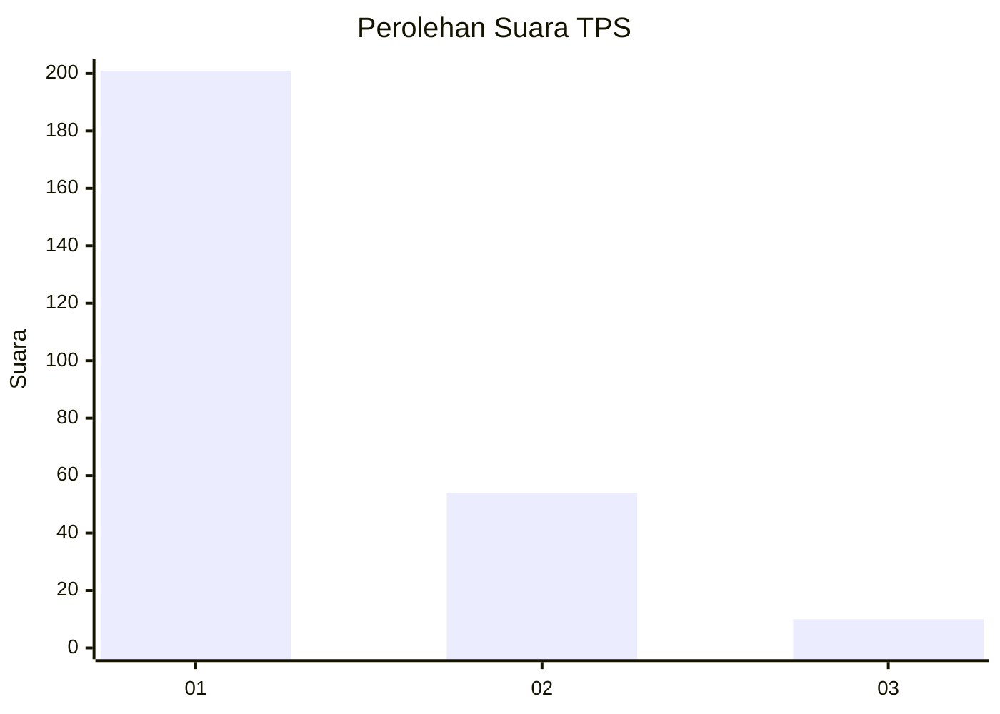
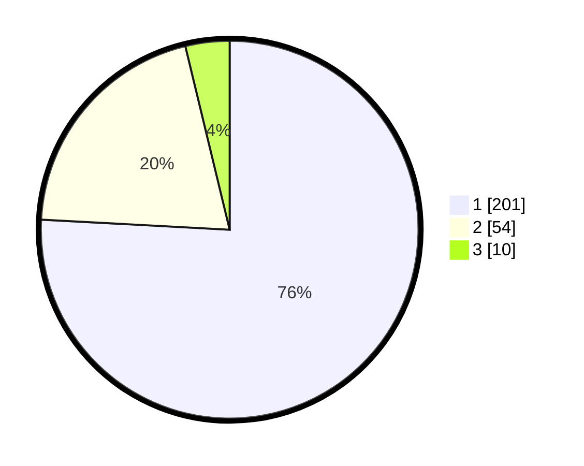

# Hasil

## Grafik

## Tabel

| No. | Nama Paslon    | Suara | Suara (raw) | Persentase |
|:--- |:-------------- | -----:| -----------:| ----------:|
| 1   | ANIES MUHAIMIN | 201   | [201][p-1]  | 75,85      |
| 2   | PRABOWO GIBRAN | 54    | [54][p-2]   | 20,38      |
| 3   | GANJAR MAHFUD  | 10    | [10][p-3]   | 3,77       |

[p-1]: https://github.com/gigit-pemilu/pemilu-2024-35-jawa-timur/blob/main/pilpres/hitung-suara/sub/35-jawa-timur/sub/28-pamekasan/sub/10-waru/sub/2010-waru-barat/sub/012-tps/sub/paslon-1.txt
[p-2]: https://github.com/gigit-pemilu/pemilu-2024-35-jawa-timur/blob/main/pilpres/hitung-suara/sub/35-jawa-timur/sub/28-pamekasan/sub/10-waru/sub/2010-waru-barat/sub/012-tps/sub/paslon-2.txt
[p-3]: https://github.com/gigit-pemilu/pemilu-2024-35-jawa-timur/blob/main/pilpres/hitung-suara/sub/35-jawa-timur/sub/28-pamekasan/sub/10-waru/sub/2010-waru-barat/sub/012-tps/sub/paslon-3.txt

## Foto C Plano

https://sirekap-obj-formc.kpu.go.id/f39c/pemilu/ppwp/35/28/10/20/10/3528102010012-20240215-122646--1edd3c9d-c262-41df-a9b0-264684bd5db3.jpg

https://sirekap-obj-formc.kpu.go.id/f39c/pemilu/ppwp/35/28/10/20/10/3528102010012-20240215-122809--3d603041-9479-4db9-b6e8-f12a5d08a2a9.jpg

https://sirekap-obj-formc.kpu.go.id/f39c/pemilu/ppwp/35/28/10/20/10/3528102010012-20240215-122931--d7a9ee93-4477-427c-8a8c-d6f8212df161.jpg

## Metadata

| Key        | Value               |
| ---------- | ------------------- |
| Time Stamp | 2024-02-15 22:00:27 |

