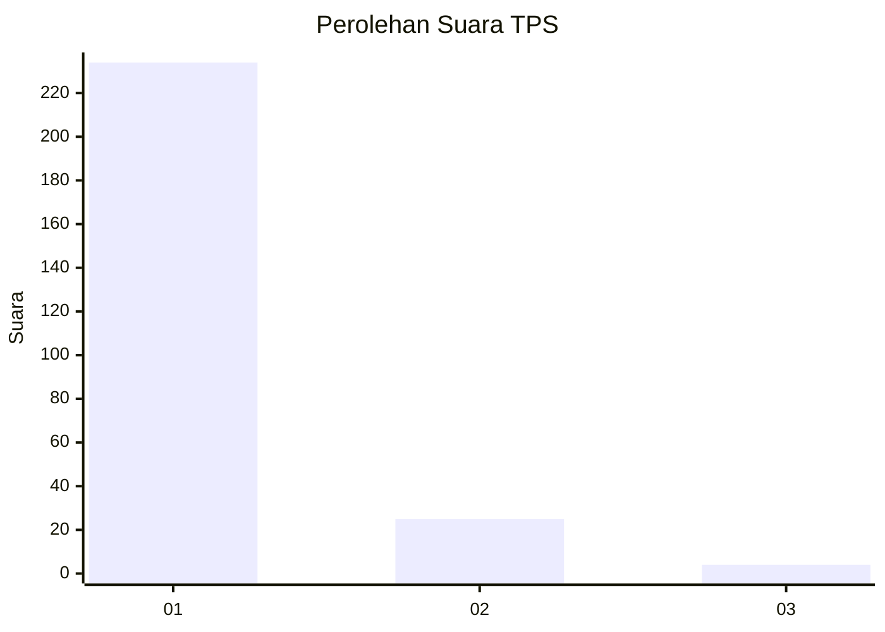
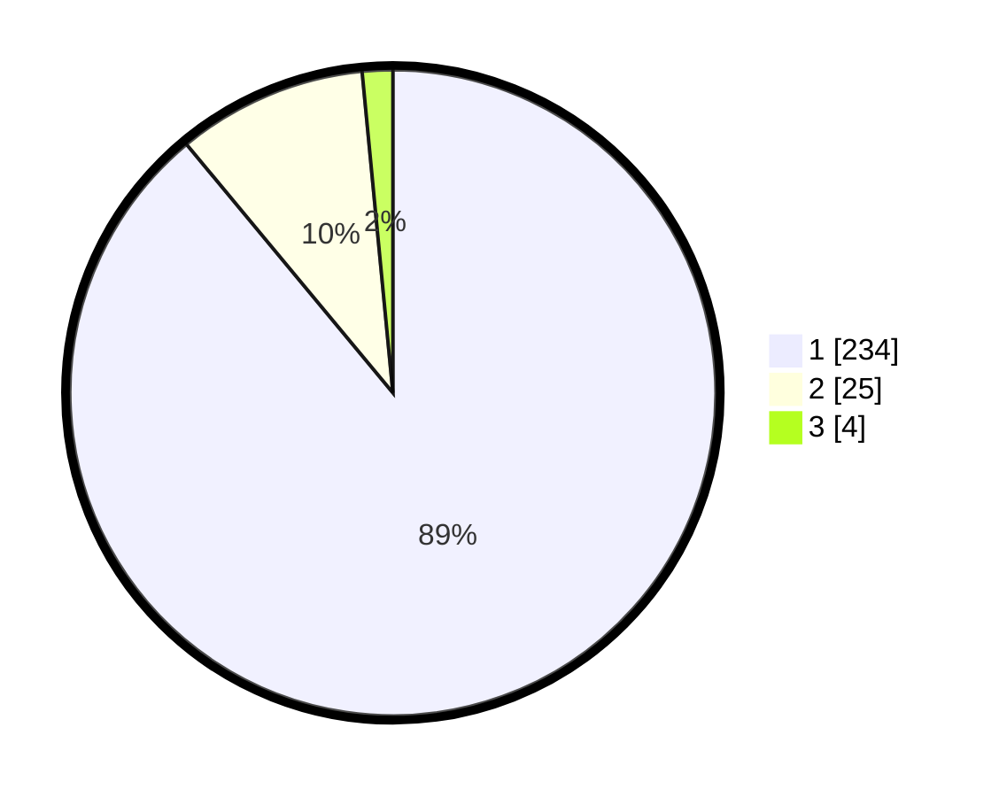

# Hasil

## Grafik

## Tabel

| No. | Nama Paslon    | Suara | Suara (raw) | Persentase |
|:--- |:-------------- | -----:| -----------:| ----------:|
| 1   | ANIES MUHAIMIN | 234   | [234][p-1]  | 88,97      |
| 2   | PRABOWO GIBRAN | 25    | [25][p-2]   | 9,51       |
| 3   | GANJAR MAHFUD  | 4     | [4][p-3]    | 1,52       |

[p-1]: https://github.com/gigit-pemilu/pemilu-2024/blob/main/pilpres/hitung-suara/sub/35-jawa-timur/sub/28-pamekasan/sub/10-waru/sub/2010-waru-barat/sub/015-tps/sub/paslon-1.txt
[p-2]: https://github.com/gigit-pemilu/pemilu-2024/blob/main/pilpres/hitung-suara/sub/35-jawa-timur/sub/28-pamekasan/sub/10-waru/sub/2010-waru-barat/sub/015-tps/sub/paslon-2.txt
[p-3]: https://github.com/gigit-pemilu/pemilu-2024/blob/main/pilpres/hitung-suara/sub/35-jawa-timur/sub/28-pamekasan/sub/10-waru/sub/2010-waru-barat/sub/015-tps/sub/paslon-3.txt

## Foto C Plano

https://sirekap-obj-formc.kpu.go.id/da46/pemilu/ppwp/35/28/10/20/10/3528102010015-20240215-083418--39674148-6b10-4658-a4f2-b1682bef8f73.jpg

https://sirekap-obj-formc.kpu.go.id/da46/pemilu/ppwp/35/28/10/20/10/3528102010015-20240215-083711--bd38663b-4e9c-4926-a5e1-91d120a0640a.jpg

https://sirekap-obj-formc.kpu.go.id/da46/pemilu/ppwp/35/28/10/20/10/3528102010015-20240215-084044--eb88cad7-e0c5-4380-be1b-fd00945e7020.jpg

## Metadata

| Key        | Value               |
| ---------- | ------------------- |
| Time Stamp | 2024-02-15 22:30:27 |

