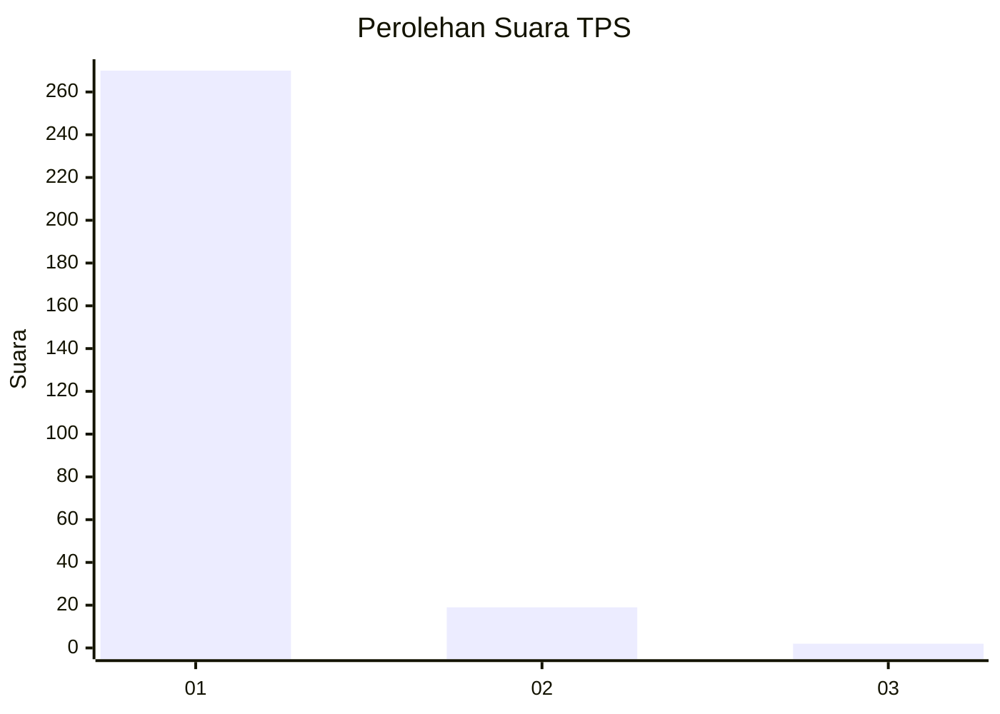
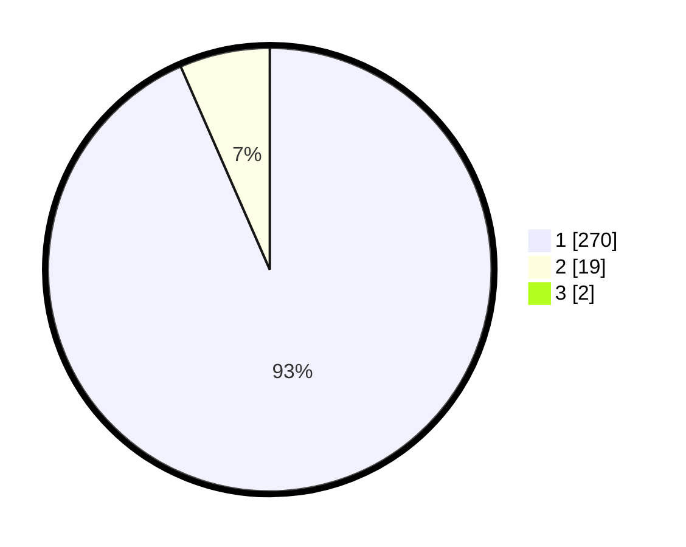

# Hasil

## Grafik

## Tabel

| No. | Nama Paslon    | Suara | Suara (raw) | Persentase |
|:--- |:-------------- | -----:| -----------:| ----------:|
| 1   | ANIES MUHAIMIN | 270   | [270][p-1]  | 92,78      |
| 2   | PRABOWO GIBRAN | 19    | [19][p-2]   | 6,53       |
| 3   | GANJAR MAHFUD  | 2     | [2][p-3]    | 0,69       |

[p-1]: https://github.com/gigit-pemilu/pemilu-2024-35-jawa-timur/blob/main/pilpres/hitung-suara/sub/35-jawa-timur/sub/28-pamekasan/sub/10-waru/sub/2010-waru-barat/sub/018-tps/sub/paslon-1.txt
[p-2]: https://github.com/gigit-pemilu/pemilu-2024-35-jawa-timur/blob/main/pilpres/hitung-suara/sub/35-jawa-timur/sub/28-pamekasan/sub/10-waru/sub/2010-waru-barat/sub/018-tps/sub/paslon-2.txt
[p-3]: https://github.com/gigit-pemilu/pemilu-2024-35-jawa-timur/blob/main/pilpres/hitung-suara/sub/35-jawa-timur/sub/28-pamekasan/sub/10-waru/sub/2010-waru-barat/sub/018-tps/sub/paslon-3.txt

## Foto C Plano

https://sirekap-obj-formc.kpu.go.id/fe10/pemilu/ppwp/35/28/10/20/10/3528102010018-20240214-231313--c4d73c9e-d46b-4adc-96b5-da6ac2d6d161.jpg

https://sirekap-obj-formc.kpu.go.id/fe10/pemilu/ppwp/35/28/10/20/10/3528102010018-20240214-231331--693f0081-9b77-40c7-9be3-23b3e43a79bc.jpg

https://sirekap-obj-formc.kpu.go.id/fe10/pemilu/ppwp/35/28/10/20/10/3528102010018-20240214-231345--7e7c0aac-1edd-4fc1-93e3-7136d66ea0d5.jpg

## Metadata

| Key        | Value               |
| ---------- | ------------------- |
| Time Stamp | 2024-02-26 17:00:04 |

